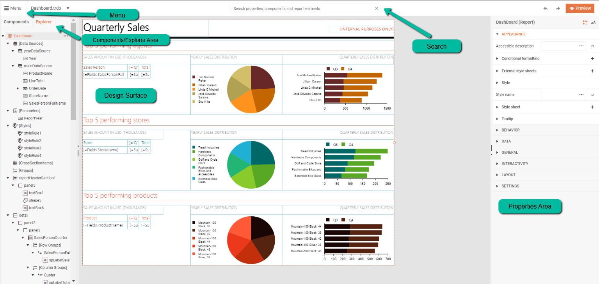

# Web Report Designer User Guide: An Overview

The Web Report Designer User Guide is intended to assist the users of business applications that integrate Telerik Reporting. It aims at providing the knowledge required for the successful crafting and maintenance of reports. Although this user guide is nested in the common developer docs, its primary audience are business application users.

> If you are a developer who integrates Telerik Reporting into web applications, see the [developer-oriented technical section]() of the Web Report Designer documentation or the [Getting Started tutorial](). 

## What is the Web Report Designer?

The Web Report designer is a tool developed to let business application users design, create, and export reports directly in their web browser, without needing any additional software. The reports can source their data from various databases, for example, relational, multi-dimensional, ORM, or custom data-layer-based data sources.

## What's in this User Guide?

This is a placeholder! 
This section briefly describes the content highlights.

## Next Steps

* [Create a Simple Report]()
* [Explore the Structure of a Report]()





## See Also

* [Reference 1]()
* [Reference 2]()
