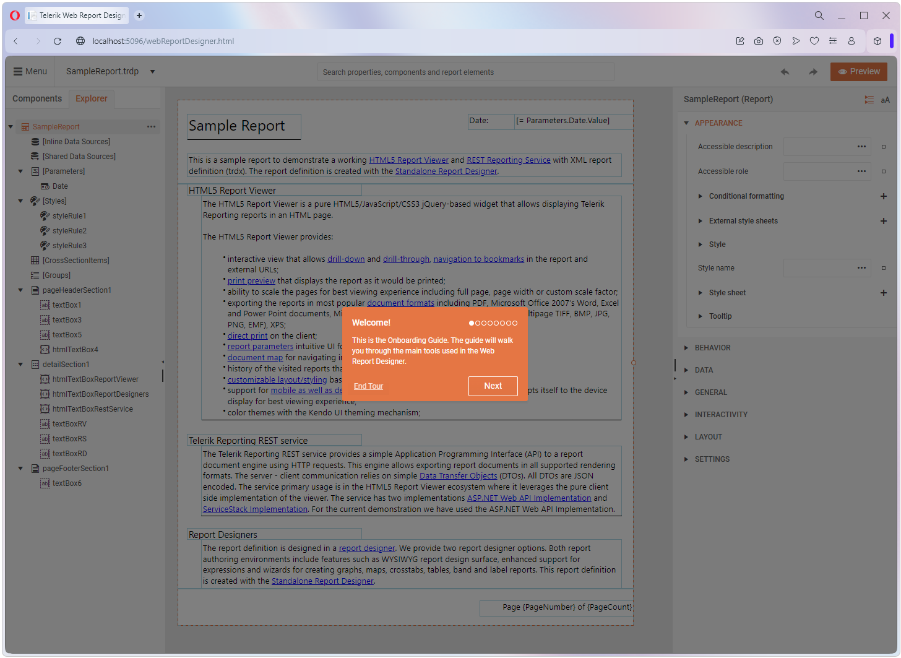
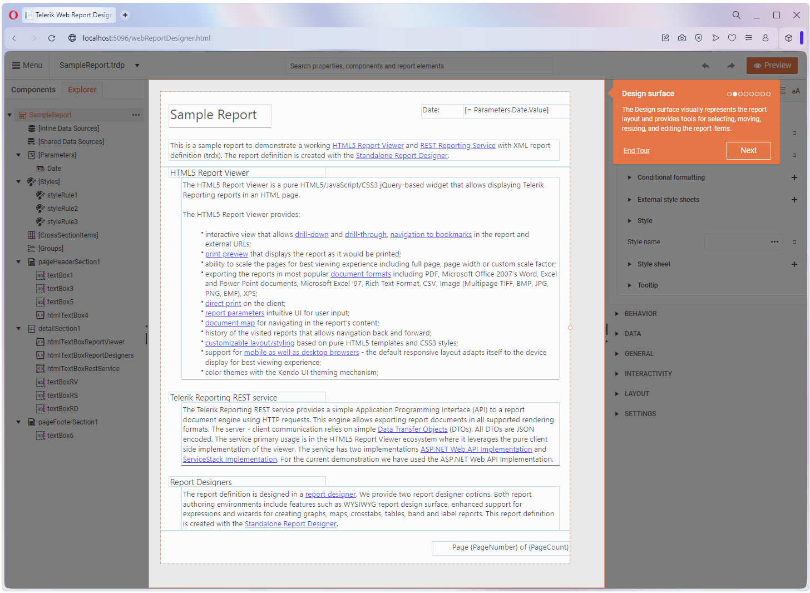
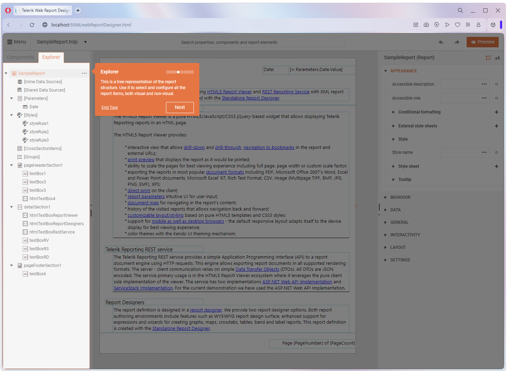
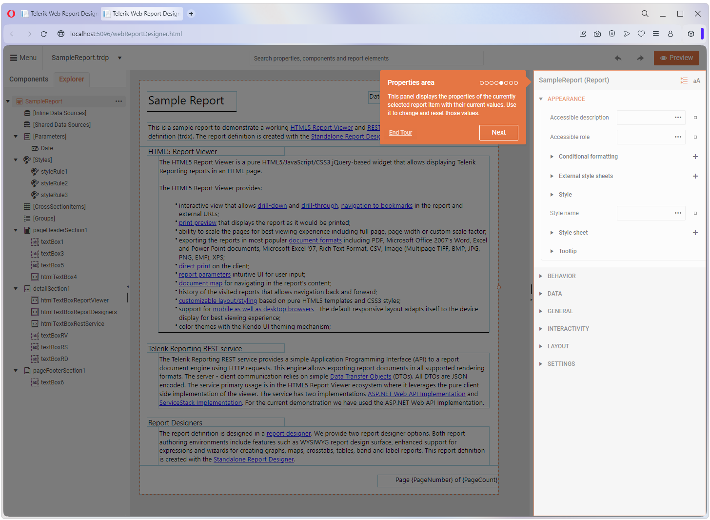
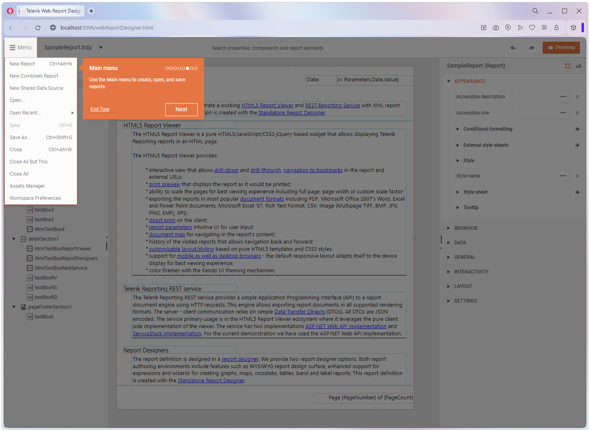
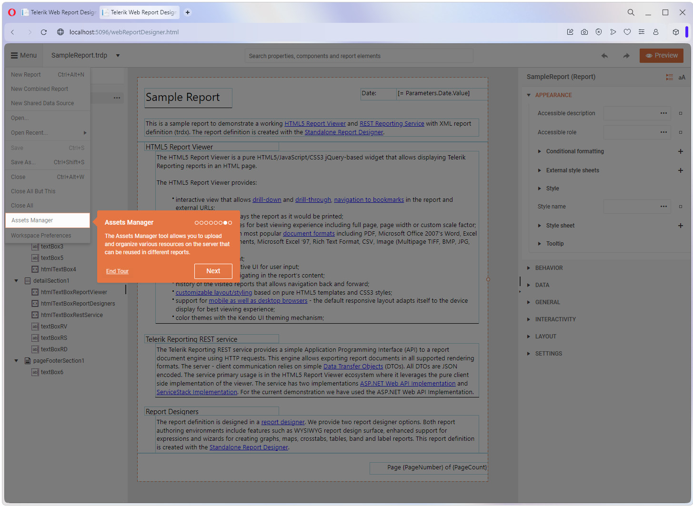
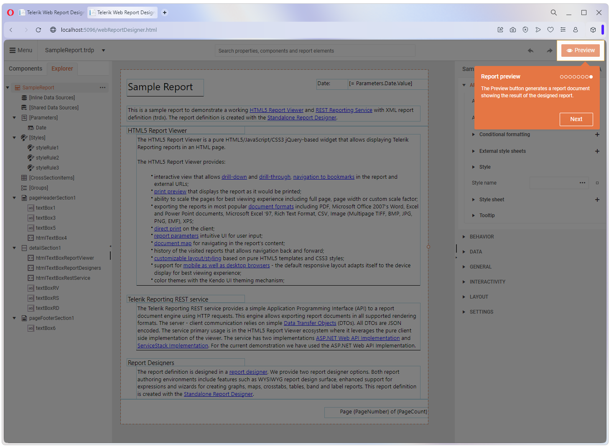
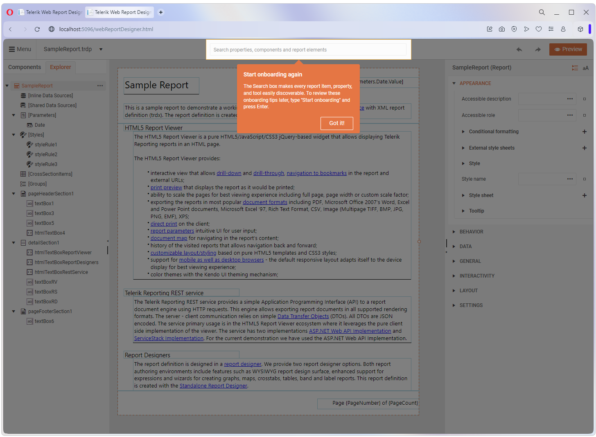

# Structure of Web Report Designer

You are expected to see the sample report and the first time a user loads the Web report designer, they will see the onboarding guide which walks you through the main tools in the designer:

    

We have the interactive **Design surface** where you actually create and style your report:

    

The **Components tray** which contains all of the items that you can add to the report:

   

The **Explorer** which provides a tree-based structure of everything that is already in the report including data structure:

   

On the right, we have a **Properties area** which will show you all of the properties and set values for the currently selected component:

  

At the top left, the **Main menu** allows you to open, save and interact with all of your reports on a global level along with the **Asset Manager** which is where you store all of your reports assets.

  

    

We have a **Preview** button which shows you a pixel perfect rendering of what the report will look like:

  

And finally, at the top we have a global **Search box** which allows you to search the report instance for any property value, component data source, etc.:

 

## See Also

* [Web Report Designer]()

