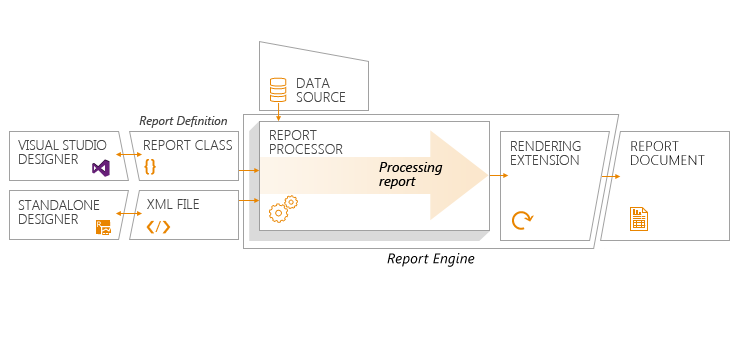

# The Lifecycle of the Report

Understanding the report lifecycle (what happens and when), is crucial to effectively use the Progress® Telerik® Reporting suite.

## Stages

The lifecycle of a report includes the following stages:

1. Defining the report. Depending on the report designer where you define the report, the produced report definition is of the following types:

	+ A report class for [Visual Studio Report Designer]()−The report resources are stored in a `.resx` .NET-managed resource file. Depending on the programming language that you used when defining the report, the report class consists of either visual C# class files (`.cs` and `.Designer.cs`) or visual basic class files (`.vb` and `.Designer.vb`).
	+ A `.trdx`, `.trdp`, or `.trbp` XML file for [Standalone Report Designer](). The XML can be stored as an XML definition and resources that are packaged in a `.zip` file (TRDP), in a plain XML format (TRDX), or as a collection of report definitions (report book) that are packaged in a `.zip` format.

1. Processing the report definition.

	+ Performing all grouping, sorting, and filtering calculations.
	+ Evaluating all expressions in the report definition except for the ones in the page header and footer sections.
	+ Binding the report definition to data from the available data sources.
	+ Triggering the data-binding and data-bound event as well as the [bindings]() of the items.
	+ Producing a processing report.

1. Rendering the processing report to a report document.

	+ Passing the processing report to a specific rendering extension such as PDF, HTML, CSV, and other.
	+ If the rendering format supports paging, the processing report is paginated.
	+ Evaluating the expressions in the page header and footer sections for every page.
	+ Rendering the report to a report document.

The following diagram demonstrates the stages of the report lifecycle−from designing a report definition to producing a report document.

## Implications

The following notes of significance, which refer to the parts and stages of the report, provide more information about when and where you can use aggregate and page functions, data fields and [data items]().

* Header, footer, group header, and group footer report sections−In expressions, use the data fields together with [aggregate functions](). By default, if an expression specifies a data field without a specified aggregate function, the report will use the `First()` aggregate function which returns the first record of the data source for the specified data field.
* Detail report sections−Expressions can contain data fields, [functions](), and, except for `PageNumber` and `PageCount`, all [global objects]().
* Page header and footer report sections−Expressions are evaluated on a later stage in the report lifecycle. The paging of the report is specific for the selected rendering format. While data binding occurs during the processing of the report, the paging of the report occurs during the rendering of the report. This means that expressions in the page and footer sections cannot include data fields or aggregate functions. The `PageNumber` and `PageCount` global objects are available only in these sections.
