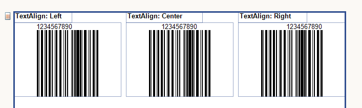
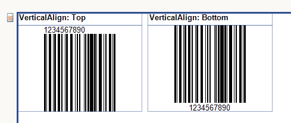

# 1D Barcodes


## 1D Barcodes

One-dimensional (1D) barcodes consists of lines and spaces of various widths that create specific patterns.         

## Settings

This section describes the common settings for one-dimensional barcodes.         

*  [ShowText](/reporting/api/Telerik.Reporting.Barcodes.Encoder1D#Telerik_Reporting_Barcodes_Encoder1D_ShowText)  - when true shows the text together with the bars.             When the text is shown it can also be aligned horizontally by using the __TextAlign__  property of the                [Style](/reporting/api/Telerik.Reporting.ReportItemBase#Telerik_Reporting_ReportItemBase_Style)  object and/or               vertically through the __VerticalAlign__  property of the                [Style](/reporting/api/Telerik.Reporting.ReportItemBase#Telerik_Reporting_ReportItemBase_Style)  object.               

    

  

## Additional information on Code128

1. Code128A, Code128B and Code128C represent the A, B and C subsets of the Code128 symbology. Code128 uses an intelligent algorithm that               picks automatically the appropriate subset according to the input value, and might switch between these subsets in the middle of a barcode               in order to produce a shorter generated sequence. For example, if you have the input string “ABCD1234”, the “ABCD” part of the string will               be encoded using the A subset, while the “1234” part will be encoded with the C subset, because Code128C uses a double-density code for               numerical values, thus producing a shorter barcode as a result. If you want to disable this behavior you can specify explicitly one of               the subsets: Code128A, Code128B or Code128C to the Symbology property of the barcode report item.             

1. Code128 can represent both ASCII characters and non-ASCII control characters. Normally the barcode report item inserts automatically               the appropriate control characters in order to conform to the Code128 specification. However certain applications might require manual               insertion of certain control characters, such as the functional characters: FNC1-FNC4. For this purpose the barcode report item assigns               special Unicode values to these control characters outside the normal 0-127 ASCII code range. The following table lists all Code128 control               characters and their corresponding Unicode values:             


>caption Code 128 Control Characters

| Control Character | Hexadecimal | Decimal |
| ------ | ------ | ------ |
|Code A|F4|244|
|Code B|F5|245|
|Code C|F6|246|
|FNC1|F7|247|
|FNC2|F8|248|
|FNC3|F9|249|
|FNC4|FA|250|
|Shift|FB|251|
|Start A|FC|252|
|Start B|FD|253|
|Start C|FE|254|
|Stop|FF|255|


For example, the following code inserts the FNC4 control character in the middle of a barcode:

	
````C#
				this.barcode1.Value = "ABCD" + "\u00FA" + "1234";
````
````VB.NET
				me.barcode1.Value = "ABCD" & ChrW(&HFA) & "1234"
````


## Additional information on GS1-128

GS1-128 is a special case of Code128. The only difference between GS1-128 and           Code 128 is that GS1-128 inserts the FNC1 control character at the beginning of the           barcode in order to conform to the GS1-128 specification. If you have a multi-part           GS1-128 barcode which requires the FNC1 control character as a delimiter between           the different parts, you should insert it manually:         

	
````C#
			this.barcode1.Value = "1234" + "\u00F7" + "5678";
````
````VB.NET
			me.barcode1.Value = "1234" & ChrW(&HF7) & "5678"
````


# See Also
 * [Telerik.Reporting.Barcode](/reporting/api/Telerik.Reporting.Barcode)  * [Encoder](/reporting/api/Telerik.Reporting.Barcode#Telerik_Reporting_Barcode_Encoder)  * [BarAlign](/reporting/api/Telerik.Reporting.Barcode#Telerik_Reporting_Barcode_BarAlign)  * [Checksum](/reporting/api/Telerik.Reporting.Barcode#Telerik_Reporting_Barcode_Checksum)  * [Module](/reporting/api/Telerik.Reporting.Barcode#Telerik_Reporting_Barcode_Module)  * [Stretch](/reporting/api/Telerik.Reporting.Barcode#Telerik_Reporting_Barcode_Stretch)  * [Angle](/reporting/api/Telerik.Reporting.Barcode#Telerik_Reporting_Barcode_Angle)  * [Telerik.Reporting.Barcodes.Encoder1D](/reporting/api/Telerik.Reporting.Barcodes.Encoder1D)  * [ShowText](/reporting/api/Telerik.Reporting.Barcodes.Encoder1D#Telerik_Reporting_Barcodes_Encoder1D_ShowText) 
