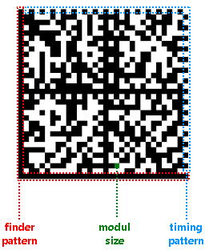

# Data Matrix Overview

Data Matrix barcode is a two-dimensional type of code used widely in industry for marking small parts and items due to its high data density and reliability.         Data Matrix code consists of dark and light square cells that form a matrix. The produced code can be square or rectangular and can have size up to 144x144 for square codes         or 16x48 for rectangular codes. To provide better readability, the Data Matrix code includes error correction algorithm, allowing to reconstruct up to 30% of damaged code image.       

## Data Matrix Barcode Structure  

  

* __Finder pattern__  - the L-shaped lines at the bottom and left of the code are called "finder pattern". It is used by the readers for orientation, adjustment and to correct distortion.             

* __Module size__  - the smallest cell in the code graphical representation. The module size is recommended to be at least 2x2 printed dots for better readability.             

* __Timing pattern__  - the lines at the top and right of the code are called "timing pattern". It provides information about the barcode size.             

* __Data area__  - the area surrounded by the finding pattern and timing pattern. Contains the modules that encode the barcode contents.             

The size of the Data Matrix code depends on module size, length and type of its contents. The contents type determines if the encoded value contains only numerical characters or includes ASCII or Unicode characters.           The following table shows the correlation between the content type, content length and matrix size:         

| Count of numerical characters | Count of ASCII characters | Matrix size |
| ------ | ------ | ------ |
|6|3|10x10|
|10|6|12x12|
|16|10|14x14|
|24|16|16x16|
|36|25|18x18|
|44|31|20x20|
|60|43|22x22|
|72|52|24x24|
|88|64|26x26|
|124|91|32x3|

# See Also

