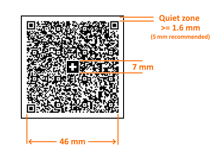

# Swiss QR Code Overview

The Swiss QR barcode is used mostly in the QR-bill - a document that is designed to replace the payment slips, currently used in Switzerland's payment transactions.         This barcode uses the QR symbology to encode its data, applying a few rules on the encoding parameters and physical (printed) dimensions.       

## Visual Stucture

The structure layout of the Swiss QR barcode is shown below:  

  

The most important characteristics of the Swiss QR barcode are listed below:         

* To ensure that the Swiss QR Code is read securely, a minimum module size of __0.4 mm__  is required when printing.               Converted to pixels on 96 DPI that makes ~1.51px. Due to rounding to a whole pixel, when the barcode is previewed on a computer screen,               it might seem that some modules have different size than the others.             This effect gets resolved when rendering in a format that uses anti-aliasing and should not be observed when printing, due to printer's higher DPI.             

* The measurements of the Swiss QR Code for printing must always be __46 x 46 mm__  without the surrounding quiet space.               To satisfy this requirement, the barcode item will calculate the minimum size of the Barcode item on the design surface and will display an error message if the item size is not large enough.             Forcing a constant barcode size also makes the  [Stretch](/reporting/api/Telerik.Reporting.Barcode#Telerik_Reporting_Barcode_Stretch)                property redundant, so it is not respected.             

* The quiet zone (also called *quiet area* ) is the space surrounding the barcode modules.               The QR barcode specification mandates that the quiet zone at least 4 modules wide, which equals to __1.6 mm__  given the minimum module size.               The Swiss QR Code design specifications suggests the quiet zone to be set to __5 mm__ .             To satisfy this requirement the  [SwissQREncoder](/reporting/api/Telerik.Reporting.Barcodes.SwissQREncoder)  provides a dedicated property named                [QuietZone](/reporting/api/Telerik.Reporting.Barcodes.SwissQREncoder#Telerik_Reporting_Barcodes_SwissQREncoder_QuietZone)                that allows to set the width of the quiet zone in string format - i.e. *5mm* , *0.5cm*  or *0.2in* .             

* To increase the recognizability, the Swiss QR Code contains an additional recognition symbol - a Swiss cross logo measuring __7 x 7 mm__ .                The logo is rendered in the center of the barcode, overlaying the existing barcode modules.             

# See Also

# See Also

 * [          Swiss Implementation Guidelines QR-bill (PDF)
        ](https://www.paymentstandards.ch/dam/downloads/ig-qr-bill-2019-en.pdf)

 * [          Swiss QR Code validator
        ](https://www.swiss-qr-invoice.org/validator/)
