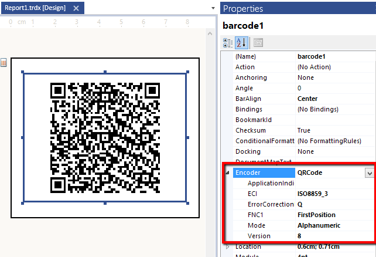
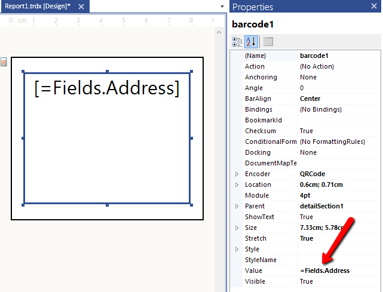
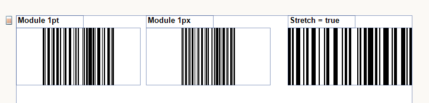
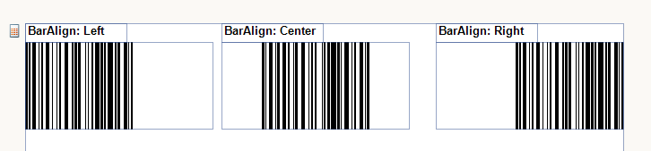
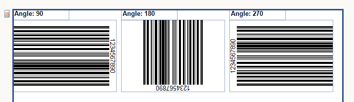

# Barcode Overview


The Barcode item is used for automatic barcode generation directly from a numeric or character data. This article elaborates on how to create and use barcodes in a report.

## Setting up a barcode

* In order to specify the type of the barcode use the  [Encoder](/reporting/api/Telerik.Reporting.Barcode#Telerik_Reporting_Barcode_Encoder)   property.             After choosing the desired encoder you can further adjust its specific settings if availabe:  

  

* The value which is encoded is set through the                [Value](/reporting/api/Telerik.Reporting.Barcode#Telerik_Reporting_Barcode_Value)  property.               It can be a static string or an expression which is evaluated at runtime:               

  

* The width (size) of the barcode elements is specified in two ways:

   + Using the  [Module](/reporting/api/Telerik.Reporting.Barcode#Telerik_Reporting_Barcode_Module)  property                 

   + Auto calculated from the size of the item when the  [Stretch](/reporting/api/Telerik.Reporting.Barcode#Telerik_Reporting_Barcode_Stretch)  proprty is set to true                   

  

* Additionally you can further adjust the barcode appearance:

   + Align the bars to the item's edges through the  [BarAlign](/reporting/api/Telerik.Reporting.Barcode#Telerik_Reporting_Barcode_BarAlign)  property.                   

  This property is not applicable when the  [Stretch](/reporting/api/Telerik.Reporting.Barcode#Telerik_Reporting_Barcode_Stretch)  property is set to true.                 

   + Rotate the barcode throught the  [Angle](/reporting/api/Telerik.Reporting.Barcode#Telerik_Reporting_Barcode_Angle)  property.                   

  When the angle is not divisable by 90 degrees and the  [Stretch](/reporting/api/Telerik.Reporting.Barcode#Telerik_Reporting_Barcode_Stretch)  property is true,                   the barcode will be scaled down so that it fits into the item bounds.                 

   + To include a checksum in the barcode use the  [Checksum](/reporting/api/Telerik.Reporting.Barcode#Telerik_Reporting_Barcode_Checksum)  property.                   Note that in some symbologies there is either no checksum or the checksum is part of its specification.                   In these cases this property will have no effect.                 

## Examples

{{source=CodeSnippets\CS\API\Telerik\Reporting\BarcodeSnippets.cs region=Barcode_Common_Settings}}
````cs
	            var encoder = new Telerik.Reporting.Barcodes.Code128AEncoder();
	
	            // Set any specific encoder settings...
	            encoder.ShowText = false; // The default value is true.
	
	            this.barcode1.Encoder = encoder;
	            this.barcode1.Angle = 90;
	            this.barcode1.BarAlign = Telerik.Reporting.Drawing.HorizontalAlign.Left;
	            this.barcode1.Checksum = true;
	            this.barcode1.Module = Telerik.Reporting.Drawing.Unit.Point(3);
	            this.barcode1.Stretch = false;
	            this.barcode1.Value = "1234567890";
````
{{source=CodeSnippets\VB\API\Telerik\Reporting\BarcodeSnippets.vb region=Barcode_Common_Settings}}
````vbnet
	        Dim encoder = New Telerik.Reporting.Barcodes.Code128AEncoder()
	
	        ' Set any specific encoder settings...
	        encoder.ShowText = False 'The default value is True
	
	        Me.barcode1.Encoder = encoder
	        Me.barcode1.Angle = 90
	        Me.barcode1.BarAlign = Telerik.Reporting.Drawing.HorizontalAlign.Left
	        Me.barcode1.Checksum = True
	        Me.barcode1.Module = Telerik.Reporting.Drawing.Unit.Point(3)
	        Me.barcode1.Stretch = False
	        Me.barcode1.Value = "1234567890"
````


# See Also
 * [Telerik.Reporting.Barcode](/reporting/api/Telerik.Reporting.Barcode)  * [Encoder](/reporting/api/Telerik.Reporting.Barcode#Telerik_Reporting_Barcode_Encoder)  * [Value](/reporting/api/Telerik.Reporting.Barcode#Telerik_Reporting_Barcode_Value)  * [Module](/reporting/api/Telerik.Reporting.Barcode#Telerik_Reporting_Barcode_Module)  * [Stretch](/reporting/api/Telerik.Reporting.Barcode#Telerik_Reporting_Barcode_Stretch)  * [BarAlign](/reporting/api/Telerik.Reporting.Barcode#Telerik_Reporting_Barcode_BarAlign)  * [Angle](/reporting/api/Telerik.Reporting.Barcode#Telerik_Reporting_Barcode_Angle)  * [Checksum](/reporting/api/Telerik.Reporting.Barcode#Telerik_Reporting_Barcode_Checksum) 
