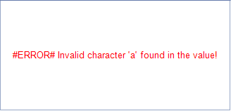
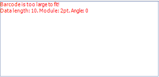
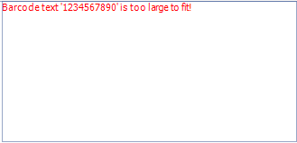

# Troubleshooting

Troubleshooting

This section elaborates on the most common errors which occur when using the Barcode item and explains how to avoid them.

* Some of the barcode types (symbologies) restrict the characters which can be used in             the encoded data. If during the encoding an invalid character for the symbology is encountered             an error message is shown instead of the actual barcode. In this case make sure that you provide             a value that conforms with the symbology character set.             

  

* It may happen that the generated barcode size is greater that the available size from the item. In this             case an error message is shown instead of the actual barcode. To workaround this issue you can increase the             size of the Barcode item, set the Barcode.Stretch property to true or use a smaller value for the Barcode.Module             property.             

  

* When ShowText is set to __true__  and the size of the text exceeds the bounds of the Barcode item an error             message is rendered to indicate the problem. In this case it is recommended to change the font size, pick another font or increase the size of the item.             

  

* Some encoders (Intelligent Mail, PLANET) require the barcode value to have specific lengths. For Intelligent Mail barcode the supported lengths are 20, 25, 29 or 31             characters. For PLANET barcode the supported lengths are 11 or 13 characters. If the barcode value does not satisfy these conditions, a descriptive error message is shown.             

  

# See Also

