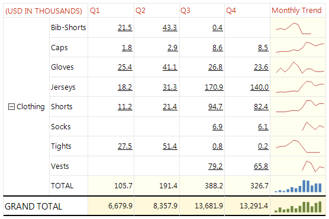

# Chart (obsolete)


## 

>note The Chart item is now superseded by the more advanced [Graph]() item.             The Graph item is most often used for building powerful OLAP/Pivot charts.           The Chart item is not supported in .NET Core projects and in projects deployed on Azure.           


The Chart report item is used to display a chart on a report. It is business-oriented item with a           focus on development productivity and ease-of-use. It allows you to rapidly build appealing charts           that represent data in a people-friendly manner.           

  


You can bind the Chart item:

* From the Report Designer by setting its DataSource property

* By using its NeedDataSource event

When you are in the event, you should work with the processing chart item i.e.:

	
````C#
			private void chart1_NeedDataSource(object sender, System.EventArgs e)
			{
				Telerik.Reporting.Processing.Chart procChart = (Telerik.Reporting.Processing.Chart)sender;
				procChart.DataSource = your_datasource;
			}
````
````VB.NET
			Private Sub chart1_NeedDataSource(sender As Object, e As System.EventArgs)
				Dim procChart As Telerik.Reporting.Processing.Chart = DirectCast(sender, Telerik.Reporting.Processing.Chart)
				procChart.DataSource = your_datasource
			End Sub
````


The formatting of the Chart report item is managed by a large number of properties.           To customize the Chart report item, right-click the chart and select Properties from           the context menu to use the Chart Wizard.         

The Chart item offers numerous features including:

* [17 customizable chart types](7377B896-2B2A-4EB6-BF58-E82E4D5BCF39)

* Automatic Text-wrapping- text elements in the chart can be wrapped automatically.

* [Databinding](48673F68-F7A8-4742-B480-ED7F8352E83D)

* [Chart wizard](486151D3-3162-4815-ACFA-1AF441A9C520)

* [Second Y axis](86F9874F-2930-4E1D-A6C6-06ABB26FB4DA)

* [Empty Values](82EC620B-D42B-46FB-805B-AC2C85232652)

* [Scale Breaks](EB54443C-0410-45F5-80CA-71DF8039CD80)

* [Marked zones](B4ED9BAA-EEB3-4142-B9BA-70CA375441FC)

* [Styling](2CFC6F7D-0B66-4C30-B744-65B05C2A78C7) [](http://www.telerik.com/help/aspnet/chart/introduction.html) 

# See Also


# See Also

 * [Telerik Charting Documentation](http://www.telerik.com/help/aspnet/chart)

 * [Chart](/reporting/api/Telerik.Reporting.Chart) 
