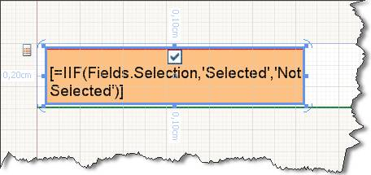
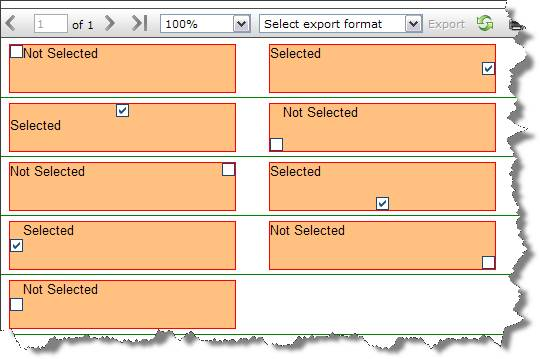
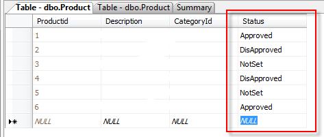
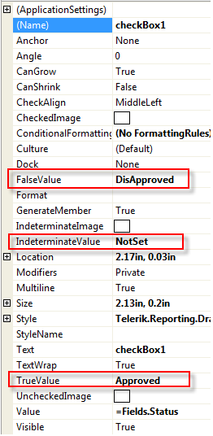
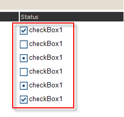

# Checkbox

The CheckBox report item is used to display both text and a check mark on a report. This screenshot shows a CheckBox report item with CheckAlign property set to TopCenter and text aligned to Top and left.  

  

## Growing and Shrinking

By default, CheckBox items are a set size. If you want to allow a CheckBox to expand vertically based on its contents,           set the  [CanGrow](/reporting/api/Telerik.Reporting.TextItemBase#Telerik_Reporting_TextItemBase_CanGrow)  property to True (default value).           If you want to allow a CheckBox to shrink based on its contents set the            [CanShrink](/reporting/api/Telerik.Reporting.TextItemBase#Telerik_Reporting_TextItemBase_CanShrink)  property to           True (default value is False). The CheckBox would always grow to accomodate the first line of text even when CanGrow is False.         

## Embedded expressions

The text part of the Checkbox report item supports [             embedded             expressions           ]() for mail merge functionality. Embedded expressions give you the freedom to get and insert data-driven           information directly into the CheckBox.Text property to produce customized reports and mail merging.         

A view where each CheckBox is initialized with CheckAlign varying from TopLeft to BottomRight:   

  

The check mark image depends on the value set in the __Value__  property. By default it would accept  =true or =false. At design time the __Value__  property can be initialized with an expression which later at runtime is evaluated to one of the System.Windows.Forms.CheckState values e.g.:         

=IsNull(Fields.Quantity, 0) > 100 which would return true or false and would check and uncheck the check mark respectively.         

Also if your data fields return two/three distinctive values, which are not true/false you can change the TrueValue/FalseValue/IndeterminateValue properties to match your field values directly.         

## Example:

You have a Status field that has three values:

* Approved 

* DisApproved 

* NotSet   

  

In such case it is more convenient to use those values directly instead of trying to evaluate them as true/false. You can do that easily by using the TrueValue/FalseValue/IndeterminateValue properties:  

  

And here is the final result:  

  

# See Also
 * [Telerik.Reporting.CheckBox](/reporting/api/Telerik.Reporting.CheckBox)  * [CheckAlign](/reporting/api/Telerik.Reporting.CheckBox#Telerik_Reporting_CheckBox_CheckAlign)  * [CheckedImage](/reporting/api/Telerik.Reporting.CheckBox#Telerik_Reporting_CheckBox_CheckedImage)  * [UncheckedImage](/reporting/api/Telerik.Reporting.CheckBox#Telerik_Reporting_CheckBox_UncheckedImage)  * [FalseValue](/reporting/api/Telerik.Reporting.CheckBox#Telerik_Reporting_CheckBox_FalseValue)  * [IndeterminateImage](/reporting/api/Telerik.Reporting.CheckBox#Telerik_Reporting_CheckBox_IndeterminateImage)  * [IndeterminateValue](/reporting/api/Telerik.Reporting.CheckBox#Telerik_Reporting_CheckBox_IndeterminateValue)  * [Text](/reporting/api/Telerik.Reporting.CheckBox#Telerik_Reporting_CheckBox_Text)  * [TrueValue](/reporting/api/Telerik.Reporting.CheckBox#Telerik_Reporting_CheckBox_TrueValue) 
