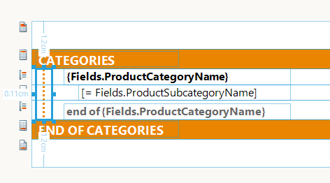

# Cross-section Item


The Cross-section Item is used to display a graphical primitive (vertical line or rectangle) across one or more report sections.         It is often used in scenarios where the parts of the reports - usually group sections - needs to be visually distinguished from each other.         The following screenshot shows how the Cross-section item looks like in the Standalone Report Designer:         

  

You can use shapes to create visual effects within a report. You can set display and other properties to this item by         using the Properties pane.       

## Properties

The properties that define the behavior of the Cross-section item are listed below:

* __BeginSection__  - this property defines the report section from which the cross-section item will start. It can be any instance of                [ReportSectionBase](/reporting/api/Telerik.Reporting.ReportSectionBase)  class: PageHeader, ReportHeader or GroupHeader.             

* __BeginMargin__  - this property defines the offset from the top of the __BeginSection__  measured in                [Unit](/reporting/api/Telerik.Reporting.Drawing.Unit) s.               The offset will be preserved if the __BeginSection__  changes its size at runtime.             

* __EndSection__  - this property defines the report section at which the cross-section item will end. It also can be any instance of                [ReportSectionBase](/reporting/api/Telerik.Reporting.ReportSectionBase)  class: PageFooter, ReportFooter or GroupFooter.             

* __EndMargin__  - this property defines the offset from the bottom of the __EndSection__  measured in                [Unit](/reporting/api/Telerik.Reporting.Drawing.Unit) s.               The offset will be preserved if the __EndSection__  changes its size at runtime.             

The properties that define the appearance of the Cross-section item are listed below:         

* __Type__  - this property defines the type graphical primitive rendered by the cross-section item.               It can be *Line*  or *Rectangle* . The default value is *Line* .             

* __Position__  - this property defines whether the cross-section item will be rendered under the rest of the report items or on top of them.               It can be set to *Behind*  or *Front* . The default value is *Behind* .             

The  [Location](/reporting/api/Telerik.Reporting.ReportItem#Telerik_Reporting_ReportItem_Location)  and            [Size](/reporting/api/Telerik.Reporting.ReportItem#Telerik_Reporting_ReportItem_Size)  properties are calculated based on the           *BeginSection* , *BeginMargin* , *EndSection*  and *EndMargin*  properties.           Changing the values of the  [Location](/reporting/api/Telerik.Reporting.ReportItem#Telerik_Reporting_ReportItem_Location) - or            [Size](/reporting/api/Telerik.Reporting.ReportItem#Telerik_Reporting_ReportItem_Size) -related property like            [Top](/reporting/api/Telerik.Reporting.ReportItem#Telerik_Reporting_ReportItem_Top) ,            [Left](/reporting/api/Telerik.Reporting.ReportItem#Telerik_Reporting_ReportItem_Left) ,            [Width](/reporting/api/Telerik.Reporting.ReportItem#Telerik_Reporting_ReportItem_Width)  or            [Height](/reporting/api/Telerik.Reporting.ReportItem#Telerik_Reporting_ReportItem_Height)  will recalculate the values of           *BeginSection* , *BeginMargin* , *EndSection*  and *EndMargin*  properties.         

In most scenarios the *Begin-*  and *End*  sections would have matching types and hierarchy levels, i.e.            *ReportHeader - ReportFooter, GroupHeader - GroupFooter* . Choosing mismatching sections can produce unexpected rendering results.         

## Instantiation and Design-Time Support

Since the Cross-section item can refer to more than one report sections, its parent is the  [Report](/reporting/api/Telerik.Reporting.Report)  item.           Hence the Cross-section item can be dragged from the designer's toolbox onto the designer surface without selecting any report section first.           When the Cross-section item is moved or resized on the report designer surface, its Begin- and End-related properties are automatically calculated based on its current location and size and displayed in the Properties window.         

Selecting a Cross-section item can be done through the [Report Explorer]() tool window or by clicking on the graphical primitive the item displays.           If its *Type*  is set to __Line__ , the item's selectable area is on both sides of the displayed vertical line and spans to at least 6 pixels.           If the item's *Type*  is set to __Rectangle__ , the selectable area can be any of its sides, again spanning to at least 6 pixels.         

>note The Cross-section item has complete design-time support in Standalone Report Designer and Visual Studio Report Designer. The Web Report Designer currently provides basic designing capabilities and some of the properties of the Cross-section item cannot be edited through the dedicated property editors.


The Cross-section item can be added programmatically to a report with the following code:         

{{source=CodeSnippets\CS\API\Telerik\Reporting\CrossSectionItemSnippets.cs region=CreateAndInitializeCrossSectionItemSnippet}}
````c#
	        void CreateAndInitializeCrossSectionItem()
	        {
	            var reportGroup = report.Groups[0];
	
	            var crossSectionItem = new CrossSectionItem();
	            report.Items.Add(crossSectionItem);
	
	            crossSectionItem.BeginSection = reportGroup.GroupHeader;
	            crossSectionItem.BeginMargin = Drawing.Unit.Cm(0.5);
	            crossSectionItem.EndSection = reportGroup.GroupFooter;
	            crossSectionItem.EndMargin = Drawing.Unit.Cm(0.5);
	
	            crossSectionItem.Left = Drawing.Unit.Cm(1);
	            crossSectionItem.Width = Drawing.Unit.Cm(1);
	        }
	
````
{{source=CodeSnippets\VB\API\Telerik\Reporting\CrossSectionItemSnippets.vb region=CreateAndInitializeCrossSectionItemSnippet}}
````vb.net
	    Private Sub CreateAndInitializeCrossSectionItemSnippet()
	        Dim reportGroup = report.Groups(0)
	        Dim crossSectionItem = New Telerik.Reporting.CrossSectionItem()
	        report.Items.Add(crossSectionItem)
	
	        crossSectionItem.BeginSection = reportGroup.GroupHeader
	        crossSectionItem.BeginMargin = Telerik.Reporting.Drawing.Unit.Cm(0.5)
	        crossSectionItem.EndSection = reportGroup.GroupFooter
	        crossSectionItem.EndMargin = Telerik.Reporting.Drawing.Unit.Cm(0.5)
	
	        crossSectionItem.Left = Telerik.Reporting.Drawing.Unit.Cm(1)
	        crossSectionItem.Width = Telerik.Reporting.Drawing.Unit.Cm(1)
	    End Sub
````


The order of assignments is important, because settings any *Location* - or *Size* -related properties           would iterate through the sections of the report, determining which of its sections should be assigned to the *BeginSection*  and *EndSection*  properties,           and also set the corresponding margins. That's why the item needs to be added to the Report's Items collection first and then assign its section-related properties.         

## Processing and Rendering

The Cross-section item is rendered per each page based on the occurrences of the report sections that match its *Begin-*  and *End*  section settings.           If the *EndSection*  is positioned on a following page or report column, the Cross-section item will generate a graphical primitive that spans to the end of the usable page area           and continues from the top of the next page.         

The Cross-section item uses the report's data context and cannot be evaluated against detail or group data.           The processing engine produces a single instance per each Cross-section item in the report definition, therefore its style or visibility cannot be changed based on data fields.         

The Cross-section item is designed to aid the production of form-type reports and it tries to preserve its location and size set at design-time.           It will not grow when the report or any of its report section grows horizontally, therefore it won't be rendered on a page, generated as a result of such horizontal paging.            However, in a multi-column report the Cross-section item will be generated per each report column shown on a page.                   

The Cross-section item is not supported in all rendering extensions. Please check the corresponding "Design Considerations" article to ensure if it is supported for a given rendering extension.         

# See Also


 * [Understanding Pagination]()
