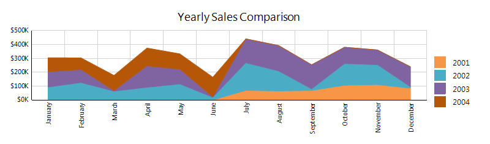

# Area Charts Overview

An area chart displays a series as a set of points connected by a line, with all the area filled in below the line.         Area charts are appropriate for visualizing data that fluctuates over a period of time and can be useful for emphasizing trends.         Values that don't vary too wildly work best for area charts.       

The following image shows an example of a stacked area chart:  

  

## Variations of the Area Charts

* __Area__ . An area chart displays a series as a set of points connected by a line, with all the area filled in below the line.             

* __Stacked Area__ . An area chart where multiple series are stacked vertically.               If there is only one series in your chart, the stacked area chart will display the same as an area chart.             

* __100% Percent Stacked Area__ . An area chart where multiple series are stacked vertically               to fit the entire chart area. If there is only one series in your chart, the stacked area chart will display the same as an area chart.             

* __Smooth Area__ . An area chart where the data points are connected by a smooth line instead of a regular line.               Use a smooth area chart instead of an area chart when you are more concerned with displaying trends than with displaying the values of individual data points.             

# See Also

 * [Chart Types]() * [AreaSeries](/reporting/api/Telerik.Reporting.AreaSeries)  * [ArrangeMode](/reporting/api/Telerik.Reporting.GraphSeries2D#Telerik_Reporting_GraphSeries2D_ArrangeMode)  * [SmoothLine](/reporting/api/Telerik.Reporting.AreaSeries#Telerik_Reporting_AreaSeries_SmoothLine) 
