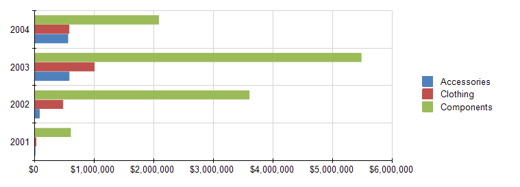

# Bar Charts Overview

Bar charts display series as sets of horizontal bars. Usually they are used to graphically summarize and display categories        of data and let the user easily compare amounts or values between different categories. Bar charts are also useful for comparing multiple        series of data (i.e. providing snapshots of data at particular points in time). For this reason, it is popular for representing data that        occurs over time, with a finite start and end date. It is also popular for showing categorical information since the categories can be        displayed horizontally.

The following image shows a typical bar chart. The bar chart is well suited for this data because all three series share a common time        period, allowing for valid comparisons to be made.  

  

## Bar Chart Variations

* __Clustered Bar Chart__ . A bar chart used to display series as sets of horizontal bars.

* __Stacked Bar Chart__ . A bar chart where multiple series are stacked vertically.   				Stacked bar charts are used to compare contributions of values to a total across categories. If there is only    				one series in your chart, the stacked column chart will  display the same as a column chart.   				

* __100% Stacked Bar Chart__ . A bar chart where multiple series are stacked vertically to fit 100%   				of the chart area. 100% Stacked Bar Charts are used when you have three or more data series and want to compare distributions    				within categories, and at the same time display the differences between categories. Each bar represents 100% of the amounts    				for that category. If there is only one series in your chart, all the bars will fit to 100% of the chart area.   			

## Design Considerations for Bar Charts

* Bar charts have their axes reversed. The category axis is the vertical axis (or the Y axis)          		and the value axis is the horizontal axis (or the X axis). This means that in a bar chart, you have more space          		for category labels to be displayed along the Y axis as a list that reads from top to bottom.

* Bar and column charts are most commonly used to show comparisons between groups. If more than          		three series are present on the chart, consider using a stacked bar or column chart.

* A bar chart displays values from left to right, which may be more intuitive when displaying data          		related to durations.

* When data point labels are shown on a bar chart, the labels are placed on the outside end of each bar (OutsideEnd).         		This can cause a label to be overlapped by its corresponding bar when the bar takes up all of the allotted space within the chart area. You can change the position          		of the data point labels displayed for each bar by setting the  [DataPointLabelAlignment](/reporting/api/Telerik.Reporting.BarSeries#Telerik_Reporting_BarSeries_DataPointLabelAlignment)  property in the Properties tool window.

* If there are a lot of data points in your dataset relative to the size of your chart, the size of the bars         		and the spacing between them are reduced. To modify the width of the bars in a chart consider changing the 				__SpacingSlotCount__  property of the __category__  axis scale. By default the          		value is 1 which indicates equal widths of the bars and the free space. The greater the value is the more free space  				is reserved between the bars.

# See Also

 * [Chart Types]() * [BarSeries](/reporting/api/Telerik.Reporting.BarSeries)  * [ArrangeMode](/reporting/api/Telerik.Reporting.GraphSeries2D#Telerik_Reporting_GraphSeries2D_ArrangeMode)  * [DataPointLabelAlignment](/reporting/api/Telerik.Reporting.BarSeries#Telerik_Reporting_BarSeries_DataPointLabelAlignment)  * [SpacingSlotCount](/reporting/api/Telerik.Reporting.Scale#Telerik_Reporting_Scale_SpacingSlotCount) 
