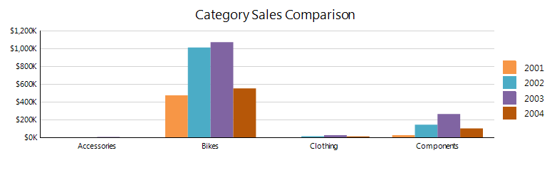

# Column Charts Overview

A column chart displays a series as a set of vertical bars that are grouped by category. Column charts are useful for         showing data changes over a period of time or for illustrating comparisons among items. The plain column chart is closely related         to the bar chart, which displays series as sets of horizontal bars, and the range column chart, which displays series as sets of         vertical bars with varying beginning and end points.       

The following image shows a typical column chart:  

  

## Column Chart Variations

* __Clustered Column Chart__ . The basic column chart type used to display a series as a set of vertical bars that are grouped by category.             

* __Stacked Column Chart__ . A column chart where multiple series are stacked vertically.               Stacked column charts are used to compare contributions of values to a total across categories. If there is only               one series in your chart, the stacked column chart will display the same as a column chart.             

* __100% Stacked Column Chart__ . A column chart where multiple series are stacked vertically               to fit 100% of the chart area. 100% Stacked Column Charts are used when you have three or more data series and want               to compare distributions within categories, and at the same time display the differences between categories. Each column               bar represents 100% of the amounts for that category. If there is only one series in your chart, all the column bars will               fit to 100% of the chart area.             

## Design Considerations for Column Charts

* Column charts are most commonly used to show comparisons between groups. If more than three series are               present on the chart, consider using a stacked column chart.             

* In a column chart, you have less space for category axis labels to display horizontally. If you have longer               category labels, consider using a bar chart or changing the rotation angle of the label through the               __LabelAngle__  property of the axis.             

* If there are a lot of data points in your dataset relative to the size of your chart, the size of the columns               and the spacing between them are reduced. To modify the width of the columns in a chart consider changing the               __SpacingSlotCount__  property of the __category__  axis scale. By default the               value is 1 which indicates equal widths of the column and the free space. The greater the value is the more free space               is reserved between the columns.             

# See Also

 * [Chart Types]() * [BarSeries](/reporting/api/Telerik.Reporting.BarSeries) 
