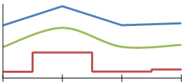

# Line Charts Overview

A line chart displays a series as a set of points connected by a single line. Line charts are used to representing        large amounts of data that occur over a continuous period of time. They can also be used to display a series of data points,        typically to show trends over a period of time. One or more series of data can be used and the appearance for each series        can be tailored to emphasize the data using unique colors, line thickness, pen style, and point marks.       

The following image displays a line chart that contains three series.         

  

## Line Chart Variations  

  

* __Straight Line Chart__ .               A line chart that uses straight lines to connect the data points.             

* __Smooth Line Chart__ .               A line chart that uses curved lines instead of regular ones.             

* __Stepped Line Chart__ .               A line chart that uses horizontal and vertical lines to connect the data points, creating a step-like strcuture.             

## Design Considerations for Line Charts

* To improve the visual impact of the default line chart, consider increasing the thickness    				of the series line. This will create a bolder line chart.

* A line chart requires at least two points to draw a line.

* A series that is drawn as a line will not take up much space within a chart area.    				For this reason, line charts are frequently combined with other chart types such as column charts.

# See Also

 * [Chart Types]() * [LineSeries](/reporting/api/Telerik.Reporting.LineSeries) 
