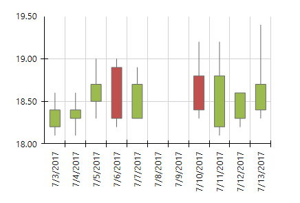

# How to Create OHLC Chart

In this article we will show you how to create an OHLC chart using the Graph item. 

  

## Create an OHLC chart using the Graph Wizard

1. The Graph Wizard provides a fast and efficient way to create complex charts. The wizard starts every time you start creating a new graph in [Standalone Report Designer]() or [Visual Studio Report Designer](). In this scenario we will use the __Standalone Report Designer__, but the steps are applicable to both designers. Start the designer and open or create a new report. Select the report section in which the Graph item will be placed. From the *Insert* tab find *Charts* section and select *Scatter* menu. Its *Financial* group has two items - __Candlestick__ and __Bar__, which provide the same functionality, but produce different series markers. In this how-to article we'll create a series with candlestick markers. 

1. In a real-world application the data would be retrieved from a database, but here we'll use some sample data as a CSV data source. Create a new CSV data source and paste the following text as content: 
    
              date,open,high,low,close
              03.07.2017,18.2,18.6,18.1,18.4
              04.07.2017,18.3,18.6,18.1,18.4
              05.07.2017,18.5,19,18.3,18.7
              06.07.2017,18.9,19,18.2,18.3
              07.07.2017,18.3,18.9,18.3,18.7
              10.07.2017,18.8,19.2,18.3,18.4
              11.07.2017,18.2,19.2,18.1,18.8
              12.07.2017,18.3,18.6,18.2,18.6
              13.07.2017,18.4,19.4,18.3,18.7
            

    Set the field separator to comma and check the *The CSV has headers* checkbox. Define the column types and preview the data using the __Parse CSV...__ button to make sure the data source is set up correctly. 

1. In the *Arrange graph fields* page drag the __date__ column to *Categories* box. Drag the __open, high, low__ and __close__ fields to their respective boxes in the bottom right corner. If you click the *Set default datapoint styling* checkbox, the wizard will add conditional formatting rules that will change the datapoint color depending on the open-close values. You can click the __Finish__ button or setup additional properties of the DateTime scale and the finish the wizard. When you close the wizard, the newly created chart will appear. 

1. Format the axis labels, set their angle and add additional styling if necessary. Your chart should look like the one below: 

   
  
  The marker width is automatically calculated based on two properties. The first property is the X scale's [SpacingSlotCount](/reporting/api/Telerik.Reporting.Scale#Telerik_Reporting_Scale_SpacingSlotCount). The second property is series' [MinMarkerWidth](/reporting/api/Telerik.Reporting.OhlcSeries#Telerik_Reporting_OhlcSeries_MinMarkerWidth), which determines the minimum width of the marker, measured in [Unit](/reporting/api/Telerik.Reporting.Drawing.Unit), i.e. 10px, 1cm, etc. By default the wizard sets the __MinMarkerWidth__ to 6px. Note the gaps between 07.07.2017 and 10.07.2017 where there are no data points. Since you are using a DateTime field to create the categories, the wizard will automatically create a  [DateTimeScale](/reporting/api/Telerik.Reporting.DateTimeScale) scale for your X axis. The DateTime scale represents the values in a continuous domain - that's why you see axis labels for 08.07.2017 and 09.07.2017 even if there are no data for these dates. In case you do not want to have such gaps, you should use a  [CategoryScale](/reporting/api/Telerik.Reporting.CategoryScale) for your X axis. 

In this article we explained how to use the Graph Wizard to create a candlestick series, presenting stock prices over a period of time. 

# See Also

* [Graph Structure]()

* [Overview]()

* [Overview]()
