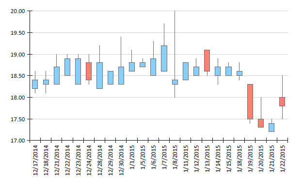
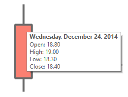
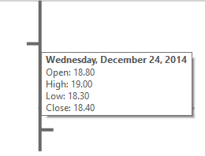

# OHLC Charts Overview

The OHLC chart displays a series of candlestick or bar markers that represent information about the price movement of a stock over a period of time.         The price movement is determined by four values - open, high, low and close marks of the stock price - that form the layout of the marker. Additionally the         marker can be colored depending on the movement of the price for this period - if the close level is lower than the open level,         it's recognized as a *bearish*  pattern and the color or the fill or the marker changes so it can be distinguished from the         *bullish*  pattern, where the close level is higher than the open level.       

The following image shows an example of a candlestick OHLC chart:  

  

## OHLC chart types

The look of the OHLC series markers can be changed in order to cover the two most used types of OHLC charts - __candlestick__  and __bar__ .            The following screenshots show the marker types with the explanational tooltip.         

* __Candlestick marker__   

  The body of the candlestick marker represents the open and close values of the stock price.                The vertical lines (called *shadows*  or *wicks* ) represent the high and low values.             Based only on the shape of the marker, it is hard to tell if the stock price is rising or falling for the given period. In this case the marker body can be colored using data point's conditional formatting rules.                           

* __Bar marker__   

  The bar markers represent the information about OHLC levels of the price using only lines. The low and high values are shown using a vertical line, and the open and close values are shown with a horizontal lines.               The horizontal line on the left side of the vertical line represents the opening price and the line on the right side represents the closing price.                           Although the bar marker doesn't need to be colored to understand the trend of the price, but additional conditional formatting can be applied for better chart reading.             

# See Also

 * [Chart Types]() * [OhlcSeries](/reporting/api/Telerik.Reporting.OhlcSeries) 
