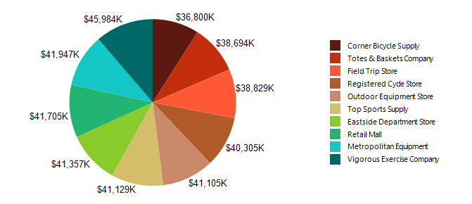

# How to Create Pie Chart


In this article we will show you how to create a Pie chart using the Graph item.         

  

## 

1. Add a new graph item to the report.

   1. Set the __DataSource__  property to a new                    __[SqlDataSource]()__ .                 

   1. Set the connection string to the demo AdventureWorks database.

   1. Set the query to the following one:

	
      ````sql

SELECT S.Name AS StoreName, SOH.SubTotal
FROM Sales.Customer AS CU
INNER JOIN Sales.SalesOrderHeader AS SOH ON CU.CustomerID = SOH.CustomerID
INNER JOIN Sales.Store AS S ON CU.CustomerID = S.CustomerID
````


   1. You can click on __Execute Query...__  just to check if everything is OK with the database connection.                   Click __Finish__  when you are ready.                 

1. Open                __SeriesGroups__  collection editor and click __Add__ :             

   1. Set the new group __Groupings__  to: *=Fields.StoreName* 

   1. Set the __Sortings__  to: *=Sum(Fields.SubTotal)* 

   1. Set the __Filters__  to: *=Sum(Fields.SubTotal) Top N =10* 

   1. Set the __Name__  to *seriesGroup1* 

1. Open                __CategoryGroups__  collection editor and click __Add.__ By default this will add a new static group (group without grouping).             

   1. Set the __Name__  to *categoryGroup1* 

1. Open                __CoordinateSystems__  collection editor and __Add__  a new __PolarCoordinateSystem__ .             

   1. Leave the __Name__  to *polarCoordinateSystem1* .                 

   1. Set the __RadialAxis__  to __New Axis with Category Scale__ .                 

   1. Expand RadialAxis node.Expand Scale node.Set SpacingSlotCount to 0.Expand the axis Style node.Set Visible to False.

   1. Set the __AngularAxis__  to __New Axis with Numerical Scale__ .                 

   1. Expand AngularAxis node.Expand the axis Style node.Set Visible to False.

1. Open __Series__  collection editor and __Add__  new __BarSeries__ .             

   1. Set the __CategoryGroup__  to __categoryGroup1__ .                 

   1. Set the __SeriesGroup__  to __seriesGroup1__ .                 

   1. Set the __CoordinateSystem__  to __polarCoordinateSystem1__ .                 

   1. Set the __ArrangeMode__  to __Stacked100__ .                 

   1. Set the __X__  value to *=Sum(Fields.SubTotal)* 

   1. Set the __DataPointLabel__  to *=Sum(Fields.SubTotal)/1000.0* 

   1. Set the __DataPointLabelFormat__  to *{0:C0}K* 

1. Set the color palette, the formatting of the labels, the values of the legend and any other improvements as needed.             For more information, see [Formatting a Graph]().             

# See Also

