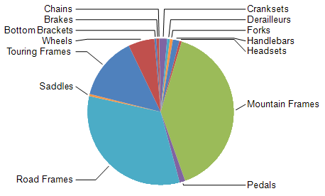

# Pie Charts Overview

Pie charts are used to display the contribution of fractional parts to a whole. Pie charts are most commonly         used to make comparisons between groups. They have no axes. When a numeric field is used, the chart can calculate         the percentage of each value to the total.       

The following image displays a pie chart with a legend:  

  

## Pie Chart Variations

* __Doughnut__ . A pie chart that has an open space in the center. The Pie Chart property that controls the width of the open space               is the                 [PolarCoordinateSystem.InnerRadiusRatio](https://docs.telerik.com/reporting/p-telerik-reporting-polarcoordinatesystem-innerradiusratio) .             

## Design Considerations for Pie Charts

* Pie charts are popular in reports because of their visual impact. However, pie charts are a very               simplified chart type that may not best represent your data. Consider using a pie chart only after the data has               been aggregated to seven data groups or less.             

* Pie charts display each data group as a separate slice on the chart. You must add at least one data               field and one series field to the pie chart. If more than one data field is added to a pie chart, the pie chart               will display both data fields in the same chart.             

* If you are defining your own colors on a pie chart using a custom palette, be sure that you have               enough colors in your palette to display each data point with its own unique color.             

* A pie chart requires at least two values in order to make a valid comparison between proportions.               If your pie chart contains only one color, verify that you have added a series field to group by. When the pie chart               does not contain series, it aggregates the values from your data field into one value for display.             

## Displaying Percentage Values on a Pie Chart

Pie charts represent proportions of the total. As a result, it is common to format pie chart           labels as percentages. In order to be consistent with other chart types, the chart does not display percentage labels by default.           To show labels with percentages follow these steps:         

1. Select the series by clicking anywhere on the pie.

1. Set __DataPointLabelStyle.Visible__  property of the series from the *Properties*  window to __true__ .             

1. Set __DataPointLabel__  property of the series to an expression adjusted to your specific needs similar to the following one: *=Sum(Fields.LineTotal)/Exec('graph1', Sum(Fields.LineTotal))*  where '*graph1* ' is the name of the Graph item.             

1. Select the series labels and from the '*Graph Tools | Format* ' contextual tab select '*Percent* ' for the label format.             

1. Adjust the precision according to your needs.

1. Position the labels through the __DataPointLabelAlignment__  property of the series.             

## Preventing Overlapped Labels on a Pie Chart

By default, the layout engine will try to arrange the data labels so they do not overlap. When the bounds of two or more labels overlap,           the engine will move them and their adjacent labels vertically, trying to find them a proper non-overlapping positions. During this rearrangement,           a label can be moved aside from its original location, which may produce a hard to read chart. Additionally, if the plot area doesn't provide           enough space and there are a lot of data points, the labels will overlap. There are several ways to prevent labels from overlapping:         

* Decrease the font size of the data point labels.

* Increase the width and height of your chart to allow more room for the labels.

* Change pie labels position through the __DataPointLabelAlignment__  property of the series.             

* Set the  [DataPointLabelOffset](/reporting/api/Telerik.Reporting.BarSeries#Telerik_Reporting_BarSeries_DataPointLabelOffset)  to a greater value               so the labels will be arranged around a circle with a bigger radius.             

For Pie Charts with lots of data points the best approach might be to use a combination of the above-mentioned approaches.           The following image shows a chart series that has its            [DataPointLabelAlignment](/reporting/api/Telerik.Reporting.BarSeries#Telerik_Reporting_BarSeries_DataPointLabelAlignment)  set to __OutsideColumn__ ,            [DataPointLabelOffset](/reporting/api/Telerik.Reporting.BarSeries#Telerik_Reporting_BarSeries_DataPointLabelOffset)  set to __0.5cm__            and  [DataPointLabelConnectorStyle](/reporting/api/Telerik.Reporting.BarSeries#Telerik_Reporting_BarSeries_DataPointLabelConnectorStyle) __.Visible__            set to __true__ .           

  

>note The algorithm that moves the data point labels, preventing them from overlapping, is activated only when the labels have their              [DataPointLabelAngle](/reporting/api/Telerik.Reporting.GraphSeriesBase#Telerik_Reporting_GraphSeriesBase_DataPointLabelAngle)  set to a multiple of  __2*π__  radians in degrees (i.e. 0, 360, etc.).           

## Merging Small Slices on a Pie Chart

Based on the data, a pie chart may produce too many slices, resulting in unreadable data presentation.           To overcome this, slices that are determined insignificant based on particular criteria can be merged into a single dedicated slice on the pie chart.         

The merging setup is controlled by the  [Telerik.Reporting.BarSeries.MergedDataPoints](/reporting/api/Telerik.Reporting.BarSeries#Telerik_Reporting_BarSeries_MergedDataPoints)  property            found under the Layout properties category of the bar series.         

To turn on the merge logic, change the  [Telerik.Reporting.MergedDataPoints.MergeMode](/reporting/api/Telerik.Reporting.MergedDataPoints#Telerik_Reporting_MergedDataPoints_MergeMode)  property            from __None__  to __SingleSlice__ . Next thing is to choose between four different modes (algorithms)            for splitting the slices (or data points) to significant ones and small ones. This is controlled from the             [Telerik.Reporting.MergedDataPoints.ThresholdMode](/reporting/api/Telerik.Reporting.MergedDataPoints#Telerik_Reporting_MergedDataPoints_ThresholdMode)  property values,            which can be found in the  [Telerik.Reporting.ThresholdMode](/reporting/api/Telerik.Reporting.ThresholdMode)  enumeration.           Based on the chosen mode, an appropriate  [Telerik.Reporting.MergedDataPoints.ThresholdValue](/reporting/api/Telerik.Reporting.MergedDataPoints#Telerik_Reporting_MergedDataPoints_ThresholdValue)  should be set.           The value of each slice being considered for merging is evaluated over the  [Telerik.Reporting.BarSeries.X](/reporting/api/Telerik.Reporting.BarSeries#Telerik_Reporting_BarSeries_X)  property.            [Telerik.Reporting.MergedDataPoints.ThresholdMode](/reporting/api/Telerik.Reporting.MergedDataPoints#Telerik_Reporting_MergedDataPoints_ThresholdMode)  supports expressions.            The expression must evaluate to the needed number type.         

By default, the merged slice is labeled in the chart’s legend as __Others__ . You can change this by setting the             [Telerik.Reporting.MergedDataPoints.LegendItemLabel](/reporting/api/Telerik.Reporting.MergedDataPoints#Telerik_Reporting_MergedDataPoints_LegendItemLabel) . It supports expressions.         

The styling of the merged data point, its label or the corresponding legend item can be customized using the corresponding Conditional Formatting property using the Filter:                      = IsMergedData() | Operator.Equals | = True           

# See Also

 * [Chart Types]() * [BarSeries](/reporting/api/Telerik.Reporting.BarSeries)  * [DataPointLabelStyle](/reporting/api/Telerik.Reporting.GraphSeriesBase#Telerik_Reporting_GraphSeriesBase_DataPointLabelStyle)  * [DataPointLabel](/reporting/api/Telerik.Reporting.GraphSeriesBase#Telerik_Reporting_GraphSeriesBase_DataPointLabel)  * [DataPointLabelAlignment](/reporting/api/Telerik.Reporting.BarSeries#Telerik_Reporting_BarSeries_DataPointLabelAlignment) 
