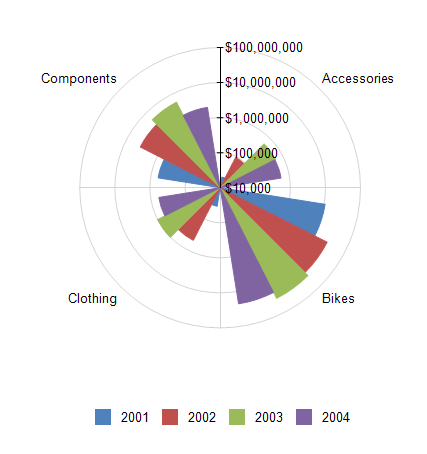

# How to Create Polar Chart


In this article we will show you how to create a Polar chart using the Graph item.         

  

## 

1. Add a new graph item to the report.

   1. Set the __DataSource__  property to a new                   __[SqlDataSource]()__ .                 

   1. Set the connection string to the demo AdventureWorks database.

   1. Set the query to the following one:

	
      ````sql

SELECT SOD.LineTotal, SOH.OrderDate, PC.Name AS Category
FROM Sales.SalesOrderHeader AS SOH
INNER JOIN Sales.SalesOrderDetail AS SOD ON SOH.SalesOrderID = SOD.SalesOrderID
INNER JOIN Production.Product AS P ON SOD.ProductID = P.ProductID
INNER JOIN Production.ProductSubcategory AS PS ON P.ProductSubcategoryID = PS.ProductSubcategoryID
INNER JOIN Production.ProductCategory AS PC ON PS.ProductCategoryID = PC.ProductCategoryID
````


   1. You can click on __Execute Query...__  just to check if everything is OK with the database connection.                   Click __Finish__  when you are ready.                 

1. Open               __SeriesGroups__  collection editor and click __Add__ :             

   1. Set the new group __Groupings__  to: *=Fields.OrderDate.Year* 

   1. Set the __Sortings__  to: *=Fields.OrderDate.Year* 

   1. Set the __Name__  to *seriesGroup1* 

1. Open               __CategoryGroups__  collection editor and click __Add.__ 

   1. Set the new group __Groupings__  to: *=Fields.Category* 

   1. Set the __Sortings__  to: *=Fields.Category* 

   1. Set the __Name__  to *categoryGroup1* 

1. Open __CoordinateSystems__  collection editor and __Add__  a new __PolarCoordinateSystem__ .             

   1. Leave the __Name__  to *polarCoordinateSystem1* .                 

   1. Set the __RadialAxis__  to __New Axis Logarithmic Scale__ .                 

   1. Set the __AngularAxis__  to __New Axis with Category Scale__ .                 

1. Open __Series__  collection editor and __Add__  new __BarSeries__ .             

   1. Set the __CategoryGroup__  to __categoryGroup1__ .                 

   1. Set the __SeriesGroup__  to __seriesGroup1__ .                 

   1. Set the __CoordinateSystem__  to __polarCoordinateSystem1__ .                 

   1. Set the __ArrangeMode__  to __Clustered__ .                 

   1. Set the __Y__  value to *=IsNull(Sum(Fields.LineTotal), 0) / 1000.0* 

1. Set the color palette, the formatting of the labels, the values of the legend and any other improvements as needed.             For more information, see [Formatting a Graph]().             

# See Also

