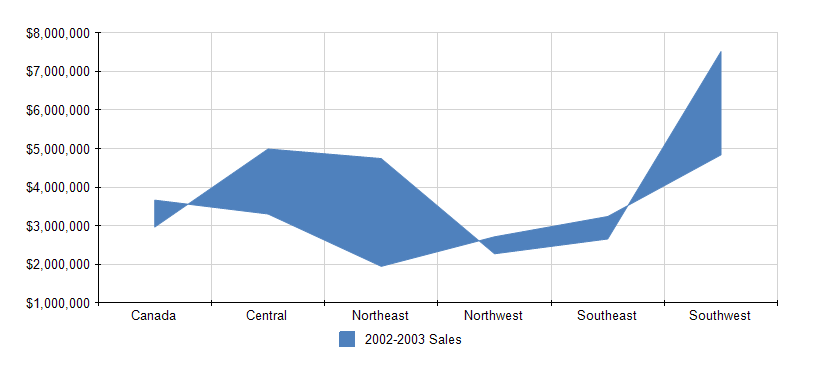

# How to Create Range Chart


In this article we will show you how to create a Range chart using the Graph item.         

  

## 

1. Add a new graph item to the report.

   1. Set the __DataSource__  property to a new                    __[SqlDataSource]()__ .                 

   1. Set the connection string to the demo AdventureWorks database.

   1. Set the query to the following one:

	
      ````sql

SELECT ST.Name, SOH.TotalDue, SOH.OrderDate
FROM Sales.SalesOrderHeader AS SOH
INNER JOIN Sales.SalesTerritory AS ST ON SOH.TerritoryID = ST.TerritoryID
````


   1. You can click on __Execute Query...__  just to check if everything is OK with the database connection.                   Click __Finish__  when you are ready.                 

1. Open               __SeriesGroups__                collection editor and click __Add__ .             By default this will add a new static group (group without grouping).             

   1. Set the __Name__  to *seriesGroup1* 

1. Open                __CategoryGroups__  collection editor and click __Add__ :             

   1. Set the new group __Groupings__  to: *=Fields.Name* 

   1. Set the __Sortings__  to *=Fields.Name* 

   1. Set the __Name__  to *categoryGroup1* 

1. Open __CoordinateSystems__  collection editor and __Add__  a new __CartesianCoordinateSystem__ .             

   1. Leave the __Name__  to *cartesianCoordinateSystem1* .                 

   1. Set the __XAxis__  to __New Axis with Category Scale__ .                 

   1. Set the __YAxis__  to __New Axis with Numerical Scale__ .                 

1. Open __Series__  collection editor and __Add__  new __AreaSeries__ .             

   1. Set the __CategoryGroup__  to __categoryGroup1__ .                 

   1. Set the __SeriesGroup__  to __seriesGroup1__ .                 

   1. Set the __CoordinateSystem__  to __cartesianCoordinateSystem1__ .                 

   1. Set the __Y__  value to *=Sum(IIF(Fields.OrderDate.Year=2002, Fields.TotalDue, 0))* 

   1. Set the __Y0__  value to *=Sum(IIF(Fields.OrderDate.Year=2003, Fields.TotalDue, 0))* 

1. Set the color palette, the formatting of the labels, the values of the legend and any other improvements as needed.             For more information, see [Formatting a Graph]().             

# See Also

