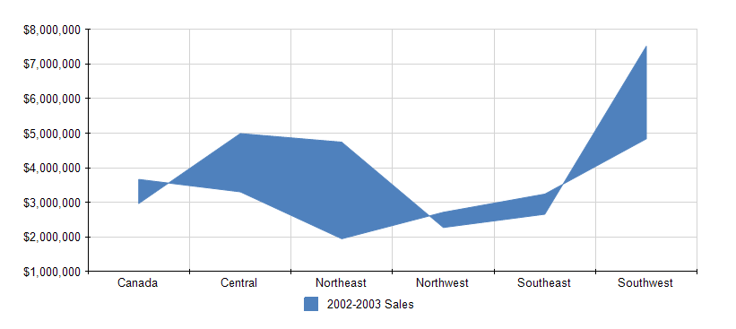

# Range Charts Overview

A range chart type displays a set of data points that are each defined by multiple values for the same category.        The range chart emphasizes on the distance between the two values. Category labels are displayed on the category axis.        The plain range chart fills in the area between the top and bottom value for each data point.

The following image displays a plain range chart with one range area series:  

  

## Range Chart Variations

* __Column range__ . The column range chart uses columns to represent the range.

* __Bar range__ . The bar range chart uses bars to represent the range. 

* __Smooth range__ . A smooth range chart uses curved lines to connect data points rather than straight ones.

## Design Considerations for Range Charts

* Range chart types require two values per data point. These values represent a high value and a low value that define    			the range for each data point. 

* If only one value is specified, the range chart will display as if it were a regular area/bar/column chart, with    			one value per data point.

* Range charts are often used to graph data that contains minimum and maximum values for each category group in    			the dataset.

* Displaying markers on each data point is not recommended for a range chart.

* Like the area chart, in a plain range chart, if the values in multiple series are similar, the series will overlap.    			In this scenario, you may want to use a column range or bar range chart instead of a plain range chart.

* Gantt charts can be created using a range bar chart.

# See Also

 * [Chart Types]() * [RangeAreaSeries](/reporting/api/Telerik.Reporting.RangeAreaSeries)  * [RangeBarSeries](/reporting/api/Telerik.Reporting.RangeBarSeries) 
