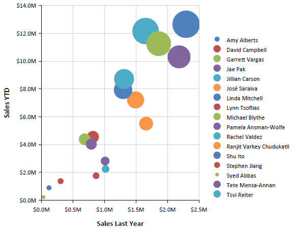

# Scatter Charts Overview

Scatter (Point) charts are used to show correlations between two sets of values. The scatter chart lets you observe the dependence       	of one value to another and is often used for scientific data modeling. This chart type is typically not used used with time dependent        	data where a Line chart is more suited. A common usage of the scatter chart is to compare aggregated data across categories.       

Scatter charts are different from other chart types because, instead of using the category values as x-values,        	they have explicit x-values for the data points. Consequently, the data can be grouped (and aggregated) into a different category        	than the value that is shown on the x-axis. For example, to show last year's sales for individual salespersons along the x-axis,        	you would not want to aggregate y-values if two salespersons have identical x-values.       

The following image illustrates a scatter chart:         

  

## Bubble Charts

Bubble charts can be considered a variation of the scatter charts, in which the data points are replaced with bubbles.    					This chart type displays the differences between data points based on the size of   					the bubble. The larger the bubble is, the larger is the difference between the two data points.   				

The following Bubble chart sample report has a category set to sales person so that it aggregates sales    					data per sales person. However, the value of last year's sales is shown on the x-axis.   				  

  

## Design Considerations for Scatter Charts

* Scatter charts usually display and compare numeric values, such as scientific, statistical, and engineering data.

* A typical usage of the scatter chart is when you want to compare large numbers of data points not related to time. The more    			data you include in a scatter chart, the better the comparisons that you can make.

* The bubble chart requires an additional value (Size of the bubble) per data point. 

* Scatter charts are most suitable for handling the distribution of values and clusters of data points. This is the best    			chart type if your dataset contains many points (for example, several thousand points). Displaying multiple series on a point    			chart is visually distracting and should be avoided. In this scenario, consider using a line chart.

# See Also

 * [Chart Types]() * [LineSeries](/reporting/api/Telerik.Reporting.LineSeries) 
