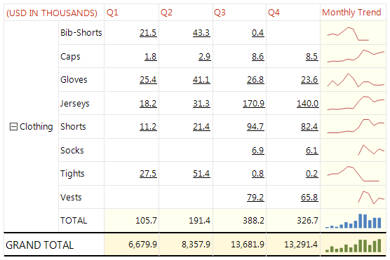

# Sparklines

Sparklines and data bars are small, simple charts that convey a lot of information in a little space,        often inline with text. The most common usage of them is in tables. Their impact comes from viewing many of them together and        being able to quickly compare them one above the other, rather than viewing them separately. They make it easy to        see the outliers, the rows that are not performing like the others. Although they are small, each sparkline often        represents multiple data points, often over time. Data bars can represent multiple data points, but typically illustrate        only one. Each sparkline typically presents a single series. Because sparklines display aggregated data, they must go in a        cell associated with a group. Sparklines and data bars have the same basic chart elements of categories, series, and values,       but they have no legend, grid lines, labels, or tick marks.

Spaklines and data bars are created by adding the required [chart type]() and applying formatting.         For more information, see [Formatting a Graph]().       

The image below shows a typical usage of the sparkline chart type in a table:  

  

## Sparklines Chart Variations

Almost any chart type can be used for a sparkline chart:

* __Bar Charts__ : The clustered, stacked, and 100% stacked bar charts.

* __Column Charts__ : The clustered, stacked, and 100% stacked column charts.

* __Line Charts__ :  The clustered, stacked, and 100% stacked line charts.

* __Area Charts__ : The clustered, stacked, and 100% stacked area charts.

* __Pie Charts__ : Both pie and doughnut charts.

* __Range Charts__ : Area and Bar range charts.

## Data Bars

Data bars typically represent a single data point, though they can represent multiple data points,        	just like regular bar charts. They often contain several series with no category, or have series grouping.

You can make data bar versions of these full charts:

* __Bar Charts__ : Clustered, stacked and 100% stacked bar charts.

* __Column Charts__ : Clustered, stacked and 100% stacked column charts. Column charts can be either sparklines or data bars.

# See Also

 * [Chart Types]() * [AreaSeries](/reporting/api/Telerik.Reporting.AreaSeries)  * [BarSeries](/reporting/api/Telerik.Reporting.BarSeries)  * [LineSeries](/reporting/api/Telerik.Reporting.LineSeries)  * [RangeAreaSeries](/reporting/api/Telerik.Reporting.RangeAreaSeries)  * [RangeBarSeries](/reporting/api/Telerik.Reporting.RangeBarSeries) 
