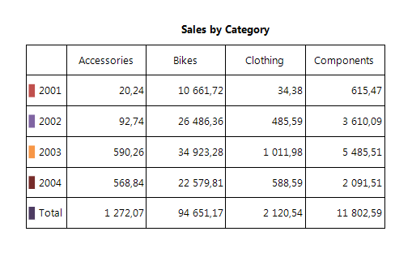
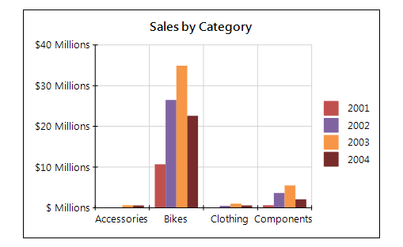

# Connecting to Data

The Graph item is a data item and similar to the [Table]() item it allows developers        to summarize data by two dimensions (__CategoryGroups__  hierarchy and __SeriesGroups__  hierarchy) and        display one or more measures (depending on the series type). Like the other data items the Graph item connects to a single data source and provides        additional options for sorting and filtering the input data, binding, conditional formatting, etc.

It is important to carefully prepare and understand your data before you create a graph, as this will help you design your charts quickly and        efficiently.

## Similarities to the Table Item

One way to think about how a Graph item works is to compare it to a Table item:  

    

  

Conceptually, they both use the same multidimensional data model:

* The __ColumnGroups__  in the __Table__  are identical to the __CategoryGroups__  of the __Graph__ .

* The __RowGroups__  in the __Table__  are identical to the __SeriesGroups__  of the __Graph__ .

* The __Cells__  in the __Table__ ’s body definition are identical to the __Series__  definitions of the __Graph__ .

## Category group hierarchy

The CategoryGroups hierarchy defines the data points in the Graph series. For example, suppose you have a group by product categories in the CategoryGroups hierarchy. The number of different categories will determine how many data points the series will have at runtime. If the product categories consist of 'Accessories', 'Bikes', 'Components' and 'Clothing' categories, the series in the Graph will have four data points.       	

## Series group hierarchy

The SeriesGroups hierarchy defines the series at runtime. For example, suppose you have a group by the Year field in the SeriesGroups hierarchy. The number of different years will determine how many series will appear on the Graph. If the Year field contains the years 2001, 2002, 2003, and 2004, the Graph will display four series for every series definition bound to this group.       	

## Series Data

The Graph item series displays aggregated data to visualize one or more measures. At runtime the intersection between the series group hierarchy members and the category group hierarchy members defines the data points in the series. For each data point one or more aggregate functions are calculated to define the value/coordinates of the data points.         

Depending on the series type the Graph item can visualize one or more measures:

* __Bar__ , __Area__  series including all derived subtypes (Pie, Doughnut, Bar, Column, etc.) represent single measures;

* Range series (Range Bar and Range Area) emphasize on the distance between two values/measures;

* __Line__  series including all derived subtypes (Scatter, etc.) allows to identify the correlation between three different measures.

# See Also

