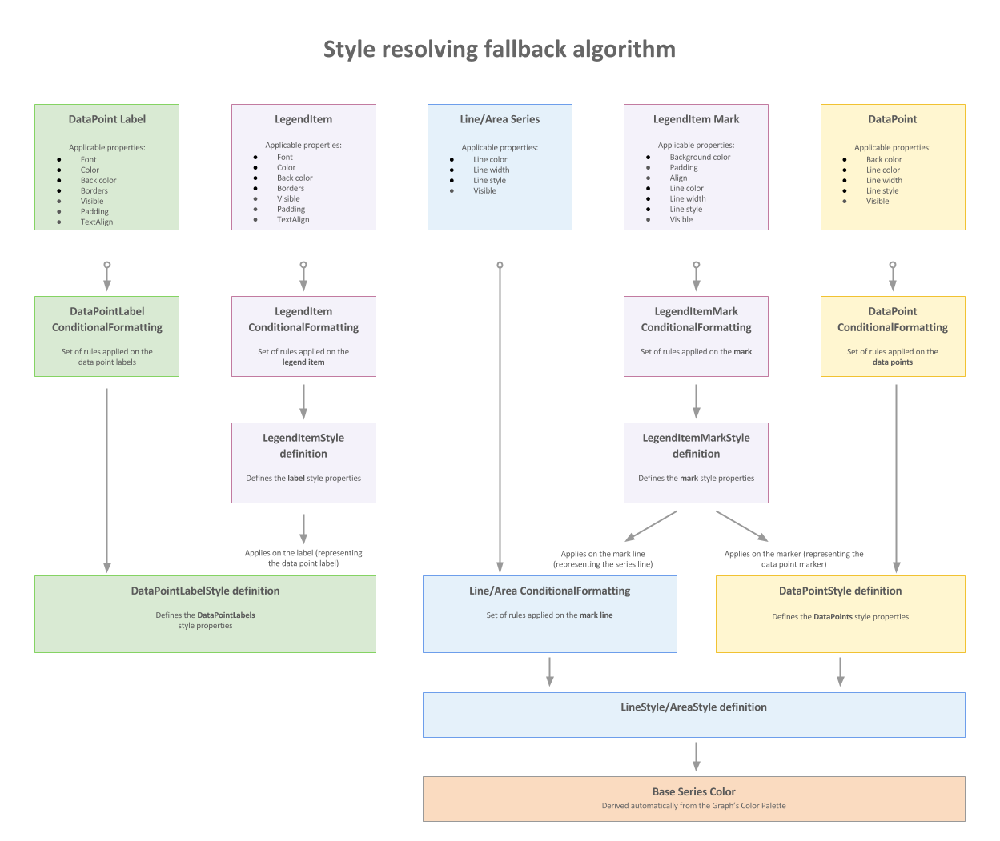

# Style Resolving Fallback Algorithm

The following diagram shows how the Graph series styles are propagated and how the style resolving algorithm fallbacks among the style definitions.

The boxes on the top row represent the report items contained in a Graph series. __Applicable properties__  is a list of properties that         are applied to the report item style. Below are listed the conditional formatting rule sets and the definitions that could affect the report item style, if set.       

>note  __Example:__ The LegendItem Mark consists of two parts - a line and a marker. The color of the mark line is set by the LineSeries' line color.           The color of the marker and its line properties are affected by the DataPointStyle definition.         Please note that setting a conditional formatting that changes the line style on the Line/Area series definition will affect the line style of the legend marker,           but setting a similar conditional formatting on the DataPoint will not affect the LegendItem's marker style and it will be only applied on the DataPoint style.         

##   

  

# See Also

 * [Graph Structure]()

 * [Conditional Formatting]()

 * [Style Inheritance and Overriding]() * [GraphSeries](/reporting/api/Telerik.Reporting.GraphSeries) 
