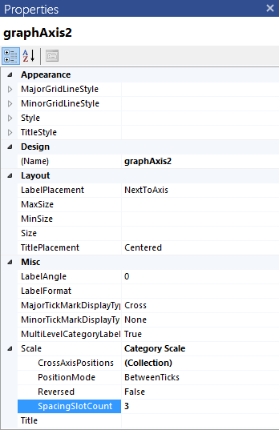

# How to Change the Gap Between the Bars

Normally the gap is automatically calculated based on the data and chart area.         If the chart area is fixed and there are many series the space between two data points may be very narrow,         or very wide when fewer series. Therefore, we may need to change the gap width manually.         The property that defines the amount of blank space between two adjacent data slots is the          [SpacingSlotCount](/reporting/api/Telerik.Reporting.Scale#Telerik_Reporting_Scale_SpacingSlotCount)          property of the  [Scale](/reporting/api/Telerik.Reporting.Scale)  class.       

This property defines the ratio between the empty space per single data slot and the space that the datapoints will occupy when placed in it.         The processing engine calculates how many data slots will be created on the axis, depending on the used scale and groupings.         Then, using the formula `Empty Space = SpacingSlotCount * DataPoint_SlotWidth` (where the         `DataPoint_SlotWidth` is the width of a single data point), the engine calculates the empty space         for each slot. Half of the empty space is placed at the beginning of the slot, the other half is placed at the end and the data points         are arranged in the remaining space, adjacent to each other.       

## 

The following pictures show how the column chart would look like with different values for the            [SpacingSlotCount](/reporting/api/Telerik.Reporting.Scale#Telerik_Reporting_Scale_SpacingSlotCount)  property:         

|     ! [Category Scale Spacing Slot Count 1](images/Graph/CategoryScale_SpacingSlotCount_1.png)|     ! [Category Scale Spacing Slot Count 1a](images/Graph/CategoryScale_SpacingSlotCount_1a.png|

The default value of __1__  produces an empty space which size is equal to a single data point's width.         

>caption 

|     ! [Category Scale Spacing Slot Count 0](images/Graph/CategoryScale_SpacingSlotCount_0.png)|     ! [Category Scale Spacing Slot Count 0a](images/Graph/CategoryScale_SpacingSlotCount_0a.png|

When the value is set to __0__ , the data points will occupy all the available slot width.         

>caption 

|     ! [Category Scale Spacing Slot Count 3](images/Graph/CategoryScale_SpacingSlotCount_3.png)|     ! [Category Scale Spacing Slot Count 3a](images/Graph/CategoryScale_SpacingSlotCount_3a.png|

A higher value (in this case __3__ ) leaves more empty space around the data points, making them thinner.         

## Changing the SpacingSlotCount property

To change the __Scale.SpacingSlotCount__  property, follow these steps:         

1. On the design surface select the target axis.             

1. In the __Misc__  section select the __Scale.SpacingSlotCount__  property, as shown in the image below.             

1. Modify the property according to your requirements, i.e. in order to increase the empty space, increase the __SpacingSlotCount__  value.               

  

# See Also

# See Also

 * [How to: change the space between chart's series](http://www.telerik.com/support/kb/reporting/details/how-to-change-the-space-between-charts-series)

 * [SpacingSlotCount](/reporting/api/Telerik.Reporting.Scale#Telerik_Reporting_Scale_SpacingSlotCount) 

 * [Scale](/reporting/api/Telerik.Reporting.Scale) 
