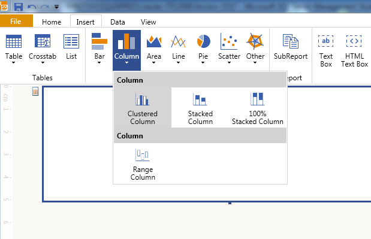
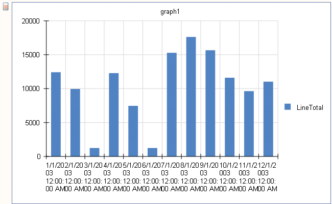
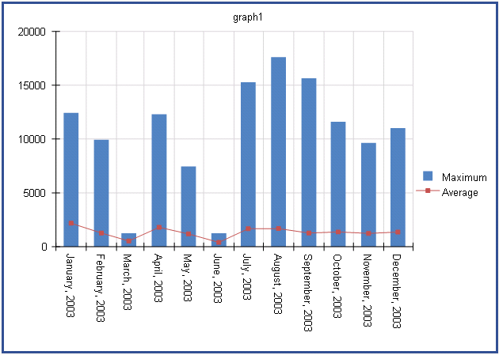

# How to Create Graph with Column and Line Series


In this how-to article we will show you how to create a graph with both column and line series, showing the maximum         and the average amount of sales on a monthly basis using the __AdventureWorks__  sample database.       

## How to create a Graph with Column and Line Series

1. Start the Graph Wizard:
   + If you use [Standalone Telerik Report Designer]()From the __Insert__  menu select __Column__  and then __Clustered Column__ .                   This will bring up the __Graph Wizard__  which will help you create the first series.                   

  

   + If you use the [Visual Studio Report Designer]():Initiate the __Graph Wizard__  from the __Visual Studio toolbox__ . Then select __Clustered Column__  chart type and click                    __OK__ .                    This will bring up the __Graph Wizard__  which will help you create the first series.                 

1. Click __'Add New Data Source...'__  button and select                __[SQL Data Source]()__ :             
   1. Set the connection string to the demo AdventureWorks database.

   1. Set the query to the following one:

    
      ````sql
SELECT SOD.LineTotal, SOH.OrderDate
FROM
Sales.SalesPerson S
INNER JOIN Sales.SalesOrderHeader SOH ON SOH.SalesPersonID = S.SalesPersonID
INNER JOIN Sales.SalesOrderDetail SOD ON SOH.SalesOrderID = SOD.SalesOrderID
WHERE SOH.OrderDate between cast('2003-01-01' as datetime) and cast('2003-12-31' as datetime)
and S.SalesPersonId = 283
````

   1. You can click on __Execute Query...__  just to check if everything is OK with the database connection.                   Click __Finish__  when you are ready.                 

1. In the *Available data sources*  list you should see the datasource you've already created.               Select it and click __Next__ .             

1. In the next page you should select the fields which will be used to build the chart. Since the report will display aggregated sums                             of the order lines by month, you need only two fields: __LineTotal__  and __OrderDate__ .               Select __OrderDate__  field and drag it to *Categories*  box.               Select __LineTotal__  field and drag it to *Values*  box.               It will be shown as __Sum(LineTotal)__ , as the __Sum__  is the default aggregate function,               but in this example we will display the maximum amount of sales in the column series and the average amount of sales in the               line series, so you should choose the __Max__  function from the drop-down menu. Click __Next__  once you are ready.             

1. The Wizard has detected that the field used as Category is of type DateTime, and this page will let you configure the scale for the graph. In most cases the               'Auto' option will work fine, so we will leave it like this. Complete the Wizard by clicking __Finish__ .             

1. The graph will display the column series and it should look like this:               

  

1. The graph is displaying the date-time values on its X-axis, and the 'Auto' scale option divides each column into one column per month.               To make the label for the X-axis easier to read, first select the X-axis, and in the *Property Browser*  set a proper                [LabelFormat](/reporting/api/Telerik.Reporting.GraphAxis#Telerik_Reporting_GraphAxis_LabelFormat)                (i.e. `{0:Y}`) and                [LabelAngle](/reporting/api/Telerik.Reporting.GraphAxis#Telerik_Reporting_GraphAxis_LabelAngle)                 to 90º.             

1. To add another series to the graph, you can right-click on the graph and select *Add Graph Series…*                 from the context menu. This will bring up a dialog window with all the chart types to select from.                Select __Line, Line with Markers__  and click __OK__ .                The Graph wizard will be displayed again. Repeat __step 4__  for choosing and dragging the data source fields to                *Categories*  and *Values*  boxes, but this time choose __Avg__                 as an aggregate function for the __LineTotal__  field. Click __Next__  and __Finish__  when you are ready.             

    >When adding a new Series, a new Category group is also created. In this guide we are using a field of type  __DateTime__  for category. This will                  set the scale of the X-axis to  __DateTime Scale__  which will correctly display the two series on top of each other. With any other type, like                   __Numerical Scale, Logarithmic Scale or Category Scale__ , the two Series will be displayed next to each other and not overlapping correctly.               To fix this, select the newly created series and change the  __CategoryGroup__  to the group used by the first series.               

1. Name the series’ legend items accordingly using the property LegendItem. [Value](/reporting/api/Telerik.Reporting.LegendItem#Telerik_Reporting_LegendItem_Value)  of both of your series.               Finally your graph should look like the one shown below:               

  

# See Also

 * [Graph Structure]() * [GraphAxis](/reporting/api/Telerik.Reporting.GraphAxis)  * [LabelFormat](/reporting/api/Telerik.Reporting.GraphAxis#Telerik_Reporting_GraphAxis_LabelFormat)  * [LabelPlacement](/reporting/api/Telerik.Reporting.GraphAxis#Telerik_Reporting_GraphAxis_LabelPlacement)  * [Scale](/reporting/api/Telerik.Reporting.GraphAxis#Telerik_Reporting_GraphAxis_Scale) 

