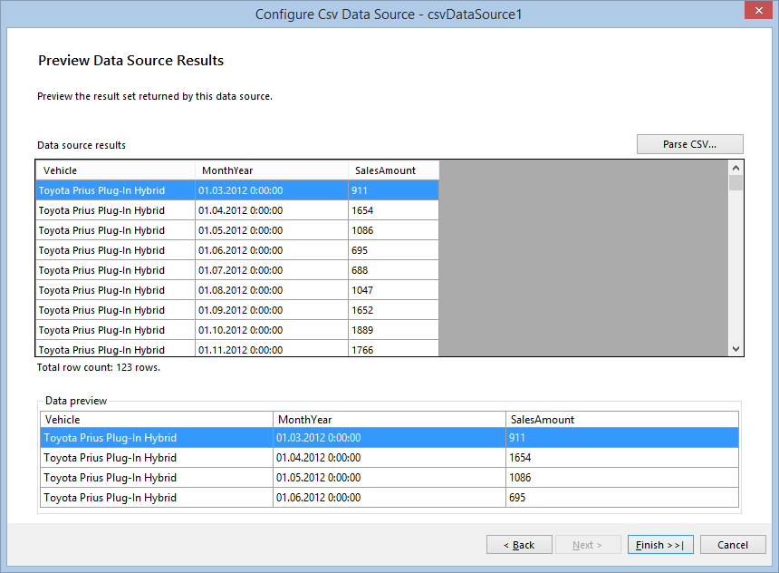
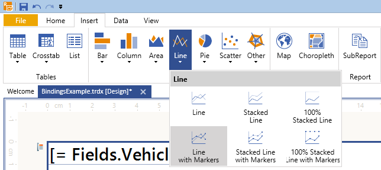
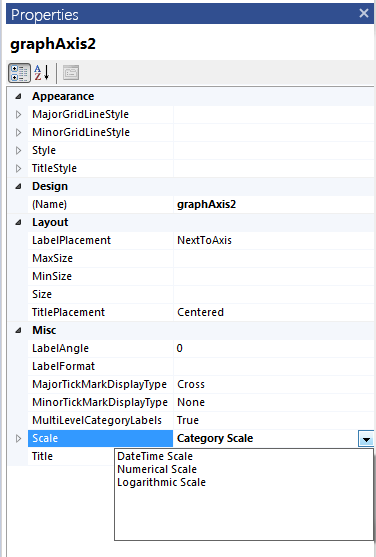
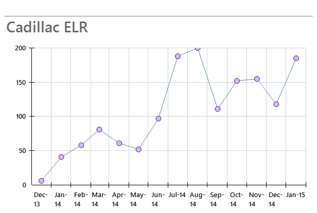
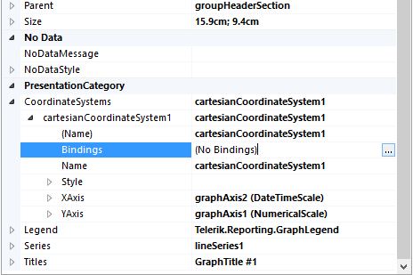
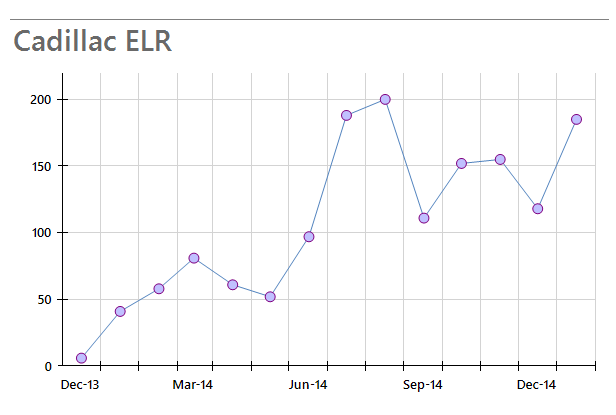

# How to Use Bindings to Control the Coordinate System Properties

In this how-to article we will show you how to setup the coordinate system's axes and scales at runtime using Bindings. This approach is really useful when your scenario involves nested Graph items and you need to adjust more precisely its properties. If you are unfamiliar with the nested data items subject, it is recommended to read the following article first: [How to use the ReportItem.DataObject property in expressions](). 

The nested graph's data will show the sales of some of the most popular electric vehicles models over the last years. The data will be grouped by vehicle model, presenting the amount of sales for each model in a separate chart. The data sample used to create the charts is taken from [Model 3](http://jpwhitenissanleaf.com/) and you can read the whole article in [March 2013 sets several records for EV Sales](http://jpwhitenissanleaf.com/2013/04/06/march-2013-sets-several-records-for-ev-sales/). 

## How to: Use Bindings to Control the Graph's Coordinate System Properties.

1. This scenario is simple enough to start from a blank report, so, depending on the designer you are using ([Standalone Report Designer]() or [Visual Studio Report Designer]()) create a new blank report. Since we won't be using the page header and footer, you can remove them as explained here: [How to Add/Remove Page Header & Footer Sections]().

1. Expand the report's __DataSource__ property and click on the __Add new DataSource...__ link at the bottom. Select the [CSV Data Source]() icon to add a new DataSource, and name it __dsEVSalesData__. This data source will contain information about the vehicles and the amount of their sales for a particular month. 
   
   + Download the [EVSalesData.csv file](http://blogs.telerik.com/docs/default-source/reporting/evsalesinus.csv?sfvrsn=2), save it locally and insert its path into the *Select a file to import* textbox. 

   + Press __Next__ until you get to the __Configure the separators__ page. The CSV file uses a semicolon __(;)__ as a field separator so you should check the respective checkbox and uncheck the other ones. 

   + Press __Next__ until you get to the __CSV Headers__ page. Note that the CSV file has headers, so you should check the *The CSV has headers* checkbox. 

   + On the __Map columns to type__ page set the type of `MonthYear` field to __DateTime__ and `SalesAmount` columns to __Integer__. Apply the __"MMM-yy"__ format to the *Date Format* field. 

   + When you click __Parse CSV...__ on the next page, you should see the result of the parsed file, which should look like this: 

     
  
     Click __Finish__ when you are ready.

1. The easiest way to define the groupings for a data item is to use the [GroupExplorer tool window](). If it is not visible, you can activate it using the __Telerik Reporting menu__ in Visual Studio or __View tab__ in the Standalone Report Designer. 

   + Select the report, right-click on the __Detail__ group, displayed in the __Group Explorer__ and select *Add Parent Group* from the context menu. This will bring the __Edit Grouping__ dialog window. 

   + Add a new group, using the field __Vehicle__ as a grouping member. 

   + Add ascending sort by the same field using the button at the end of the *Grouping* column in __Group Explorer__. 

1. According to our scenario, the group header will contain all the items used to display all the information, so you can make the details and group footer sections invisible by setting their __Visible__ property to __false__. 

   + Add new TextBox to the group header, set its Font.Size to 18pt and its value to `=Fields.Vehicle`. 

   + Add a Graph item to the group header: 

   + If you use [Standalone Report Designer](), click on the __Insert__ menu select __Line__ and then __Line with Markers__. 

     

   + If you use the [Visual Studio Report Designer](), drag the __Graph Wizard__ from the __Visual Studio toolbox__. Then select __Line__ and __Line with Markers__ and click __OK__. This will bring up the __Graph Wizard__ which will help you create the line series. 

   + The Graph's data source will be set through __Bindings__, but still it is more convenient to use the wizard to setup its series, category groups and values. 

   + On the first page select the previously created __dsEVSalesData__ data source. 

   + On the __Arrange graph fields__ page you should select the fields that will be used to build the chart. Since the report will display aggregated sums of the vehicle sales by month/year, you need only two fields:      __MonthYear__ and __SalesAmount__. 
     
	 1. Select __MonthYear__ field and drag it to *Categories* box. 
	 
	 1. Select __SalesAmount__ field and drag it to *Values* box. It will be shown as __Sum(SalesAmount)__, as the __Sum__ is the default aggregate function. 
	 
	 1. Click __Finish__ once you are ready. 

   + To change the scale type, select the X-axis by clicking on it or on its labels and in the *Property Browser* window select __DateTime Scale__ for the __Scale__ property: 

     

   + For better layout set the X-axis [LabelFormat](/reporting/api/Telerik.Reporting.GraphAxis#Telerik_Reporting_GraphAxis_LabelFormat) property to `={0:MMM-yy}`. You can add some additional styling to its datapoints as well - for example, you can hide the graph legend, edit its title and set the  [MarkerType](/reporting/api/Telerik.Reporting.LineSeries#Telerik_Reporting_LineSeries_MarkerType) to __Circle__ and increase its  [MarkerSize](/reporting/api/Telerik.Reporting.LineSeries#Telerik_Reporting_LineSeries_MarkerSize) to 10px. 

   + Currently the Graph displays data for all the vehicle models, but according to the scenario it should display the data only for the current group. To do this, add a __Binding__ to the Graph item, setting `DataSource` as a __PropertyPath__ and `=ReportItem.DataObject` as an __Expression__. You can delete its current data source if you wish. 

1. If you now preview your report, it should display a label and a graph for each vehicle in the data source. However, looking at the second graph that shows the *Cadillac ELR* data, you will notice that its layout needs some improvements. 

  
  
   + The datapoint marker on __August'14__ is cut, because the Y axis scale maximum value is automatically calculated as 200, which is exactly the value that this datapoint represents. In this case it will be useful if we can control the minimum and maximum values of the scale according to the current data. 

   + The labels on the X axis scale are too close to each other and that makes the chart unreadable. Usually for such cases the  [LabelStep](/reporting/api/Telerik.Reporting.DateTimeScale#Telerik_Reporting_DateTimeScale_LabelStep) property can be used, but it should be set dynamically for a particular set of data - otherwise it could be applied unnecessarily. 

1. The above problems can be resolved using coordinate system's [Bindings](/reporting/api/Telerik.Reporting.GraphCoordinateSystem#Telerik_Reporting_GraphCoordinateSystem_Bindings). Expand the coordinate system properties in the __PropertyGrid__ and bring the Bindings dialog up by clicking on the button on the right side of the __Bindings__ property, as shown below: 

  
  
   + Add a new binding and select `YAxis.Scale.Maximum` as a __Property path__. Since we want to bind the scale maximum with the current graph data, it is a good idea to raise the maximum by 10%. To do so, set the following expression on the right: `=CDbl(Max(Fields.SalesAmount) + Max(Fields.SalesAmount) * 0.1)`

     >Note that the expression result should be of the same type as the property which is applies to. In this case, the [Maximum](/reporting/api/Telerik.Reporting.NumericalScaleBase#Telerik_Reporting_NumericalScaleBase_Maximum) is of type  __double__, so you need to cast the expression result  to double - otherwise it won't be applied. 

   + Add another binding and select `XAxis.Scale.LabelStep` as a __Property path__. Our expression will set the [LabelStep](/reporting/api/Telerik.Reporting.DateTimeScale#Telerik_Reporting_DateTimeScale_LabelStep) to __3__ if there are more than 10 data points to be displayed: `=IIF(CountDistinct(Fields.MonthYear) > 10, 3, 1)`. However, the __LabelStep__ property would not be applied if the [LabelUnit](/reporting/api/Telerik.Reporting.DateTimeScale#Telerik_Reporting_DateTimeScale_LabelUnit)  is set to __Auto__, so we need to change it dynamically to __Months__ with the following expression: `=IIF(CountDistinct(Fields.MonthYear) > 10, 'Months', 'Auto')`. When you preview your report with the bindings applied, the graph that shows the *Cadillac ELR* data should look like the one below: 

     

In this article we demonstrated how to set dynamically the graph's coordinate system properties using __Bindings__. All the described steps are valid for both [Standalone Report Designer]() and [Visual Studio Report Designer]() and can be reproduced with code as well. 

You can download this example report as a __.trdx__ report definition from the following link: [How to: Use Bindings to Control the Graph's Coordinate System Properties.](http://blogs.telerik.com/docs/default-source/reporting/graphbindingsexample.trdx?sfvrsn=2) 

# See Also

* [Bindings]()

* [Graph Structure]() 

* [GraphAxis](/reporting/api/Telerik.Reporting.GraphAxis)  

* [LabelFormat](/reporting/api/Telerik.Reporting.GraphAxis#Telerik_Reporting_GraphAxis_LabelFormat)  

* [LabelPlacement](/reporting/api/Telerik.Reporting.GraphAxis#Telerik_Reporting_GraphAxis_LabelPlacement)  

* [Scale](/reporting/api/Telerik.Reporting.GraphAxis#Telerik_Reporting_GraphAxis_Scale)
