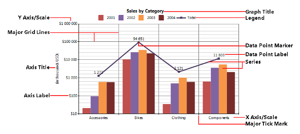
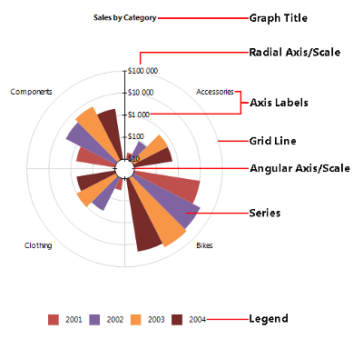

# Structure

##Graph elements

The images below show the basic elements of a chart:  

  

Fig.1 *Combined Column and Line charts in a Graph item with Cartesian coordinate system.*   

  

Fig.2 *Rose (Bar) chart in a Graph item with Polar coordinate system.* 

## Coordinate Systems

The Graph item uses a two-dimensional  [coordinate system](http://en.wikipedia.org/wiki/Coordinate_system)  that uniquely identifies  	      		the position of each data point. Each coordinate system consists of two reference lines called coordinate axes or just axes and an origin. 	      	

The Graph item supports two types of two-dimensional coordinate systems:

*  [Cartesian](http://en.wikipedia.org/wiki/Cartesian_coordinate_system)  		            	where each point is defined by an ordered pair of two coordinates which are the distances of the  		            	point to the two perpendicular axes, which are: 		            

   + __x axis__  - the horizontal axis;

   + __y axis__  - the vertical axis.The data point in the Cartesian coordinate system is represented by an ordered pair of two coordinates (x, y).

*  [Polar](http://en.wikipedia.org/wiki/Polar_coordinate_system)  is used where each point on a  		            	plane is determined by a distance from the origin (called the radial coordinate or radius) and an angle from a  		            	fixed direction (the angular coordinate, polar angle, or azimuth). The polar coordinate system has two axes: 		            

   + __angular axis__  - the circular axis for the angular coordinate;

   + __radial axis__  - the axis for the radial coordinate.The data point in the Polar coordinate system is represented by an ordered pair of two coordinates (r, ϴ).

Since there is a direct conversion between the two coordinate systems they are interchangeable in the Graph item.  	      		The coordinates of the data points in the Graph are represented by the (x, y) pair that for the Polar coordinate  	      		system is converted to (ϴ, r): 	      	

(x, y) ⇔ (ϴ, r).

The coordinate system also defines the default appearance/style of the two axes.

## Axis

The __coordinate axis__  or simply axis represents a single dimension of the coordinate system.

An axis consists of:

*  __Scale__  - defines how the data is projected on the axis;

*  __Tick marks__  - major/minor - periodic graduations;

*  __Labels__  - numerical/categorical indications accompanying the tick marks;

*  __Title__  - the title of the axis, usually a brief description of the dimension;

*  __Grid lines__  - within the graph a grid of lines may appear to aid in the visual alignment of data.
				  	The grid can be enhanced by visually emphasizing the lines at regular or significant graduations.  The emphasized lines are then 
				  	called major grid lines and the remainder are minor grid lines.

## Scales

Scales define how the data is projected on the corresponding axis that is how the data from the user domain is converted to coordinates.  	      	According to the type of the input data there are 5 types of scales: 		  

* __NumericalScale__  - represents a scale with continuous domain of numbers: integer numbers (Int16, Int32, Int64) or floating point numbers (Single, Double), etc;

* __LogarithmicScale__  - a numerical scale that applies a logarithmic transformation (with a given base) to the input data;

* __DateTimeScale__  - represents a scale with continuous domain of DateTime values;

* __CategoryScale__  - represents an ordinal scale with discrete domain like names and categories.

## Series

Series - a series of data points that represents individual measurements. The graph item supports:

*  [Bar](http://en.wikipedia.org/wiki/Bar_chart)  - displays data points as bars to show comparisons among categories.  			  		One axis of the chart shows the specific categories being compared, and the other axis represents a discrete value.Bar series can be arranged in different way in order to emphasize different aspects of the data:

   + __clustered__  bar graphs - bars are clustered in groups of more than one series;

   + __stacked, stacked 100%__  - show the bars divided into subparts to show cumulative effect;In a Cartesian coordinate system the bars have a rectangular shape and can be horizontal (Bar chart) or vertical (sometime called Column chart);In a Polar coordinate system the bars appears in a wedge shape; if the series are arranged on the radial axis (that is the wedges start from the radial axis and goes by the angular axis) the result is a Pie chart; otherwise if the bars are arranged by the angular axis the result is a Rose chart.

*  [Line](http://en.wikipedia.org/wiki/Line_chart)  - displays a series of data points connected by straight or  			  		smooth line segments; Data points are represented by markers that can vary by shape (circle, square, diamond, cross, etc.) and can display  			  		a 3rd variable/measure with its size (also known as Bubble charts); 				When a Line series is projected on a Polar coordinate system the result is also known as a radar or spider line chart.Line series may be stacked to show cumulative effect (stacked or stacked 100%).

*  [Area](http://en.wikipedia.org/wiki/Area_chart)  - similar to the line series displays a series of data points  			  	connected by straight or smooth line segments, except that the area below the line is filled in with color to indicate volume.When an Area series is projected on a Polar coordinate system the result is also known as a radar or spider area chart.Area series may be stacked to show cumulative effect (stacked or stacked 100%).

* __Range Bar__  - similar to the Bar series except that the bars do not start from the axis but at a given value; The Range Bar emphasizes on the distance between two values/measures.

* __Range Area__  - similar to the Area series except that the bottom point does not start from the axis but at a given value; The Range Area emphasizes on the distance between two values/measures.

## Legend

When the data appearing in a chart contains multiple variables, the chart may include a legend. The legend contains a list of the variables appearing in the chart and an example of their appearance. This information allows the data from each variable to be identified in the graph.

## Title

The Graph item can have one or more Titles that provides a succinct description of what the data in the graph refers to.

# See Also

