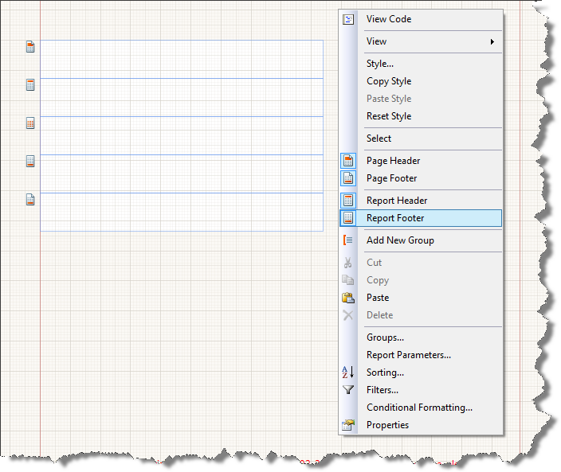

# How to Add/Remove Report Header & Footer Sections

Reports can contain report headers and footers. By default, new reports are created without these sections.

* Any control you place in the report header section is rendered once at the top of the entire report's output, but after the first page header section (if any).

* Any control you place in the report footer section is rendered once at the bottom of the entire report's output, but before the last page footer section (if any).

## To Add or Remove Report Header/Footer Section

1. Right-click on any section header in the report, or in the empty space around the sections.

1. Select __Report Header__  or __Report Footer__  .

  

  

# See Also
 * [ReportHeaderSection](/reporting/api/Telerik.Reporting.ReportHeaderSection)  * [ReportFooterSection](/reporting/api/Telerik.Reporting.ReportFooterSection) 
