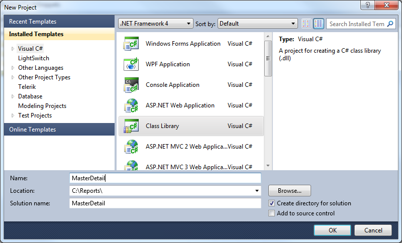
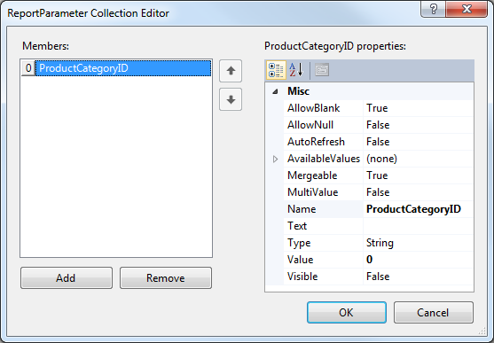

# How to Create a Master-Detail Report Using a SubReport Item

The following walk through demonstrates how to create a Master-Detail report using a SubReport report item to contain detail data. The master report data in this example consists of product categories from the         AdventureWorks database. The detail report displays product names and numbers. A [Report Parameter]() is used to filter the detail report on product category. 

## Create the Detail Report

1. Create a new class library named "MasterDetail" to contain the reports. 

  

1. Add a new Telerik Report item to the project via __Add New item - Reporting - Telerik Reporting [VERSION] Wizard - Blank Report, and name it DetailReport__. 

1. Click on the report selector (upper left corner of design surface) to select the report. 

1. Navigate to its DataSource property, open it, select "Add New Data Source" and select [SqlDataSource Component](). 

1. Setup the data connection to the AdventureWorks database, save it so it can be used later when creating the master report and click Next. Enter the following SQL statement and Finish the DataSource wizard. 
    
      ````SQL
SELECT
    P.Name,ProductID,ProductNumber,PC.ProductCategoryID
FROM
    Production.Product P,
    Production.ProductSubcategory PS,
    Production.ProductCategory PC
WHERE
    P.ProductSubcategoryID=PS.ProductSubcategoryID
    AND PS.ProductCategoryID=PC.ProductCategoryID
````

1. Remove the page header and page footer sections. Open the [Data Explorer]() and add the __ProductNumber__ and __Name__ fields to the detail section of the report. 

The detail report should now look something like this in the designer. 

  

## Configure the Report Parameter and Filter

This next set of steps creates a report parameter and a filter that uses the report parameter. The master report passes in the current ProductCategoryID for each record and the detail report prints all products that have that ProductCategoryID. 

1. In the __Property Window__ navigate to the __ReportParameters__ property and click the ellipses. 

1. In the ReportParameter Collection Editor click the __Add__ button. In the Name property for the parameter enter __ProductCategoryID__. Enter zero for the __Value__  property. 

  

1. In the __Property Window__ navigate to the __Filters__ property and click the ellipses. 

1. Click the __New__ button to create a new filter. In the __Expression__ drop down for the filter select =Fields.ProductCategoryID. Leave the operator at the default equals ("=") sign. In the __Value__  property drop down select the report parameter we created in earlier step: =Parameters.ProductCategoryID.Value. 

  

1. Click the __OK__ button to close the dialog. 

## Create the Master Report

The master report will contain only a simple listing of product categories.

1. Add a new report item to the project and name it MasterReport. 

1. The [Report Wizard]() will display automatically, when you select __Telerik Report [VERSION] Wizard - Band Report Wizard__. 

1. On __Choose Data Source__ page of the wizard, click __Add New Data Source__ button and select [SqlDataSource Component](). On the __Choose Your Data Connection__ page of the wizard, select the saved database connection you created for the detail report. Click the __Next__ button. 

1. Enter the SQL statement below and click the __Next__ button. 
    
      ````SQL
SELECT ProductCategoryID,Name FROM Production.ProductCategory
````

1. In the __Design Data Layout__ page of the wizard add the __Name__ column to the detail section and click the Next button. Continue taking the defaults until you finish the Wizard. 

## Configure the SubReport

This next set of steps ties both reports together using a SubReport to display the detail and passing the current ProductCategoryID from each record of the master report to the detail. The detail report uses the parameter to filter the data to only products for the specified product category. 

1. Resize the detail section to create some vertical room for a SubReport item. 

1. Drag a [SubReport]() from the Toolbox to the detail section of the report. 

1. In the Properties Window for the SubReport, open the [ReportSource]() dialog, select __Type name__ ([TypeReportSource](/reporting/api/Telerik.Reporting.TypeReportSource)) and set it to the DetailReport. Note that you should build the project first in order the type(s) to appear in the wizard. 

1. Click the __Edit Parameters__ button that would display the __Edit Parameters__ dialog. 

1. Click the __New__ button to define a parameter. 

1. Set the __Parameter Name__ to __ProductCategoryID__ and the parameter value to __=Fields.ProductCategoryID__. 

1. Click the __OK__ button to close the parameters dialog and click __OK__ once again to close the Report Source dialog. 

  Click the Preview button to preview the MasterReport. Notice that product numbers and names from the detail report display under each product category from the master report. 

  

>The same report layout can be created with the Standalone Report Designer, where sub reports can be specified by path to a TRDX file or by directly placing the sub report's XML in the provided SubReport.ReportSource editor.

