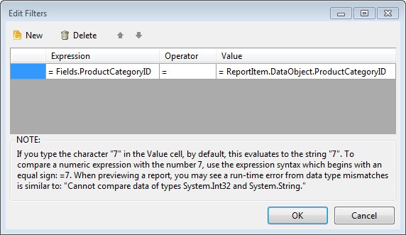
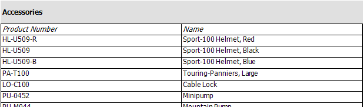

# How to Create a Master-Detail Report Using a Table


The following walkthrough demonstrates how to create a Master-Detail report using a Table report item         to contain the detail data. The master report data in this example consists of product categories from the         AdventureWorks database. The detail table displays product names and numbers.          The [ReportItem.DataObject]() property is used to filter the detail         table on product category.       

## Create the Master Report

The master report will contain only a simple listing of product categories.

1. Create a new [Telerik Report Library]() to contain the report.             

1. The __Choose Report Type__  dialog opens. Select __Band Report Wizard__  and enter a name for the report class.             

1. On the __Choose Data Source__  page of the Band Report Wizard, click the __Add New Data Source__  button and select the               [SqlDataSource Component](). On the __Choose Your Data Connection__  page of the wizard,               setup the data connection to the AdventureWorks database, save it so it can be used later when creating               the Table item, and click __Next__ .             

1. Enter the SQL statement below and click the __Next__  button.             

    
      ````SQL
SELECT ProductCategoryID, Name FROM Production.ProductCategory
````

1. In the __Design Data Layout__  page of the wizard add the __Name__  column               to the detail section and click the Next button. Continue taking the defaults until you finish the Wizard.             

## Create the Detail Table

1. Resize the detail section to create some vertical space for the Table item.

1. Drag the __Table Wizard__  item from the Visual Studio Toolbox to the detail section of the report.             

1. On the __Choose Data Source__  page of the Table Wizard, click the __Add New Data Source__  button and select the               [SqlDataSource Component](). On the __Choose Your Data Connection__  page of the wizard,               select the already created data connection and click __Next__ .             

1. Enter the following SQL statement and Finish the DataSource wizard.

    
      ````SQL
SELECT
    P.Name,ProductID,ProductNumber,PC.ProductCategoryID
FROM
    Production.Product P,
    Production.ProductSubcategory PS,
    Production.ProductCategory PC
WHERE
    P.ProductSubcategoryID=PS.ProductSubcategoryID
    AND PS.ProductCategoryID=PC.ProductCategoryID
````

1. In the __Arrange Fields__  page of the Table Wizard add the __ProductNumber__  and __Name__  fields               to the Table Columns and click the Next button. Continue taking the defaults until you finish the wizard.             

## Configure the Table Filter

This next set of steps creates a filter that uses the [ReportItem.DataObject]() property to           pass in the current ProductCategoryID for each record and the detail table prints all products that have that ProductCategoryID.         

1. Select the Table item.             

1. In the __Property Window__  navigate to the __Filters__  property and click the ellipses.             

1. Click the __New__  button to create a new filter. In the __Expression__  drop down               for the filter select =Fields.ProductCategoryID. Leave the operator at the default equals ("=") sign. In the               __Value__  property drop down enter the expression: =ReportItem.DataObject.ProductCategoryID.               

  

1. Click the __OK__  button to close the dialog.             

Click the Preview button to preview the report.           Notice that product numbers and names from the detail table display under each product category from the master report.           

  

>note The same report layout can be created with the [Standalone Report Designer]().           

