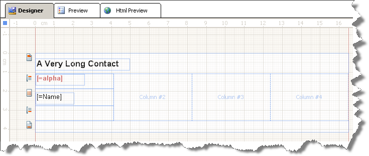
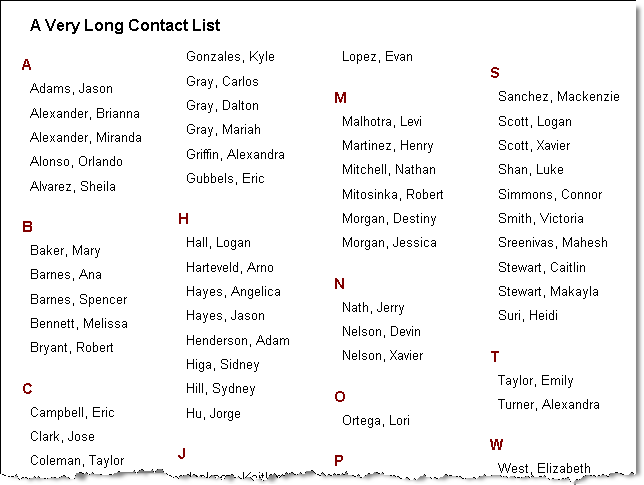

# How to Create a Multi-Column Report

A report can be divided into columns (imagine columns in a newspaper), that are treated as logical pages rendered on the same physical page.      	The detail section is printed once for every row in the data source similarly to a repeater and this happens vertically. The columns actually      	represent the separate pages of the report, which are treated as logical pages rendered on the same physical page. Columns are      	arranged from left to right, top to bottom, and are separated by white space between each, and data flow in the columns is left to right, top to      	bottom i.e. down the page and then across. A column on a physical page is considered a logical page, whenever there are multiple columns on the physical page. If you apply a page break     	on a report section in multi-column layout, the section affected by the page break would move to the next column (logical page). This means that if      	there is enough space on the current physical page, the section is moved to a new logical page (column) and not to a new physical page.     	

Columns are specified using the  [ColumnCount](/reporting/api/Telerik.Reporting.DetailSection#Telerik_Reporting_DetailSection_ColumnCount)  property.      	Column width is determined by the width of the report in design view. The  [ColumnSpacing](/reporting/api/Telerik.Reporting.DetailSection#Telerik_Reporting_DetailSection_ColumnSpacing)       	property is used to set the spacing in between the columns. The column width can be calculated as:

Page width minus sum of left and right margins minus ColumnSpacing * (ColumnCount - 1). The result should be divided to the ColumnCount.

>note Columns are only applied when you view a report in  __Print Preview__ , print a report or export it to a page oriented format.A report with multi-column report layout used as a SubReport would be rendered as a single column report layout.

## Setup multi-column report layout

1. In the Properties window expand the __PageSettings__  property of the report.

1. Change the __ColumnCount__  property to __4__  .

1. Set __ColumnSpacing__  if needed.

1. Resize the report to match the desired width of the columns. You can do this visually or by setting the __Width__  property of the report in the Properties window.

1. Resize any report items so that they are not greater than the width of the report.

>note If the report does not render the number of columns set in ColumnCount, it is likely the report width is too large. 			Check for report items with greater width than the width of the report and the column width itself.         	

## Multi-column report layout example

Below is a report set for multi-column layout in design time. It has the following properties:

__Report.Width=1.5in__ 

__Report.PageSettings.ColumnCount=4__ 

__Report.PageSettings.ColumnSpacing=0in.__ 

  

  

Here is how this report looks when previewed in Print Preview:

  

  

The following specifics are visible from the preview:

* Report header and group header sections span the width of the column.

* Page header and page footer sections span the actual width of the page, not the width of the column.

# See Also

# See Also

 * [How to: Create Multi-Column Report - Across the Page and Then Down](http://www.telerik.com/support/kb/reporting/details/how-to-create-multi-column-report---across-the-page-and-then-down)
