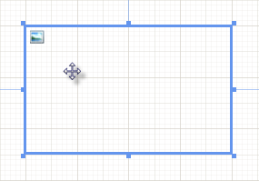
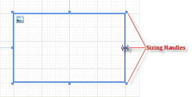

# How to Layout Report Items

Content on reports is displayed in report items. To use report items, you select them from the Toolbox and place them on your report.

## To Place a Report Item on a Report

In Visual Studio:

1. Open the report in design view.             

1. Expand the Telerik__Reporting__ tab of the Toolbox.             

1. Select the report item that you want to place.             

1. Drag the report item from the Toolbox to the report's design surface. Alternatively,               you may select the section of the report where you want the report item to appear by clicking               the section header, and then double-click the report item in the Toolbox. Or you can select the               report item in the toolbox and draw a bounding rectangle to indicate the area that the report item should occupy.             

In the Standalone Designer:

1. Open the report in design view.             

1. Click the __Insert__  tab of the ribbon.             

1. Select the report item that you want to place and click on it.             

## To Move a Report Item  

  

Move the mouse over the report item until you see the cross hair cursor (see image above), then click and drag the report item.

## To Change the Size of a Report Item

1. Click on the report item to select it.

1. Click and drag one of the size handles on the edge of the report item to the desired size.  

  

## Controlling Height

To remove blank vertical space in a container (report section or panel item), whenever you control the visibility of report items in runtime,           set its respective height to a very small value (e.g. 1mm). Section/Panel item can grow to accommodate their children but cannot shrink/take space that is           no longer occupied. If you want a section/panel to shrink only at runtime you can set its Height property in the report constructor.           Place the Height property assignment code just after the IntializeComponent() method call.         

# See Also

 * [Report Structure]()

 * [Design Considerations for Report Item Layout]()
