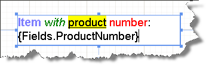
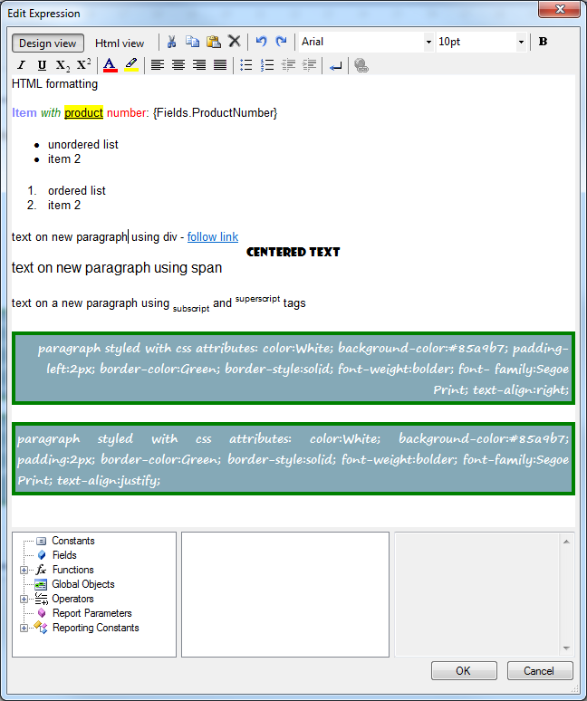
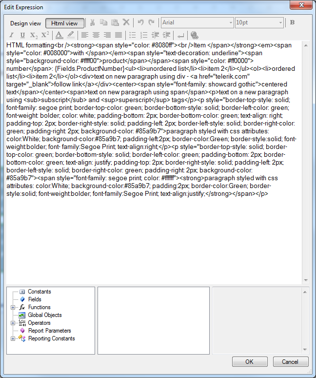

# HtmlTextBox Overview


This document describes the HtmlTextBox report item, which you can style through HTML tags and CSS attributes.        

## Overview

The HtmlTextBox report item allows developers to insert HTML-formatted text into a report. You can specify the HTML value at           design time (either through a WYSIWYG editor or through an expression editor), or retrieve it from a data source by using any simple           or complex expression that evaluates to correctly formatted HTML.         

With the HtmlTextBox report item, you can:       

* Define colors, fonts, and other behavior on any subset of text within a single HtmlTextBox to create a mail merge or a template for text in your report.           

* Use multiple paragraphs inside a single text box.           

* Set an alignment value for any individual string of text.           

For the full list with special entities like "?" and TAB and their expression, refer to this          [w3.org page](http://www.w3.org/TR/xhtml1/DTD/xhtml-special.ent) .       

>note  __Known Limitations:__ 
* The HtmlTextBox works with the -text formatting options only- .
* The HtmlTextbox is rendered as plain text with no formatting in Excel.
* RTL (Right to Left) is not supported.
* The HyperLink (```<A>``` tag) is interactive (acts as an actual hyperlink) only under an HTML rendering extension. To add links in PDF, XLSX, DOCX, PPTX files               and HTML, XAML, IMAGE renderings for the different Report Viewers, you can use a[Hyperlink Action]().
* Any limitations of the HtmlTextBox in specific export formats are reflected in the respective topic in the[Design considerations for Report Rendering]()help section.>


## Supported HTML tags

Various formatting options are available to control the text presentation:

* Font, size (relative size against the font size of the item, default is 3 (1-7)), color (```<FONT>```)

* Bold, Italic, Underline (```<strong>```,```<b>```, ```<em>```, ```<i>```, ```<u>```)

* Subscript, Superscript (```<sub>```,```<sup>```)

* HyperLink (```<a href target>```)

* Lists (```<ol>```, ```<ul>```, ```<li>```)

* Organize the text in paragraphs (```<div>```, ```<span>```,```<p>```, ```<br>```, ```<center>```)

>important TABLE and IMG tags are not supported. Instead, you must use the native Reporting [Table/List/Crrostab]()             and [PictureBox]() items. A custom approach like rendering HTML as an Image with a third-party tool             and using the image via PictureBox item is also supported.           


## Supported CSS attributes

You can style the text with the following CSS attributes:         

* background-color

* border, border-color, border-width, border-style

* text-align (center, left, right, justify), text-decoration (none, underline, line-through)

* text-indent (note: should be specified on a block item)

* font-family, font-size, font-weight

* padding, padding-bottom, padding-top, padding-right, padding-left

* color

>note When you import text that contains HTML markup, the data is always parsed by the HtmlTextBox first. Because             only a subset of HTML tags is supported, the HTML that is shown in the rendered report may differ from your             original HTML.           Also according to the HTML specification (and the general XML specification as well) the "&", "```<" and ">```"             characters are considered special (markup delimiters), so they need to be encoded in order to be treated as regular             text. For example the "&" character can be escaped with the "& amp;" entity. You can find more information on the subject in                 [this w3.org article](http://www.w3.org/TR/REC-xml/#syntax) .           


Any other HTML markup tags will be ignored during report processing. If the HTML represented by the expression in the           HtmlTextBox is not well formed, the HtmlTextBox would throw an exception. All HTML tags are case-insensitive.         

## Growing and Shrinking

By default, HtmlTextBoxes are a set size. If you want to allow an HtmlTextBox to expand vertically based on its contents,           set the  [CanGrow](/reporting/api/Telerik.Reporting.TextItemBase#Telerik_Reporting_TextItemBase_CanGrow)  property           to True (default value).           If you want to allow a TextBox to shrink based on its contents, set the            [CanShrink](/reporting/api/Telerik.Reporting.TextItemBase#Telerik_Reporting_TextItemBase_CanShrink)  property to           True (default value is False). The HtmlTextBox would always grow to accommodate the first line of text even when CanGrow is False.         

## Embedded expressions

The HtmlTextBox supports [embedded expressions]() for mail merge           functionality. Embedded expressions give you the freedom to get and insert data-driven information directly into the           text box report item to produce customized reports and mail merging.         

After the expression evaluation/replacement, the value of the HtmlTextBox must be valid XHTML.

## Editing

The HtmlTextBox supports data-driven in-line fields, which are editable either in-place or through a design-time editor, which is           available in Visual Studio and the Standalone Report Designer.           

The in-place editor for the HtmlTextBox report item allows you to quickly enter text           directly into the designer rather than having to look for a property in the property grid.           To activate the in-place editor, double-click the HtmlTextBox or select it and press F2. Once the in-place editor is activated:         

* Enter accepts all changes.

* Esc discards all changes.

* Moving focus away from the HtmlTextBox also accepts all changes. 

The screenshot below shows an HtmlTextBox with the in-place editor active.  

  

The design time editor supports two modes:

1. Interactive (__Design view__ ) - you can select a portion of the text and make it bold, change its font, size, color, etc.               using appropriate controls like comboboxes and buttons (WYSIWYG editor). Internally, the designer generates a               valid HTML source and stores it in the Value property of the item. Adding embedded expressions is possible, but               the entire HTML value cannot be an expression. You can switch to __HTML view__  at any time if needed.             

   >note Pressing the Enter key inserts a new paragraph or new list item depending on the current context.                 Note that it does NOT insert ```<br />``` (new line). To insert new line, use the button on the toolbar)                 

  

1. Expression (__Html view__ ) - the user enters raw HTML tags and text into the source editor. The value can be an expression or text               containing embedded expressions. The user can switch to __Design view__  unless the value is an expression.               

  

>note MultiLine and TextWrap concepts are always true for HtmlTextBox.The  __subscript__  and  __superscript__  tags can be nested (i.e. ```<sub>```subscript1```<sub>```subscript2```</sub>``````</sub>```),             resulting in gradually smaller font sizes and offsets. However, the corresponding toolbar buttons only toggles the  __subscript__  or  __superscript__  feature,             so if nested tags are needed, the appropriate code should be added manually using the editor's  __Html view__ .           


# See Also


# See Also

 * [HtmlTextBox with Anchor tag vs Hyperlink Action](http://www.telerik.com/support/kb/reporting/report-items/details/htmltextbox-with-anchor-tag-vs-hyperlink-action)

 * [HtmlTextBox: #ERROR# An error occurred while parsing EntityName](http://www.telerik.com/support/kb/reporting/report-items/details/htmltextbox-an-error-occurred-while-parsing-entityname)
