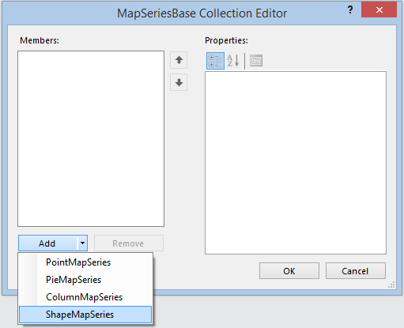
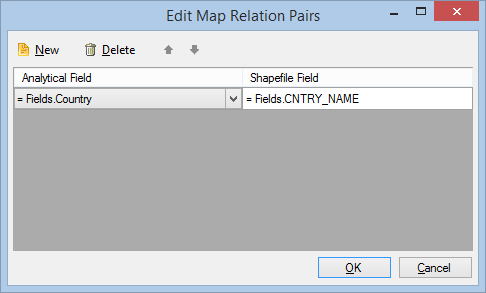
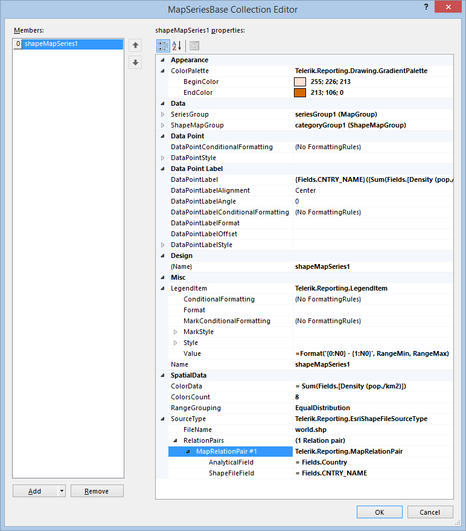

# How to Add ShapeMapSeries to the Map Item

The  [ShapeMapSeries](/reporting/api/Telerik.Reporting.ShapeMapSeries)  uses its own source to obtain a set of coordinates which will         determine the shape of the data points. These series does not use a LocationProvider or a GeoLocationMapGroup, because the data points         are not determined by a single location on the map surface, as with the  [LocationMapSeries](/reporting/api/Telerik.Reporting.LocationMapSeries) 

## Adding a ShapeMapSeries instance to the map

To add new ShapeMap series to the map follow these steps:         

1. Open __Series__ collection editor and __Add__ new                [ShapeMapSeries](/reporting/api/Telerik.Reporting.ShapeMapSeries)  item, as shown below:               

  

1. Set the  [ShapeMapGroup](/reporting/api/Telerik.Reporting.ShapeMapSeries#Telerik_Reporting_ShapeMapSeries_ShapeMapGroup)  to an existing                [ShapeMapGroup](/reporting/api/Telerik.Reporting.ShapeMapGroup)  instance or create a new one from scratch.             

1. Set the  [SeriesGroup](/reporting/api/Telerik.Reporting.MapSeriesBase#Telerik_Reporting_MapSeriesBase_SeriesGroup)  to an existing                [MapGroup](/reporting/api/Telerik.Reporting.MapGroup)  instance or create a new one from scratch.             

1. Set an expression for the  [ColorData](/reporting/api/Telerik.Reporting.ShapeMapSeries#Telerik_Reporting_ShapeMapSeries_ColorData)  field to define the value               that will be used to calculate the data point color.             

1. Set the  [RangeGrouping](/reporting/api/Telerik.Reporting.ShapeMapSeries#Telerik_Reporting_ShapeMapSeries_RangeGrouping)  property to one of the available options:               None, EqualInterval or EqualDistribution.               __None__ means that no grouping will be used and every data point will be colored according to its respective color data value.               __EqualInterval__ will split the interval between the minimum and maximum values by the colors count, assigning a separate color to each interval.               __EqualDistribution__ will try to distribute the data evenly among the groups defined by the ColorsCount property, assigning a separate color to each group.             

   >When the  __RangeGrouping__ property is set to  __None__,                 the  [ColorsCount](/reporting/api/Telerik.Reporting.ShapeMapSeries#Telerik_Reporting_ShapeMapSeries_ColorsCount)  value is not respected.               

1. Set the  [ColorsCount](/reporting/api/Telerik.Reporting.ShapeMapSeries#Telerik_Reporting_ShapeMapSeries_ColorsCount)  property depending on on how many groups               you would want to split the data values. When the __RangeGrouping__ is set to __None__, the legend               will contain only two items, showing the minimum and maximum data values. However, if the data set contains less records than the desired               colors count, the legend will display items only for the available data records.                           

1. Setup the __LegendItem.Value__ expression, using the specific references `RangeMin` and               `RangeMax` that determine the minimum and maximum values of the respective data range.             

1. Setup the  [ColorPalette](/reporting/api/Telerik.Reporting.GraphSeriesBase#Telerik_Reporting_GraphSeriesBase_ColorPalette)  property in order to define a range of               colors that will be used when displaying the data points. In the most cases the                [GradientPalette](/reporting/api/Telerik.Reporting.Drawing.GradientPalette)  will be the best choice.             

1. 

   + If you want to use a Well-known text __(WKT)__ or its binary representation __(WKB)__                 as a source for your shapes, select the __SourceType__ property and choose __WellKnownText__                 from the drop-down list. In the property __SpatialField__ below you have to write an expression or select the data set                   field that will provide the WKT/WKB data. This property is mandatory and it will be used by the processing engine to evaluate                   the contents of the field against the current data record and parse it as a __Well-known text__ or                   __Well-known binary__. Since the ShapeMapSeries displays polygons as its data points, the WKT/WKB contents will be used                   only if they contain valid __POLYGON__ or __MULTIPOLYGON__ definitions.                    The parsing of the points data will be done using __InvariantCulture__, so make sure your WKT definition uses period [.] as                   a decimal symbol.                 

   >The nested (interior) polygon rings will be displayed as polygons with no color fill.                   

   + If you want to use an __ESRI Shapefile__ as a shapes source, select the __SourceType__ property and                   choose __EsriShapeFile__ from the drop-down list.                 Set the path to the Shapefile as a value of the __FileName__ property. The processing engine will resolve                   absolute and relative file paths, and also will try to download __synchronously__ the file contents                   if it detects a valid URL. It is not necessary to provide the __.shp__ file extension.                 Using the __Map Relation Pairs dialog__, setup the __RelationPairs__ property, pairing the fields                    from the analytical data set with fields from the spatial data set, produced by the DBF file that is contained in the Shapefile bundle.                   

  

   >The engine will join the analytical data set with the spatial data set, preserving all the records from the spatial data set.                     In terms of SQL, if the spatial data set is "left" and the analytical data set is "right", the processing engine will produce a                      [Left outer join](http://en.wikipedia.org/wiki/Join_(SQL)#Left_outer_join).                   

1. If needed, you can apply some additional styling properties to the data points in order to make their boundaries more distinctive from each other.             

When all the properties are set, the __ShapeMapSeries__ instance should look similar to the following one in the           __Property Grid__ :           

  

# See Also

 

* [Map Overview]()

 

* [Map Structure]()

 

* [Add LocationMapSeries to the Map item]()

