# How to Create a Map with BarChart series using CSV data source


In this how-to article we will show you how to create a Map which will present the          [countries with the most medals won in Olympic Games](http://en.wikipedia.org/wiki/All-time_Olympic_Games_medal_table)           divided by their continental          [Association of National Olympic Committees](http://www.olympic.org/ioc-governance-national-olympic-committees) .         We will also add some interactivity to the report, giving the user the option to choose which countries to be displayed         on the map, highlighting the currently selected country and displaying an additional chart with         detailed information about it. We will be using the [Standalone Report Designer]()         to demonstrate how such a complex report can be done without writing any code.       

>important This article assumes that you have obtained a valid  __Location Provider key__  to authenticate your geocoding requests.           If you don't want to use a location provider, you need to provide the geographical coordinates of your points yourself and setup the MapSeries accordingly.           For more information please take a look at the [Location Providers]() article.         


## 

1. Start the Map Wizard:
   + If you create a new report, select the __Map Wizard__  icon from the __Available Templates__  page.                   

  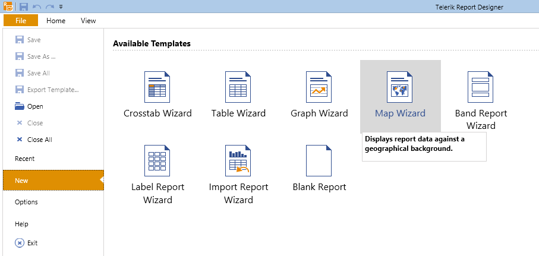

   + If you want to add the Map item to an existing report, you have to select the __Map__  item                   from the __Insert__  menu.                   This will bring up the __Map Wizard__  which will guide you through the creation process.                   

  


1. Add new               [CSV Data Source]()               and name it __medalsData__ . This data source will hold the information about the               countries, the ID of their respective olympic association, which place and how many times they have occupied it.             
   1. Download the                    [MedalsData.csv file](http://blogs.telerik.com/docs/default-source/reporting/medalsdata.csv?sfvrsn=2)                    , save it locally and insert its path into the *Select a file to import*  textbox.                   The information in this file is an example data set that shows how many times a national olympic team had occupied a first, a second                   or a third place in the Olympic Games. It also has a relation with the Association of National Olympic Committees table                   that we will build later.                 

   1. Press __Next__  until you get to the __CSV Headers__  page.                   Note that the CSV file has headers, so you should check the *The CSV has headers*  checkbox.                 

   1. On the __Map columns to type__  page set the type of `AssociationId, Place` and                   `Count` columns to __Integer__ .                 

   1. When you click __Parse CSV...__  on the next page, you should see the result of the parsed file, which should look                   like this:                   

  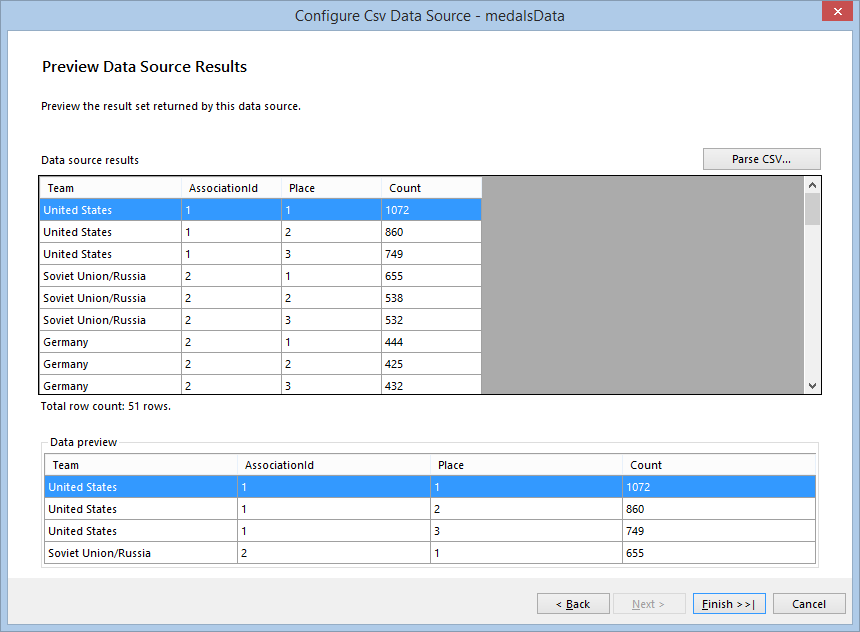Click __Finish__  when you are ready.                 


1. In the *Available data sources*  list you should see the datasource you've already created.               Select it and click __Next__ .             

1. In the next page you have to select the fields which will be used to build the map charts.             

    >tip Since the map will use a Location Provider, there is no need to provide the  __Latitude__  and  __Longitude__  coordinates by yourself, so you can                 left these boxes empty and just define a location group, which will set the geocoding string.               


   + Select the __Column Chart__  radiobutton from the *Datapoints type*  box.                 

   + Select the __Place__  field and drag it to the *Series (color)*  box.                 

   + Select the __Team__  field and drag it to *Categories (location)*  box.                 

   + Select the __Count__  field and drag it to *Size*  box, where it will be transformed to                   __Sum(Count)__ .                 
    Your __Arrange map fields__  page should look like the one shown below:               

  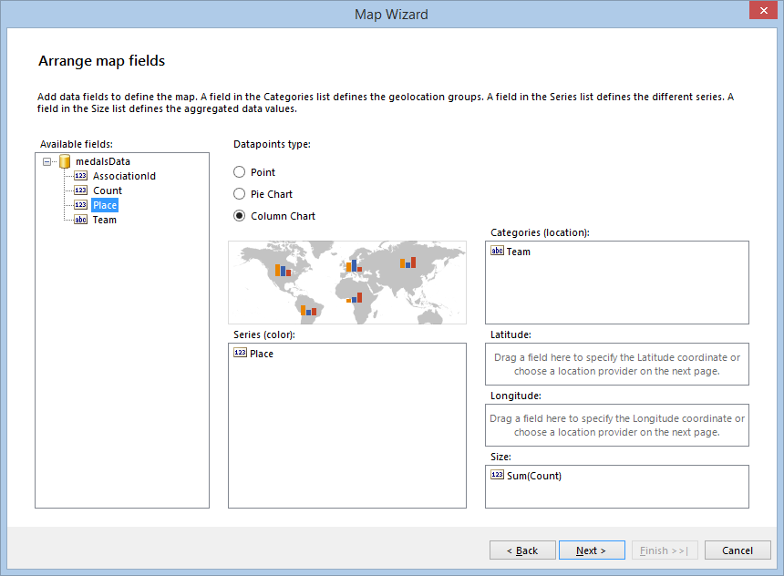    Once the mandatory fields are set up, the __Next__  button will get enabled and you can go to the next page.             

1. On the __Choose a location provider__  page you have to select the location provider that will be used to geocode               the __State__  field that was dragged in the *Categories (location)*  box on the previous page.               Currently the supported providers are                [MapQuestOpenAPILocationProvider](/reporting/api/Telerik.Reporting.MapQuestOpenAPILocationProvider)                ,                [MapQuestLocationProvider](/reporting/api/Telerik.Reporting.MapQuestLocationProvider)                and                [BingLocationProvider](/reporting/api/Telerik.Reporting.BingLocationProvider) .               They both require a valid client token (key) to authenticate the geocoding requests that will be sent from the Map item.               Once you have obtained the key, you should paste it in the *Client token*  box, as shown below:               

  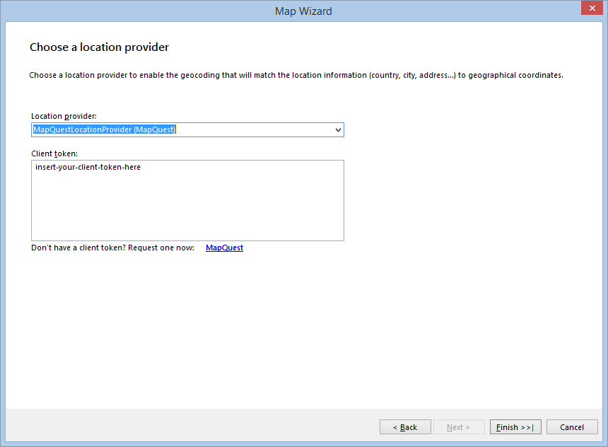

1. When you click __Finish__ , the Wizard will create the definition of the Map item, show it in the designer               and will start to request the geocode and tiles information from the providers asynchronously. Initially it will take a few seconds to fetch               all the data from the geocoding service, but the following requests should be executed faster. The tiles, needed to prepare the map background,               will be displayed as they arrive, but the map will stay responsive and you can examine and change its definition.               When finished, your map should look like this:               

  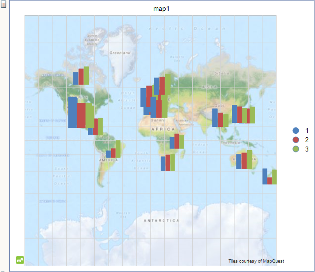

1. Now we will add a                [PointMapSeries](/reporting/api/Telerik.Reporting.PointMapSeries)                that will display a circle around each column chart. The circle size will be relevant to the               whole number of medals each team has won.                 The easiest way to add a series to the already created __Map__  or __Graph__  is to select it               and then start the respective Wizard. In this case you should start the MapWizard again by clicking the Map toolbar icon and on the               __Arrange map fields__  page perform the following steps:             
   + Select the __Point__  radiobutton from the *Datapoints type*  box.                 

   + Select the __Team__  field and drag it to *Categories (location)*  box.                 

   + Select the __Count__  field and drag it to *Size*  box, where it will be transformed to                   __Sum(Count)__ .                 
    Your __Arrange map fields__  page should look like the one shown below:               

  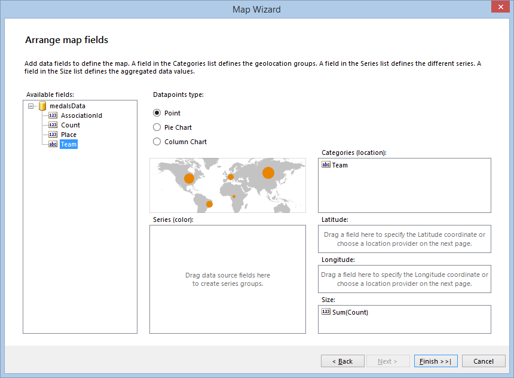    When you click the __Finish__  button, the map will display the two series together, rendered in the               order they have been created. That's why you will see the column charts being overlapped by the circles.             

1. The map needs some more setup and styling in order to make it look good. Select the Map item, click on the               __Series__  item in the Property grid and perform the following steps in the opened               __MapSeries Collection Editor__ :             
   + In the left pane (__Members:__ ) select the __pointMapSeries1__  item and move it up using                    the arrow buttons. This will cause the circles to be displayed as a background of the column charts.                 

   + Since the PointMapSeries will use the same grouping as the ColumnMapSeries, you should set its GeoLocationGroup to                   __teamGroup__  and its SeriesGroup to __seriesGroup__ , which were created along with the                   ColumnMapSeries.                 

   + As you have the __pointMapSeries1__  selected, set its                    [DataPointStyle](/reporting/api/Telerik.Reporting.GraphSeriesBase#Telerik_Reporting_GraphSeriesBase_DataPointStyle)                    .                    [BackgroundColor](/reporting/api/Telerik.Reporting.Drawing.Style#Telerik_Reporting_Drawing_Style_BackgroundColor)                    to __White__  and the                    [LineColor](/reporting/api/Telerik.Reporting.Drawing.Style#Telerik_Reporting_Drawing_Style_LineColor)                    to a color of your choice. In the example report is used the __DarkSlateBlue__                    color from the __Web__  palette.                 

   + Set the                    [DataPointLabel](/reporting/api/Telerik.Reporting.GraphSeriesBase#Telerik_Reporting_GraphSeriesBase_DataPointLabel)                    expression to `=Fields.Team` to display the name of the national team above the point.                 

   + Set the                    [DataPointLabelStyle](/reporting/api/Telerik.Reporting.GraphSeriesBase#Telerik_Reporting_GraphSeriesBase_DataPointLabelStyle) .                    [Visible](/reporting/api/Telerik.Reporting.Drawing.Style#Telerik_Reporting_Drawing_Style_Visible)                    property to __True__ .                 

   + Select the __columnMapSeries1__  item from the __Members:__  pane and set its                    [MarkerMinSize](/reporting/api/Telerik.Reporting.PointMapSeries#Telerik_Reporting_PointMapSeries_MarkerMinSize)  to __6mm__  and                    [MarkerMaxSize](/reporting/api/Telerik.Reporting.PointMapSeries#Telerik_Reporting_PointMapSeries_MarkerMaxSize)  to __10mm__ .                 

   + In order to match the column series colors with the real world medal colors, you need to define a custom ColorPalette.                   The process is explained [here]()                   and the colors used for this example are shown on the following screenshot:                   

  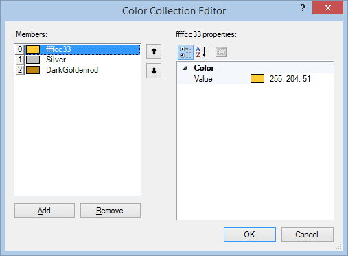

   + If you wish, you can change the map size, adjust the fonts properties and try various styling, but finally your map should look like this:                   

  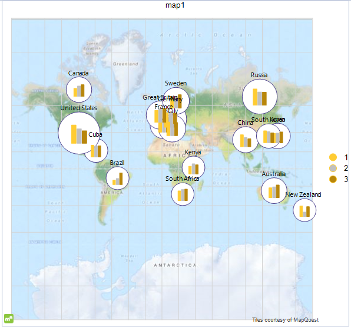


1. As you may have noticed, the information about the occupied places is present in the CSV file as integer numbers, that's why the               legend displays it this way. But the report will look better if the information about the places is displayed with medal names -                __Gold__ , __Silver__  and __Bronze__ .                This can be achieved using an expression for the                [LegendItem](/reporting/api/Telerik.Reporting.LegendItem) .                [Value](/reporting/api/Telerik.Reporting.LegendItem#Telerik_Reporting_LegendItem_Value) , but we will use a               [Calculated Field]()               , added to the CSV Data Source. The benefit of this approach is that we can use the calculated field as any other field, without having to               use an expression every time we need to address it.                 Select the __medalsData__  data source, add a calculated field named __Medal__                 of type `String` to it and set its expression to:             

	
              =IIF(Fields.Place = 1, 'Gold', IIF(Fields.Place = 2, 'Silver', IIF(Fields.Place = 3, 'Bronze', 'none')))
            

    Now you can set the __columnMapSeries'__  [LegendItem](/reporting/api/Telerik.Reporting.LegendItem) . [Value](/reporting/api/Telerik.Reporting.LegendItem#Telerik_Reporting_LegendItem_Value)  expression to               `=Fields.Medal` and style the legend by your choice.             

1. In case we want to reduce the amount of displayed information on the map, one of the best options is to use               [Report Parameters]()               and  apply               [Filtering](). In this case the filtering will be based on the                __AssociationId__  field.                 In order to display the meaningful names of the olympic associations, we will add another CSV Data Source, which has a relation with the               current data source's `AssociationId` field and will be used only for displaying the report parameters.             
   + Add a new CSV Data Source, select the tab *Enter CSV as text*  and paste the following text in the box:                 

	````

                  Id,Name
                  1,Pan-American Sports Organization
                  2,European Olympic Committees
                  3,Olympic Council of Asia
                  4,Oceania National Olympic Committees
                  5,Association of National Olympic Committees of Africa
                
````


   + Check the *The CSV has headers*  box on the __CSV Headers__  page.                 

   + On the __Map columns to type__  page set the type of `Id` column to                   __Integer__ .                 

   + When you click __Parse CSV...__  on the next page, you should see the result of the parsed file.                   Click __Finish__  when you are ready and name the dataSource __associationsData__                    when the Wizard closes.                 

   + Add new report parameter named __associationParam__  and set its properties as shown at the following screenshot:                   

  By default the parameter will be set to the association with `Id = 1`, which means that the report                   initially will show all the teams that are members of __Pan-American Sports Organization__ . However, because it is a multivalue                   parameter, you can add all the Association IDs in its __Value__  property.                 

   + Select the Map item and add a Filter Rule, that will filter out the teams with an AssociationId different than the ones, selected in the                   __associationParam__ . Set the __Expression__  to `=Fields.AssociationId`,                   the __Operator__  to `In` and the __Value__  to                   `=Parameters.associationParam.Value`.                 When you close the Filter Rules dialog, the designer gets updated and the map should show only the teams                   from the Pan-American Sports Organization. If you preview the report, you will be able to change the map extent                   only by selecting different combinations of parameter values.                 


1. Since the column charts on the map are not suitable to display any labels on them, we will add an additional CrossTab,               which will show the number of medals and calculate their amount for each national team.             
   + Start the Crosstab Wizard and choose the __medalsData__  data source on its                    __Choose a Data Source__  page.                 

   + Select the __Medal__  field and drag it to the *Column Groups*  box.                 

   + Select the __Team__  field and drag it to *Row Groups*  box.                 

   + Select the __Count__  field and drag it to *Detail Values*  box, where it will be transformed to                   __Sum(Count)__ .                 Your __Arrange fields__  page should look like the one shown below:                   

  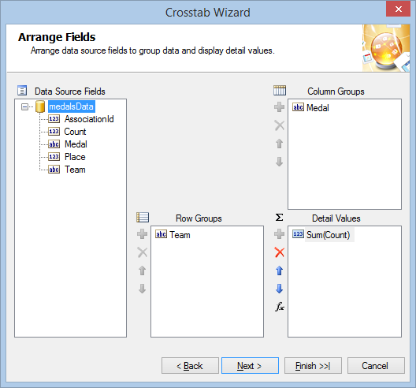

   + On the __Choose Layout__  page select *Blocked layout, subtotals below*  option                   and select __Finish__  if you do not need to choose from any predefined stylings.                 

   + Once the Crosstab Wizard is closed, your crosstab is done, but now it needs to be filtered the same way as the Map item. Apply the                   same filter rule as you did in the previous step (`=Fields.AssociationId In =Parameters.associationParam.Value`).                 

   + If you want to apply a different color for any of the medals columns, you have to set up three                   [ConditionalFormatting Rules]() to the textbox with the value                    *=Fields.Medal*                    , as shown below:                   

  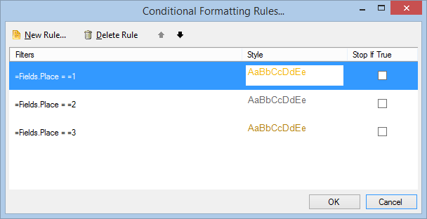

   + In order to have the information in your crosstab sorted properly, you can set `=Sum(Fields.Count) Desc`                   as a sorting for the row group and `=Fields.Place Asc` as a sorting for the column group.                 

   + You can change the table styling by your choice, but finally when you preview the report, the crosstab should look like the one below:                   

  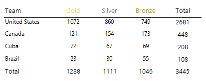


1. In this step we will add some interactivity to our report, allowing the user to select a national team from the crosstab and changing               the map extent according to its selection. The drill-through action will use an invisible report parameter which will store               the selected team name and utilize it in conditional formattings and filterings.             
   + Add new report parameter named __teamParam__ . Set its __AllowNull__  property                   to __True__  and leave the other properties as set by its default constructor.                 

   + If you haven't saved your report so far, save it now.                   Select the crosstab's textbox that displays the team name and add a __Navigate to Report__  action,                   as explained [here]().                 Click on __Select a Report Source__  button, select *URL or File*  option and                   from the *Select a file or enter a valid URL:*  drop-down list click the                   __```< Select a file >```__  option.                 

   + From the __Open file__  dialog select the report you're currently working on. This will cause the report to call itself                   every time this action is performed.                 

   + Click on __Edit Parameters...__  button, which will bring up the Edit Parameters dialog. When you click on                   *New*  toolbar button, the two report parameters - __associationParam__  and                   __teamParam__  - should be loaded in the *Parameter Name*  drop-down list.                 

   + Select `associationParam` from the *Parameter Name*  drop-down list and choose `=Parameters.associationParam.Value`                   for *Parameter Value* .                 Select `teamParam` from the *Parameter Name*  drop-down list and add the following expression as *Parameter Value* :                   `=ReportItem.Text`This setup means that on every report call the value of the __associationParam__  will be preserved and                   the __teamParam__  value will be set from the textbox that initiated the action.                 

   + To make the currently selected crosstab row more distinctive, we can apply a conditional formatting to it.                   Select the whole row, clicking on its header. This will select its three cells. Add new conditional formatting rule and set                   its expression to `=Fields.Team` and its value to `=Parameters.teamParam.Value`.                   Set an appropriate color as a style background to denote the selected state of the row.                 

   + We can apply conditional formatting to the map series as well, outlining the currently selected national team so it would be easier to                   find it among the data points on the map. Select the __PointMapSeries__  and set a new                    [DataPointConditionalFormatting](/reporting/api/Telerik.Reporting.GraphSeriesBase#Telerik_Reporting_GraphSeriesBase_DataPointConditionalFormatting)                    rule, as shown here:                   

  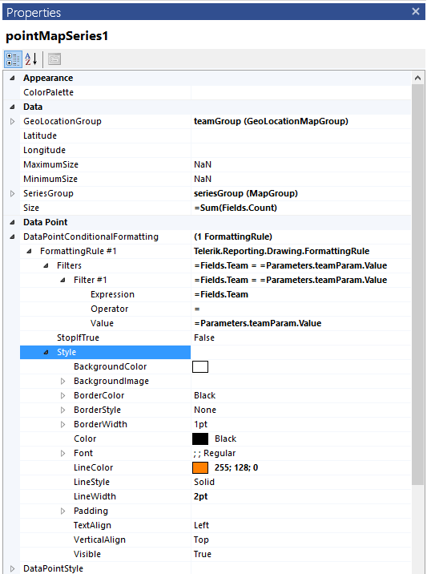


1. Finally we will add a small Graph showing a               [Column Chart]()               that will be used to display the amount of medals won by each team.             
   + Start the Graph Wizard by selecting __Column__ , __Clustered Column__  from the                    __Insert__  toolbar of the Standalone Report Designer.                 

   + Select __medalsData__  as a Graph's data source.                 

   + On the next page select the __Medal__  field and drag it to the *Series*  box.                 Select the __Count__  field and drag it to *Values*  box, where it will be transformed to                   __Sum(Count)__ .                 Click __Finish__  when you are ready.                 

   + Since the graph's purpose is to show the currently selected team's medals, you have to apply filtering by __Team__                    to it: `=Fields.Team = =Parameters.teamParam.Value`

   + In order to make it look the same way as the map's column charts, you have to set the __Sorting__  of the                   first member of the graph's series groups to                   `=Fields.Place ASC` and apply the same ColorPalette you have defined in step 8 to the Graph item.                 Additionally you can make the graph axes invisible, set the Y axis __Minumum__  to 0 and change the styling properties of its data points and data point labels.                 


1. When you are finished, you can preview your report and it should look similar to this one:               

  


In this example we demonstrated some of the newest features of Telerik Reporting along with a couple of advanced techniques that can be used             to make your reports more dynamic and more interactive, and all that without writing a single line of code.           

You can download this example report as a __.trdx__  report definition from the following link:              [How to: Create а map with ColumnChart series using CSV data source.](http://blogs.telerik.com/docs/default-source/reporting/olympicmedalsbynationalteams.trdx?sfvrsn=2) 

# See Also


 * [How to Setup a Map Using the Map Wizard]()

 * [Map Overview]()

 * [Map Structure]()

 * [Location Providers]()
