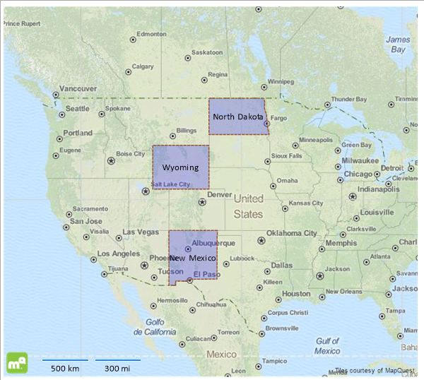

# How to Create a Map with custom polygons

This topic explains how to create a map that shows custom-defined shapes. The Map item processes and renders polygon primitives         using  [ShapeMapSeries](/reporting/api/Telerik.Reporting.ShapeMapSeries),         which accept          [Well-known text/Well-known binary](http://en.wikipedia.org/wiki/Well-known_text)          or          [ESRI Shapefile](http://en.wikipedia.org/wiki/Shapefile)          as a source. Since creating __ESRI Shapefiles__ requires additional tools, in this example the WKT polygon representation         will be used. The resulting report will display three American states whose coordinates will be obtained from a CSV data source.       

## Displaying custom polygons using the Map item

1. We will use the Choropleth wizard that will create the ShapeMap series instance for us. Start it either by selecting the               __Choropleth Wizard__ icon from the *Data Presentation Templates section* or from the __Insert__             menu in [Standalone Report Designer]().             

1. Add new               [CSV Data Source]()               and name it __statesData__. This data source will hold the information about the state name and their WKT-coordinates.               Click OK to continue with the data source wizard.             

1. On the page __Choose a CSV Source__ paste the following text in the *Enter CSV as text* tab:             

    
              State;WKT
              North Dakota;POLYGON((-104.064281 49.004828,-104.064281 45.945270,-96.557949 45.945270,-96.796902 46.641745,-96.763943 46.935113,-96.840847 47.006332,-96.879299 47.620830,-97.151211 48.176931,-97.105495 48.689066,-97.231838 49.004828,-104.064281 49.004828))
              Wyoming;POLYGON((-111.064309 45.005438,-111.064309 41.006683,-104.066018 41.006683,-104.066018 45.005438,-111.064309 45.005438))
              New Mexico;POLYGON((-109.065510 37.006785,-109.051777 31.332360,-108.208414 31.333407,-108.208493 31.783783,-106.528509 31.783783,-106.645607 31.896072,-106.614021 31.921719,-106.621574 31.971244,-106.638054 31.982311,-106.618623 32.000556,-103.064750 32.000519,-103.041428 36.500404,-103.002656 36.500529,-103.002220 36.999981,-109.065510 37.006785))
            

    >Note that the WKT consists of closed polygons (i.e. the last point coincides with the first one) that are enumerated in a counter-clockwise order.                 See the                  [OGC 10-032r8](https://portal.opengeospatial.org/files/?artifact_id=56866)                  specification for more information.               

    Click __Next__ when ready.             

1. On the __Configure the separators__ page check only the *Semicolon* option and click __Next__.             

1. Skip the __Escape Format__ page by clicking __Next__.             

1. On the __CSV Headers__ page tick the *The CSV has headers* option. Click __Next__.             

1. On the __Map columns to type__ page there should be displayed two columns: `State` and `WKT` that have type __string__.               In the *Data preview* box should be displayed the formatted output of the CSV data. If everything is correct, close the wizard by clicking __Finish__.             

1. The data source wizard closes and the __Choropleth Wizard__ activates, displaying the __statesData__ data source we just created. Click __Next__.             

1. On the __Choose a spatial data source__ page select the              *Well-Known-Text or Well-Known-Binary field from the data source* option and choose the               __WKT__ field in the combobox below. Click __Next__.             

1. The __Choropleth setup__ expects to setup the fields required to create a choropleth.               Since our data source doesn't include any analytical information that could be used, just drag one of the two available fields in the              *Color data field* box. Click __Finish__.             

1. When the wizard closes, the Map item should display the three polygons that roughly represent the state borders of North Dakota, Wyoming and New Mexico.               Depending on your scenario, you can setup a                [TileProvider](/reporting/api/Telerik.Reporting.TileProvider)  and add some additional styling to the data points and map:               

  

In this article we demonstrated how to display custom-shaped polygons using              [ShapeMapSeries](/reporting/api/Telerik.Reporting.ShapeMapSeries)  and Choropleth wizard. This approach is useful when is needed to             show an additional layer or layers of geospatial data in a report.           

# See Also

 

* [Map Overview]()

 

* [Map Structure]()

 

* [How to Add ShapeMapSeries to the Map Item]()

