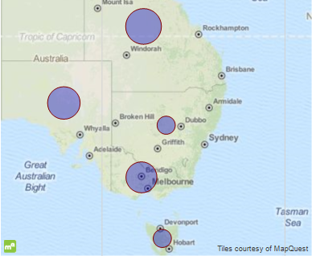
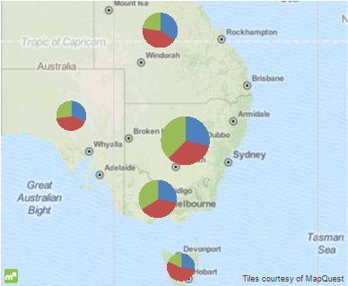
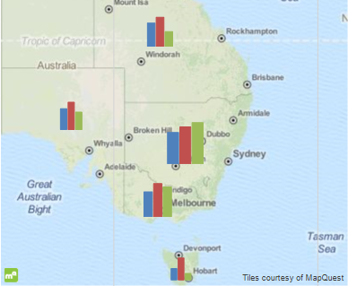
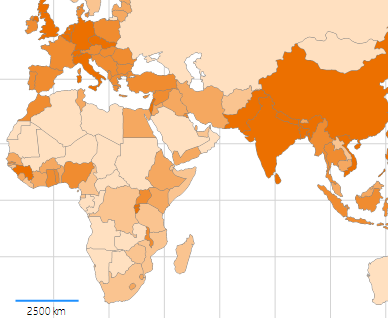

# Map Types

It is important to choose an appropriate map type for the type of data that you are presenting. This will determine how well the data can be interpreted when put in map form.

## Choosing a Map Type

Each map type has unique characteristics to help you visualize your dataset. You can use any map type to           display your data, but your data will be easier to read when you use a map type that is suitable to your data,           based on what you are trying to show in your report.         

The supported map types are:         

* __Point__  - similar to the Graph's [Scatter Chart](),               it is used to display a correlations between two sets of values.               The main difference is that the first values set is defined using a geographical coordinates, which will position every data point onto the map.               The second values set is used as a measure and displays a bubble with variable size depending on the measured value, i.e.                the differences between the data points are based on the size of the point. The larger the point is,                the larger is the difference between the two data points.               

  

* __Pie__  - such a chart is used to display grouped data as a Graph's               [Pie Chart]() on every data point. As with the Point map type, the data point               coordinates are defined by the GeoLocation group. The analytical data, needed to create the pie chart, is obtained using the child groups               of the GeoLocation group. A how-to article that explains how to setup such a map, can be found               [here]().               

  

* __Column__  - identical to the __Pie chart type__ , with the only difference that the analytical               data is presented using the Graph's [Column Chart](). A more advanced example               that shows how to create such a map and add some additional extras, can be found               [here]().               

  

*  [Choropleth](http://en.wikipedia.org/wiki/Choropleth_map)                 - a thematic map that uses graded color differences to display a               measure over predefined regions or areas. It is one of the most popular ways to visualize how a measure varies across               a geographic area. An example how to create a Choropleth map can be found                [here]().             

  The Choropleth item is basically a [Map item ]() with a special kind of series and groups.               To create a choropleth map, there is no need to configure a [Location provider]()               or use a  [GeoLocationMapGroup](/reporting/api/Telerik.Reporting.GeoLocationMapGroup)  to obtain the coordinates of the data points.               Instead, it uses a  [ShapeMapSeries](/reporting/api/Telerik.Reporting.ShapeMapSeries)  instance, whose major distinction from the               other Map series is that they define the source which will be used to provide the spatial data. This source can be either a string, formatted               in compliance with the                [Well-known text/Well-known binary](http://en.wikipedia.org/wiki/Well-known_text)                standards, or an                [ESRI Shapefile](http://en.wikipedia.org/wiki/Shapefile) .             

To achieve better appearance, the Map item can define a [Tile Provider]() which will           draw an image of the requested map extent as a background layer onto the plot area.         

# See Also

 * [Map Overview]()

 * [Map Structure]()
