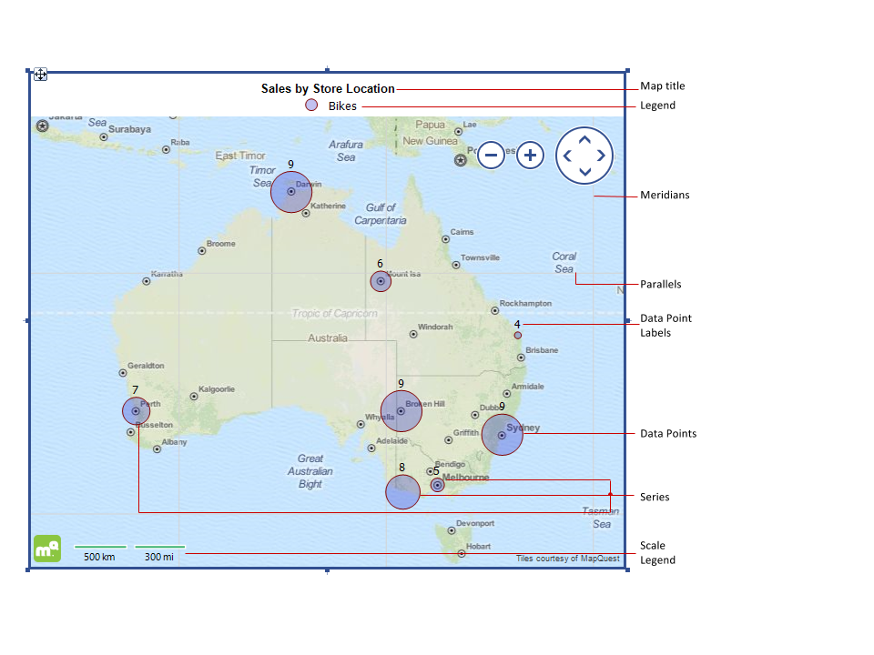

# Structure Overview

Map item enables you to visualize an aggregated business data in a geographical manner.

## Map elements

The image below show the basic elements of a map:  

  

Fig.1 *Map Item showing a PointMap series* 

## Parallels/Meridians

The parallels and meridians (named also latitude and longitude lines) represent an imaginary grid over the Earth's surface           thus forming the map coordinate system, called *graticule* . By combining longitude and latitude measurements, any location can be determined.           The units of measurement for geographic coordinates are degrees (°), minutes ('), and seconds ("), but for simplicity the Map item           uses their decimal representation (decimal degrees).         

When using the [Mercator projection](d41d4d88-13f3-465f-9e28-db79c99fb0a4#projection), the meridians are distributed equally along the coordinate system.           However, when using this projection, the latitude lines are non-linear, hence the parallels are placed on a non-constant distance from each other.           That's why the Map item gives the user the option to change the step at which the parallels/meridians are drawn.           When not set, the latitude and longitude lines are drawn based on the given extent and scale factor.         

## Data Points

Data points are produced by the defined map Series groups and GeoLocation groups. Their position is uniquely identified by the latitude/longitude           coordinates, returned either from a [Location Provider]() or from an expression. The data point can display one or more measures -           for example, when using a [Point Map]() series, the __Size__            property could represent some scalar value.         

## Data Point Labels

Data point labels are used to display the exact value represented by a data point. However, when the map has lots of data points           fit on a small plot area, the data point labels make it more difficult to read so they are created invisible by default.         

## Series

Series represent a number of data points that show individual measurements. The series in the Map item can be divided in two major categories           depending on the groups they use and the data points they display.         

The first category uses  [GeoLocationMapGroup](/reporting/api/Telerik.Reporting.GeoLocationMapGroup)            to obtain a set of latitude/longitude coordinates or to query the define a [Location provider]()           in order to determine its data points position on the map. The PointMap, PieMap and ColumnMap series fall in that category, since they present similar           data points, each one on a single location on the map. These series are called  [LocationMapSeries](/reporting/api/Telerik.Reporting.LocationMapSeries) .         

However, the  [ShapeMapSeries](/reporting/api/Telerik.Reporting.ShapeMapSeries)  belongs to a second category that uses a set of coordinates           to determine the shape of the data point itself. In this case the engine does not use a LocationProvider or a GeoLocationMapGroup, because the data points           are not determined by a single location on the map surface.         

The Map series can share existing GeoLocation, ShapeMap and Series groups.

>note Although the Map series share common properties, a  __ShapeMapSeries__  can only use and share a  __ShapeMap groups__ .             The  __LocationMapSeries__  (PointMap, PieMap and ColumnMap) can only use and share a  __GeoLocation groups__ .           

## Map Title

The Map Title is a report item used to set a header over a report item. It could be moved to a various position for a better visual effect.         

## Legend

The Map Legend is a collection of legend items that are used to distinguish the map series. It has numerous styling and expression           capabilities that are resolved in a hierarchical way as as explained in the           [Style Inheritance and Overriding]() documentation article.         

## Scale

The  [MapScaleLegend](/reporting/api/Telerik.Reporting.MapScaleLegend)  shows the scale of the current map extent,           measured at the middle between its minimum and maximum latitude.           The scale is calculated using the            [Haversine formula](http://en.wikipedia.org/wiki/Haversine_formula)            , assuming the Earth is a perfect sphere.         

* __Formatting the Scale Legend__ The __ScaleLegend__  allows the user to see the map scale in metric, imperial or both units, depending how the                [ScaleUnits](/reporting/api/Telerik.Reporting.MapScaleLegend#Telerik_Reporting_MapScaleLegend_ScaleUnits)  property is set.               The value of the shown scale depends on the  [Size](/reporting/api/Telerik.Reporting.MapScaleLegend#Telerik_Reporting_MapScaleLegend_Size)  property -               the processing engine calculates the nearest round value that can be               shown on the scale, using all the available width. The  [Height](/reporting/api/Telerik.Reporting.Drawing.SizeU#Telerik_Reporting_Drawing_SizeU_Height)                property in conjunction with  [VerticalAlign](/reporting/api/Telerik.Reporting.Drawing.VerticalAlign)  property               determines how the scale will be positioned vertically. If the __Size.Height__  is set to a very small value (e.g. 0.1),               the __ScaleLegend__  will grow vertically to display its content.             

* __Styling the Scale Legend__ Similar to the GraphSeries'  [LegendItem](/reporting/api/Telerik.Reporting.LegendItem) , the __MapScaleLegend__                provides two styles for more precise styling, named                [Style](/reporting/api/Telerik.Reporting.MapScaleLegend#Telerik_Reporting_MapScaleLegend_Style)  and                [ItemStyle](/reporting/api/Telerik.Reporting.MapScaleLegend#Telerik_Reporting_MapScaleLegend_ItemStyle) .               The __ItemStyle__  is used to set the styling of the mark line and the label. The                [LineStyle](/reporting/api/Telerik.Reporting.Drawing.Style#Telerik_Reporting_Drawing_Style_LineStyle) ,                [LineWidth](/reporting/api/Telerik.Reporting.Drawing.Style#Telerik_Reporting_Drawing_Style_LineWidth)  and the                [LineColor](/reporting/api/Telerik.Reporting.Drawing.Style#Telerik_Reporting_Drawing_Style_LineColor)                properties define how the scale line would look like. The borders around the line are defined by the                [BorderColor](/reporting/api/Telerik.Reporting.Drawing.Style#Telerik_Reporting_Drawing_Style_BorderColor) ,                [BorderStyle](/reporting/api/Telerik.Reporting.Drawing.Style#Telerik_Reporting_Drawing_Style_BorderStyle)  and                [BorderWidth](/reporting/api/Telerik.Reporting.Drawing.Style#Telerik_Reporting_Drawing_Style_BorderWidth)  properties.               The label styling is determined by the                [Color](/reporting/api/Telerik.Reporting.Drawing.Style#Telerik_Reporting_Drawing_Style_Color)  and                [Font](/reporting/api/Telerik.Reporting.Drawing.Style#Telerik_Reporting_Drawing_Style_Font)  properties               The __Style__  property sets the styling of the container item, including the background color, borders               and the vertical alignment of its content.             

## Projection

The projection is the representation model used to project the globe or celestial sphere on a surface. The projected coordinate system is defined           on a flat two-dimensional surface and it is always based on a geographic coordinate system that represents a sphere or spheroid.           In such a coordinate system, the locations are identified by a __x/y__  coordinates with the origin at the center of the grid.           Each position has two values that reference it to that central location - one for the horizontal and one for the vertical position.           The map item supports the following projections:         

*  [Mercator Projection](http://en.wikipedia.org/wiki/Mercator_projection)  - a conformal map projection of which the meridians are drawn parallel to each other and the parallels of latitude               are straight lines whose distance from each other increases with their distance from the equator.             

## Extent

__Map extent__  is a rectangular map area defined by geographical coordinates. It consists of 4 fields defining the sides           of the extent area: *LatitudeMax*  - usually the top side of the area rectangle,           *LatitudeMin*  - the bottom side,           *LongitudeMin*  - the left side,           *LongitudeMax*  - the right side of the area rectangle. The extent is displayed in the map viewport and can be defined in three ways:         

* __automatically__  - by the latitude and longitude coordinates of the data points. These coordinates can be retrieved               by geocoding or set from the data source.             

* __explicitly__  - when the extent fields are set directly using the Property grid. If the defined extent is not conformant               or has an invalid values, it will be automatically fixed when the map is panned or zoomed.             

* __from the viewport__  - when the map is panned or zoomed in/out, the extent is being recalculated and its new values are               populated in the Property grid.             

The Map extent can be reset to its automatically calculated bounds by right-clicking on the map outside the plot area and selecting           __Reset Map Extent__  from the context menu. This will restore its Latitude and Longitude values to its default state.         

## Tile Provider

[Tile Provider]() is used to request and download the imagery data for the specified map extent.           This data is downloaded on a small images called *tiles*  that form a background image, which can be used to           give a better appearance of your maps.         

## Location Provider

The [Location Provider]() matches the addresses or locations with geographical coordinates (latitude and longitude).           It is used in conjunction with the GeoLocation groups which is used to provide the geocoding request in order to retrieve the data point coordinates.           The more detailed information is used in the query, the more accurate the results will be.         

## Precision

The Map item is not designed for scenarios where great precision is needed. The processing engine works with float numbers for performance reasons, which limits the data points precision to ~0.00001. Such difference in decimal degrees, measured as latitude at the equator, gives a distance of ~1.1 meters. If the coordinates of the data points are closer than that distance, they may be rendered overlapped.         

# See Also

 * [Map Overview]()
