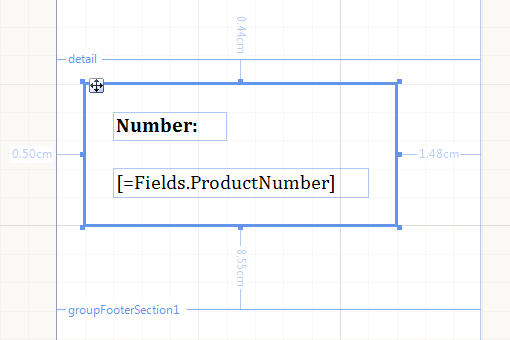

# Panel

The Panel report item is not associated with data and is used as a container for other items, usually to group/separate multiple report items by some criteria. 

## 

The Panel item can be used to organize the layout of a report and allow items to be rendered without affecting the content outside the Panel item.           The Panel item grows to accommodate its content, and as of __R3 2016__  it can shrink by setting its CanShrink property to true.           You can also set properties such as __Visible__  on the Panel to affect all of the report items hosted in that Panel.           When you move the Panel, the items that are contained within it move along with it. The           screenshot shows a Panel containing two [TextBox]() report items.           

  

>note A Panel acts as a container for items that you either create in it or drag into it. If you draw a Panel around an item that already exists in the Report Designer,             the Panel will not act as its container.           

# See Also

 * [Organizing the Report Layout via Panel item]()

 * [Using Styles to Customize Reports]() * [Panel](/reporting/api/Telerik.Reporting.Panel) 
