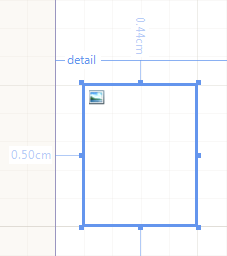

# PictureBox


The PictureBox report item is used to display images in a report. It works with the image formats supported by         GDI+ (BMP, GIF, JPEG, EXIF, PNG, and TIFF) and SVG (Scalable Vector Graphics) and with Base64-encoded images.

This document explains how to add an image to a report with the help of the PictureBox item and how to configure its layout.          

## Add a value to PictureBox

As a value for PictureBox, you can set an [expression]() that contains          binary image data, a URI (local path or URL) that points to a bitmap or an SVG file, or a string that represents either a Base64-encoded          image or an SVG markup.         When a Value property is assigned a string that is not an expression (doesn't start with "=") the value is assumed to be a URI,          a Base64-encoded image, or an SVG markup. Clicking the ellipsis for this property will open a browse dialog to navigate to a file on your          hard drive. The engine will try to determine the type of the selected file and populate the Value property with a descriptive text.         When a raster image file (BMP, GIF, JPEG, PNG, EXIF, TIFF) is selected, its bytes will be serialized in the report definition.         When a Base64-encoded image file is selected, the report definition will persist the string representation of the Base64-encoded image.         When an SVG image file is selected, the report definition persist its markup and it will be accessible in Edit Expression dialog.       

A path to an image file, a Base64-encoded string or an SVG markup can also be pasted in the Value property editor or in the          Edit Expression dialog. Note that the maximum length supported by the Value property editor is 32767 characters, so if the new string value is longer than that,          the Edit Expression dialog must be used instead.       

This screenshot shows a PictureBox report item on a report at design-time (note the image thumbnail in the upper left corner).  

  

If you want to set an expression as a Value of the PictureBox in the Report Designer, you need to right-click over the item              and choose "Expression...". You may enter the expression in the popped-up              [Edit Expression Dialog]().           

## Data Binding

Binding image data to a PictureBox report item is straight-forward. When you use a Report Designer and have connected to a data source,           you can simply drag the image field from the [Data Explorer]()           window onto your report. The designer is smart enough to know what kind of report item to associate with each field based on its            data type.         

Alternatively, one can drag a PictureBox item onto the design surface and use an expression to set its Value           property to an existing field from the data source.         

While the methods above are quickest to get an image onto your report, one doesn’t have to bind directly to a           database field with an image column. The type of the PictureBox.Value property is  [Object](http://msdn2.microsoft.com/en-us/library/system.object(VS.71).aspx)            which allows for versatile data binding. The Value property accepts objects of type  [Image](http://msdn2.microsoft.com/en-us/library/system.drawing.image.aspx)  and strings. The string can be expression or string literal. The expression should evaluate to            [Image](http://msdn2.microsoft.com/en-us/library/system.drawing.image.aspx) , byte array, relative or absolute            [Uri](http://msdn.microsoft.com/en-us/library/system.uri.aspx)  or a string representing a Base64-encoded image. The string literal can also be a relative or absolute            [Uri](http://msdn.microsoft.com/en-us/library/system.uri.aspx)  or a string representing a Base64-encoded image.         

* __Binding to a Binary Image__ You can directly assign a reference to an  [Image](http://msdn2.microsoft.com/en-us/library/system.drawing.image.aspx)                 to the Value property of a PictureBox:             

	
      ````c#
        using System.Drawing;
        Image image1 = Image.FromFile(@"C:\MyPictures\MyPicture.jpg");
        this.pictureBox1.Value = image1;
        Image image2 = Image.FromStream(imageStream);
        this.pictureBox2.Value = image2;
````
````vb.net
        Imports System.Drawing
        Dim image1 As Image = Image.FromFile("C:\MyPictures\MyPicture.jpg")
        Me.PictureBox1.Value = image1
        Dim image2 As Image = Image.FromStream(imageStream)
        Me.PictureBox2.Value = image2
````

While in design-time, if you click the ellipsis of the Value property of a selected PictureBox, you will be presented               with a dialog to choose the desired image. After you have selected the image, the Designer will automatically store it in               the resources file for the report (.resx) and add a line of code to the InitializeComponent method that obtains a reference               to the image stored in the resources and assigns it to the Value property of the PictureBox:             

	
      ````c#
			    this.pictureBox1.Value = ((object)(resources.GetObject("pictureBox1.Value")));
````

When the database field contains relative path (be it file path or URI) you can use [User Functions]()               to specify the correct path to the image:             

	
      ````c#
public static Image LoadImage(string imageLocation)
{
     string absoluteLocation = "C:\\" + imageLocation;
     return Image.FromFile(absoluteLocation);
}
````
````vb.net
Public Shared Function LoadImage(imageLocation As String) As Image
	Dim absoluteLocation As String = "C:\" + imageLocation
	Return Image.FromFile(absoluteLocation)
End Function
````

and set the Value of the PictureBox item to the correct expression: =LoadImage(Fields.YourImagePathColumn).             

* __Binding to an Expression/URI/Base64-encoded image/SVG markup__ Alternatively you can assign a string value to the Value property of a PictureBox. This string value can be either an                [item binding expression](),               an  [URI](http://en.wikipedia.org/wiki/URI)                a string representing a Base64-encoded image,               or a valid SVG markup.               Both __absolute__  and __relative__  URIs are supported.               When binding to a data field with an expression, the Value property will accept both __binary and string data fields__ .               For optimization the engine initially checks the length of the string value. If it is less than 80 characters, the value is                considered to be an URI. Otherwise the string is tested whether it is SVG markup (if its first 256 characters contain                __<svg__ ) or a Base64-encoded string. In case the string is neither a valid SVG nor Base64-encoded string,                the engine will still accept the string as URI and will try to instantiate an image from it. In other words, your data source                column may store the image object, its Base64 string representation, an SVG markup or a relative or absolute                __URI__  pointing to the image:             

	
      ````c#
      this.pictureBox1.Value = "=Fields.MyImageBinary";//a binary data column 
      this.pictureBox2.Value = "=Fields.MyImageURI";//a data column containing an URI
      this.pictureBox3.Value = @"C:\MyPictures\MyPicture.png";//absolute file path to a PNG file
      this.pictureBox4.Value = @"C:\MyPictures\MySVGImage.svg";//absolute file path to an SVG file
      this.pictureBox5.Value = @".\images\MyPicture.png";//relative path
      this.pictureBox6.Value = "http://www.mysite.com/images/img1.gif";//absolute URL
````
````vb.net
      Me.PictureBox1.Value = "=Fields.MyImageBinary" 'a binary data column
      Me.PictureBox2.Value = "=Fields.MyImageURI" 'a data column containing an URI
      Me.PictureBox3.Value = "C:\MyPictures\MyPicture.png" 'absolute file path to a PNG image
      Me.PictureBox4.Value = "C:\MyPictures\MySVGImage.svg" 'absolute file path to an SVG file
      Me.PictureBox5.Value = ".\images\MyPicture.png" 'relative path
      Me.PictureBox6.Value = "http://www.mysite.com/images/img1.gif" 'absolute URL
````


## Clipping, positioning and rendering

The clipping and positioning of an image in the display area of a PictureBox item is controlled by its Sizing property.         

__Sizing Property modes:__ 


| Name | Description |
| ------ | ------ |
|AutoSize|The __PictureBox item__ size is adjusted to that of the image it contains.|
|Center|The image is displayed in the center of the __PictureBox item__ . If the image is larger than the __PictureBox item__ , the outside edges are clipped.|
|Normal|The image is placed in the upper-left corner of the __PictureBox item__ . The image is clipped if it's larger than the __PictureBox item__ which contains it.|
|Stretch|The image within the __PictureBox item__ is stretched or shrunk as appropriate to fit the size of the __PictureBox item__ .|
|ScaleProportional|The image is sized proportionally (without clipping), so that it's best fitted to the __PictureBox item__ .<br/>              If the height and width ratio of the __PictureBox item__ is the same as the image's ratio it will be resized<br/>              to exactly fit into the __PictureBox item__ . Otherwise the closest fitting side (height or width) of the<br/>              image will be sized to the item and the other side (height or width) of the image sized proportionally (leaving empty space)|


The PictureBox image is rendered depending on the underlying image DPI settings, so the physical dimensions of the rendered item may vary.           For example, if you are using an 120dpi image in your PictureBox with __Sizing__  set to           *AutoSize*  or *Normal*  and the machine settings are set to 96dpi,           the image would look smaller due to the higher amount of pixels per inch. If you want your image to be resized appropriately, its           __Sizing__  should be set to *Stretch*  or *ScaleProportional* .         

The SVG images are rendered in vector format where the rendering extension supports it. On the designer surface and in image formats the SVG contents are rendered as EMF (Enhanced Metafile) which is also a vector format           and preserves the lossless scaling. In HTML formats the SVG markup is rendered as-is, since all modern browsers support SVG contents.            In OpenXML-based rendering extensions (DOCX, XLSX, PPTX, RTF) the SVG is rendered in vector format by default, but can be rendered in raster format if the deviceInfo setting *UseMetafile*  is set to __false__ .           In the rest of the rendering extensions the SVG is rendered as raster image, but the item's size is always taken into account to ensure highest rendering quality.         

# See Also


 * [Using Styles to Customize Reports]()

 * [Using Expressions]()

 * [Types of Bitmaps](http://msdn.microsoft.com/en-us/library/at62haz6.aspx)

 * [Images, Bitmaps, and Metafiles](http://msdn.microsoft.com/en-us/library/3ke1f63h.aspx)

 * [Scalable Vector Graphics (SVG)](https://www.w3.org/TR/SVG/)

 * [PictureBox](/reporting/api/Telerik.Reporting.PictureBox) 

 * [Sizing](/reporting/api/Telerik.Reporting.PictureBox#Telerik_Reporting_PictureBox_Sizing) 
