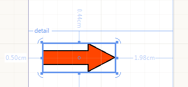

# Shape


The Shape report item is used to display one of a selection of predefined shapes on a report. The screenshot below         shows a Shape report item with ShapeType="Right Arrow" on the report design surface.         

  

You can use shapes to create visual effects within a report. You can set display and other properties to this item by         using the Properties pane.       

__ShapeType Property modes:__ 

* Ellipse           

* Vertical Line           

* Horizontal Line           

* Slant Line           

* BackSlant Line           

* Triangle           

* Square           

* Pentagon           

* Hexagon           

* Octagon           

* 3-ray star           

* 4-ray star           

* 5-ray star           

* 6-ray star           

* 8-ray star           

* Top Arrow           

* Bottom Arrow           

* Left Arrow           

* Right Arrow           

* Cross           

The Shape report item supports creating a custom shapes programmatically. The following code snippet shows how to inherit the          [ShapeBase](/reporting/api/Telerik.Reporting.Drawing.Shapes.ShapeBase)  class and provide a custom set of __PointF__  array         that will form the shape. The points coordinates are relative and do not depend on the item's size or position in the report.       

{{source=CodeSnippets\CS\API\Telerik\Reporting\ShapeSnippets.cs region=CustomShapeClassDeclarationSnippet}}
````c#
	        class CustomShapeType : Drawing.Shapes.ShapeBase
	        {
	            public override object Clone()
	            {
	                return new CustomShapeType()
	                {
	                    Bounds = this.Bounds
	                };
	            }
	
	            protected override void CreateShape()
	            {
	                var points = new System.Drawing.PointF[]
	                {
	                    new System.Drawing.PointF(0.5f, 1.5f),
	                    new System.Drawing.PointF(2, 0),
	                    new System.Drawing.PointF(6, 4),
	                    new System.Drawing.PointF(4, 6),
	                    new System.Drawing.PointF(2, 4),
	                    new System.Drawing.PointF(6, 0),
	                    new System.Drawing.PointF(7.5f, 1.5f)
	                };
	
	                base.AddLines(points, false);
	            }
	        }
````
{{source=CodeSnippets\VB\API\Telerik\Reporting\ShapeSnippets.vb region=CustomShapeClassDeclarationSnippet}}
````vb.net
	    Class CustomShapeType
	        Inherits Drawing.Shapes.ShapeBase
	
	        Public Overrides Function Clone() As Object
	            Return New CustomShapeType() With {.Bounds = Me.Bounds}
	        End Function
	
	        Protected Overrides Sub CreateShape()
	            Dim points = New System.Drawing.PointF() {New System.Drawing.PointF(0.5F, 1.5F), New System.Drawing.PointF(2, 0), New System.Drawing.PointF(6, 4), New System.Drawing.PointF(4, 6), New System.Drawing.PointF(2, 4), New System.Drawing.PointF(6, 0), New System.Drawing.PointF(7.5F, 1.5F)}
	            MyBase.AddLines(points, False)
	        End Sub
	    End Class
````


The Shape item can be created at runtime and added to a report item container (section, panel, etc.).          The snippet below shows how to instantiate a Shape item of __CustomShape__  type:       

{{source=CodeSnippets\CS\API\Telerik\Reporting\ShapeSnippets.cs region=CreateCustomShapeSnippet}}
````c#
	        Shape CreateShape()
	        {
	            var shape = new Telerik.Reporting.Shape()
	            {
	                ShapeType = new CustomShapeType(),
	                Size = new Drawing.SizeU(Drawing.Unit.Cm(2), Drawing.Unit.Cm(2)),
	                Location = new Drawing.PointU(Drawing.Unit.Cm(1), Drawing.Unit.Cm(1)),
	            };
	            shape.Style.Color = System.Drawing.Color.Green;
	            shape.Style.LineWidth = Drawing.Unit.Pixel(5);
	
	            return shape;
	        }
	
````
{{source=CodeSnippets\VB\API\Telerik\Reporting\ShapeSnippets.vb region=CreateCustomShapeSnippet}}
````vb.net
	    Private Function CreateShape() As Shape
	        Dim shape = New Telerik.Reporting.Shape() With {.ShapeType = New CustomShapeType(), .Size = New Drawing.SizeU(Drawing.Unit.Cm(2), Drawing.Unit.Cm(2)), .Location = New Drawing.PointU(Drawing.Unit.Cm(1), Drawing.Unit.Cm(1))}
	        shape.Style.Color = System.Drawing.Color.Green
	        shape.Style.LineWidth = Drawing.Unit.Pixel(5)
	        Return shape
	    End Function
````


# See Also


 * [Using Styles to Customize Reports]() * [Shape](/reporting/api/Telerik.Reporting.Shape)  * [ShapeType](/reporting/api/Telerik.Reporting.Shape#Telerik_Reporting_Shape_ShapeType)  * [Stretch](/reporting/api/Telerik.Reporting.Shape#Telerik_Reporting_Shape_Stretch) 
