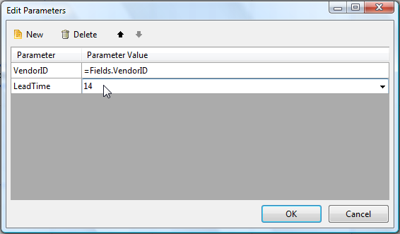

# SubReport

The SubReport report item lets you display one report within another report. It is a container item just like the report sections and grows depending on its children. The screenshot shows a SubReport report item at design-time. This allows you to compose complex reports from disparate report sources. The data for each SubReport can be completely different. For example you could combine a product listing, a sales summary and a list of sales people each in their own sub reports, with each sub report getting data from a different source. You can also pass parameters to SubReports using the Edit Parameters collection editor.

> [Data Items]() cannot be used in page sections, because the latter are processed after the report data has been processed. At this moment the report data source is not available anymore.
 

  

> Page sections are not related to the report itself, but are relative to the paper or screen. Thus page sections of nested/detail reports are ignored and only the page sections of the main report are visible.In order to have sections that repeat on every page similar to page sections, consider using an unbound group (no grouping criteria specified) and set the  [PrintOnEveryPage](/reporting/api/Telerik.Reporting.GroupSection#Telerik_Reporting_GroupSection_PrintOnEveryPage) property of its sections to True. Be aware that you cannot use __PageCount__ and __PageNumber__ global objects in group sections.

## SubReport Height Issues

To remove blank vertical space in the detail section of a __SubReport__, set the Height of the __SubReport.ReportSource__ __DetailSection__ to the height of the tallest item. Sections can grow to accommodate their children but cannot shrink to hide empty space. If you want the detail section to shrink only at runtime you can set the Height property of the DetailSection in the report constructor. Place the __Height__ property assignment code just after the _IntializeComponent()_ method call.

## Passing Parameters to a SubReport

1. Click the subreport item that you want to change. The selected subreport properties are listed in the __Property Browser__.

1. In the __ReportSource property__, click the __Edit Collection (…) button__. __Load a Report From__ window opens. 

1. Click __Edit Parameters__ button to add a parameter. __Edit Parameters__ window opens. 

1. Click the __New__ button to add a new parameter mapping.                     

1. Assuming you have assigned the __ReportSource__ property the __Parameter Name__ drop down list will contain the names of parameters defined in the subreport report. Select a __Parameter Name__ from the combobox to set the target for this parameter. from the combobox to set the target for this parameter. 

1. __Parameter Value__ combobox allows you to enter value directly, create an "```<Expression>```" or a "```<New Report Parameter>```". 

1. When you are done, click __OK__. 
  

  


# See Also

* [How to configure a ReportSource for a SubReport]()

* [How to create a Master-Detail report using a SubReport]()

* [How to bind a SubReport to the parent report's data]()

* [SubReport](/reporting/api/Telerik.Reporting.SubReport) 

* [ReportSource](/reporting/api/Telerik.Reporting.SubReport#Telerik_Reporting_SubReport_ReportSource)

