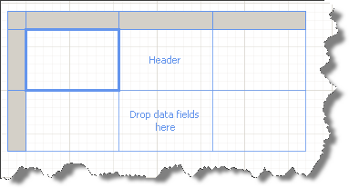
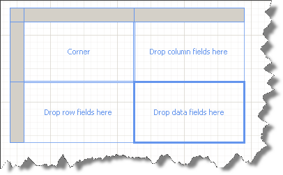
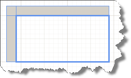
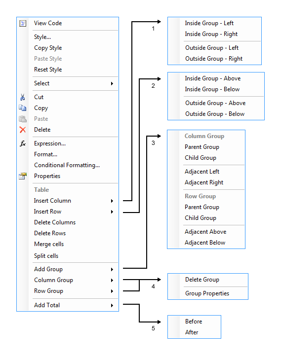
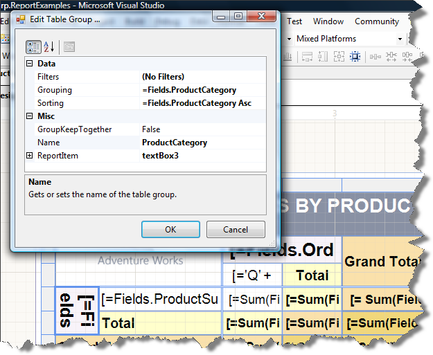

# Table/Crosstab/List Overview

The Table report item is a separate data region and does not make use of the report's data source. It has its own          [Telerik.Reporting.DataItem.DataSource](/reporting/api/Telerik.Reporting.DataItem#Telerik_Reporting_DataItem_DataSource)  property which you have to set in order to populate the item with data.       

Use the table to display fields from a dataset either as detail data or as grouped data in a grid or free-form layout. Telerik Reporting provides three items that can be used as templates and you can add them directly from the Toolbox: table, crosstab, and list.

## OverView

* __Table:__ Use a table item to display detail data, organize the data in row groups, or both. The Table contains three columns with a table header row and a details row for data. The following figure shows the initial table template, selected on the design surface:                 

  

* __CrossTab:__  Use a CrossTab template to display aggregated data summaries, grouped in rows and columns. The number of rows and columns for groups is determined by the number of unique values for each row and column groups. The following figure shows the initial crossTab template, selected on the design surface:                 

  

* __List:__ Use a list item to create a free-form layout. You are not limited to a grid layout, but can place fields freely inside the list. You can use a list to design a form for displaying many dataset fields or as a container to display multiple data regions side by side for grouped data. For example, you can define a group for a list; add a table, chart, and image; and display values in table and graphic form for each group value.                 

  

Of course, you are not limited to your initial template choice. As you add groups, totals, and labels, you may find you want to modify your table design. For example, you might start with a table and then delete the details row and add column groups.

You can continue to develop a Table, crossTab, or List by adding any table feature. Table features include displaying detail data or aggregates for grouped data on rows and columns. You can create nested groups, independent adjacent groups, or recursive groups. You can filter and sort grouped data, and easily combine groups by including multiple group expressions in a group definition.

> [Data Items]() cannot be used in page sections ([PageHeaderSection/PageFooterSection]()), because the latter are processed             after the report data has been processed. At this moment the report data source is not available anymore.           

## Context Menu

When you click on a Table/Crosstab cell, you select a TextBox item. Although this is standard TextBox report item, when it is in the context of a Table/Crosstab/List item, its context menu would show settings for the Table/Crosstab/List item besides the [usual TextBox item's attributes it shows]().            To see an option you need to click either on an item or on the row/column handlers (the gray rectangles appearing when the whole Table item is selected). The Context Menu is functionally dependent on where exactly you click, and offers possible actions that are allowed and you can take (see image below).           

  

The Groups can be Parent, Child and Adjacent according to the hierarchy level. However when it comes to row/column operations they're referred to as inside and outside group i.e. a static row/column is added inside or outside of the current group.

When you select several cells which belong to a single dynamic (or static) group, then the Ccontext Menu would show Merge Cells option. Once cells from a single group are merged they can be later split by selecting the merged cell and choosing Split Cells from the menu.

## Table Group Editor

Choosing a dynamic group from the           [          Group             Explorer        ](), shows a context menu which allows you to alter the           properties of the selected group. Choosing Group properties option,           would open a "Edit Table Group" dialog from which you can control           Filters, Grouping and Sorting along with specifying GroupKeepTogether.           

  

## In This Section

[Basic Concepts]()

[Understanding Crosstab Areas]()

[Understanding table Cells, Rows and Columns]()

