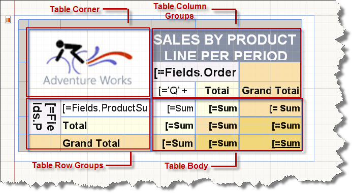

# Understanding Crosstab Areas

A CrossTab item has four areas that contain table cells: corner, row group, column group and body. Cells in each area have a distinct function. You add cells to the body area to display detail and grouped data. The report designer adds cells to the row group or column group area when you create a group in order to display group instance values. The corner cells are created when both row groups and column groups exist.

The following figure shows the areas for a CrossTab with nested row groups based on "ProductCategory" and "ProductSubCategory", nested column groups based on "OrderDate.Year".

  

The following list describes each area:

* __Corner area__. (Optional) 
  
  A CrossTab corner is located in the upper-left corner. This area is automatically created when you add both row groups and column groups to a CrossTab. In this area, you can merge cells and add a label or embed another report item. In the figure, the corner display the AdventureWorks logo.

* __Column groups area__. (Optional) 
  
  CrossTab column groups are located in the upper-right corner. This area is automatically created when you add a column group. Cells in this area represent members of the column groups hierarchy, and display the column group instance values. In the figure, the cell that displays OrderDate.Year is column group. The columns Total and Grant Total displays the aggregated totals across each row. It can be repeated on every page that the table spans vertically on by setting the [ColumnHeadersPrintOnEveryPage](/reporting/api/Telerik.Reporting.Table#Telerik_Reporting_Table_ColumnHeadersPrintOnEveryPage) to true. Column headers can also remain visible while scrolling vertically in Interactive mode of the HTML5-based viewers by setting [FreezeColumnHeaders](/reporting/api/Telerik.Reporting.Table#Telerik_Reporting_Table_FreezeColumnHeaders) to true.

* __Row groups area__. (Optional) 
  
  CrossTab row groups are located on the lower-left corner. This area is automatically created when you add a row group. Cells in this area represent members of the row groups hierarchy, and display row group instance values. In the figure, the cells that display ProductCategory and ProductSubCategory are nested row groups. The Total row below ProductSubCategory repeats with each category group to show the aggregated subtotals for each column. The grand total row shows the totals for all categories. It can be repeated on every page that the table spans horizontally on by setting [RowHeadersPrintOnEveryPage](/reporting/api/Telerik.Reporting.Table#Telerik_Reporting_Table_RowHeadersPrintOnEveryPage) to true. Row headers can also remain visible while scrolling horizontally in Interactive mode of the HTML5-based viewers by setting  [FreezeRowHeaders](/reporting/api/Telerik.Reporting.Table#Telerik_Reporting_Table_FreezeRowHeaders) to true.

* __Body  area__. 
  
  The CrossTab body is located in the lower right corner and it displays detail and grouped data. In this example, only aggregated data is used. The scope for the expression is determined by the innermost groups to which the text box belongs. Cells in the CrossTab body display detail data when they are members of a detail row and they represent aggregate data when they are members of a row or column associated with a group. By default, cells in a group row or column that contain simple expressions that do not include an aggregate function, evaluate to the first value in the group. In the figure, the cells display the aggregate totals and grand totals for line totals for all sales order.

When the report runs, column groups expand to the right for as many columns as there are unique values for a group expression. Row groups expand down the page. For more information see [Understanding table cells, rows and columns](). 

The following figure shows the CrossTab in Preview.  

  

The row group area displays group instances for ProductCategory (Accessories from the screenshot). The column group  displays four year group instances for 2001, 2002, 2003 and 2004. The Total column row displays the row totals; the totals row that repeats with the category group shows productSubCategory totals, and the grand total row displays the category totals once for the crosstab.
