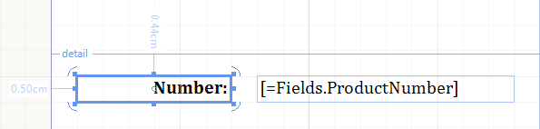
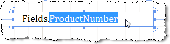
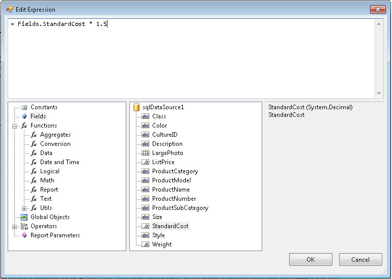

# TextBox


The TextBox report item is used to display text on a report. This screenshot shows two TextBox report items.  

  

TextBox can display literal text for titles, descriptions, and labels, or dynamic text based on expressions. Every         cell in a Table or CrossTab also contains a TextBox, which can be formatted the same way as stand-alone TextBoxes in your report.         The expressions in a TextBox can contain literal text, point to a database field or calculate data.       

Use a Panel item when you want to control the TextBox layout and dependency with other report items. For more information,         see  [Panel](/reporting/api/Telerik.Reporting.Panel) .       

In order to format separate chunks of text (i.e. different words) or insert HTML-formatted text into a report, use the          [HtmlTextBox](/reporting/api/Telerik.Reporting.HtmlTextBox)  report item.       

## Growing and Shrinking

By default, TextBox items are a set size. If you want to allow a TextBox to expand vertically based on its contents,           set the  [CanGrow](/reporting/api/Telerik.Reporting.TextItemBase#Telerik_Reporting_TextItemBase_CanGrow)  property to True (default value).           If you want to allow a TextBox to shrink based on its contents set the            [CanShrink](/reporting/api/Telerik.Reporting.TextItemBase#Telerik_Reporting_TextItemBase_CanShrink)  property to           True (default value is False). The TextBox would always grow to accomodate the first line of text even when CanGrow is False.         

## Text Orientation

You can use the  [Angle](/reporting/api/Telerik.Reporting.TextItemBase#Telerik_Reporting_TextItemBase_Angle)            property to change the text orientation in a TextBox item. This can help you create           more readable reports, support locale-specific text orientation, fit more columns on a printed report that           has fixed page size, and create reports with a better graphical appeal. The layout of the tilted text starts from the very           corner of the item's client rectangle and fits the text until finished. This produces short initial text lines which can be avoided            if desired by adding some empty lines at the beginning of the text/expression:         

	
````cs
             this.textBox1.Value = "= \"\r\n\r\n\" + Fields.MyDataColumn";
````
````vb
            Me.textBox1.Value = "= """ & vbCr & vbLf & vbCr & vbLf & """ + Fields.MyDataColumn"
````


The item grows vertically enough to accommodate a full tilted line from the left to the right edge.           This might produce significant growth of the item, specifically for angles closer to 90 degrees.           To avoid that, you may set the  [CanGrow](/reporting/api/Telerik.Reporting.TextItemBase#Telerik_Reporting_TextItemBase_CanGrow)            property to false. For the angles 90 and 270 degrees, the item will grow until the whole text gets fitted on a single line.           This also can be controlled using the  [CanGrow](/reporting/api/Telerik.Reporting.TextItemBase#Telerik_Reporting_TextItemBase_CanGrow)            property.         

Reconsider the usage of tilted text for busy reports that will need to break the item into two pages. A split tilted text is hardly readable.         

## Formatting Considerations

Before you apply a format, you should consider the following:         

* By default, numbers are formatted to reflect the cultural settings on the client computer. Use formatting strings               to specify how numbers are displayed so that formatting is consistent regardless of where the person who is viewing the               report is located.             

* The formats provided on the Number page are a subset of the .NET Framework standard numeric format strings. To               format a number or date using a custom format that is not shown in the dialog box, you can use any .NET Framework format               strings for numbers or dates. For more information about custom format strings, see the  [Formatting Types](http://msdn.microsoft.com/en-us/library/fbxft59x%28VS.95%29.aspx)                topic on MSDN.             

* If a custom format string has been specified, it has a higher priority over default settings that are               culture-specific. For example, suppose you set a custom format string of "#,###" to show the number 1234 as 1,234. This               may have different meaning to users in different parts of the world. Before specifying a custom format, consider how the               chosen format will affect users of different cultures viewing the report.             

* If you specify an invalid format string, it will override the actual Value.

See also [Format Builder Dialog]().         

## Using In-place editing

The in-place editor for [TextBox]() report items           allows you to quickly enter text directly into the designer where the report item is rather than having to go look           for a property in the Property Window. To activate the in-place editor, double-click the __TextBox__            report item or select the report item and press F2. Once the in-place editor is activated:         

* CTRL-Enter creates a new line.

* Enter accepts all changes.

* Esc discards all changes.

* Moving focus away from the __TextBox__  also accepts all changes.

The screenshot below shows a __TextBox__  with the in-place editor active.         
>caption In Place Editor

  

  

## Using Expression editor

Information on using the expression editor is available in the [Edit Expression Dialog]() article.         

>note Pressing the Enter key inserts a new line in the expression. Enclose the new line within double quotes ("") to              insert a new line in the string resulting from the evaluated expression.           


  

  


## Embedded expressions

The item supports [embedded expressions]() for mail merge functionality. Embedded expressions give you the freedom to get and insert data-driven information directly into the text box report item to produce customized reports and mail merging.         

# See Also


 * [Using Styles to Customize Reports]() * [TextBox](/reporting/api/Telerik.Reporting.TextBox)  * [Angle](/reporting/api/Telerik.Reporting.TextItemBase#Telerik_Reporting_TextItemBase_Angle)  * [Format](/reporting/api/Telerik.Reporting.TextItemBase#Telerik_Reporting_TextItemBase_Format)  * [HtmlTextBox](/reporting/api/Telerik.Reporting.HtmlTextBox) 
