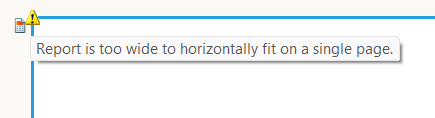
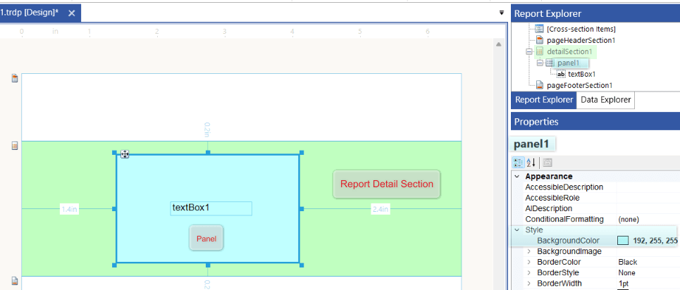
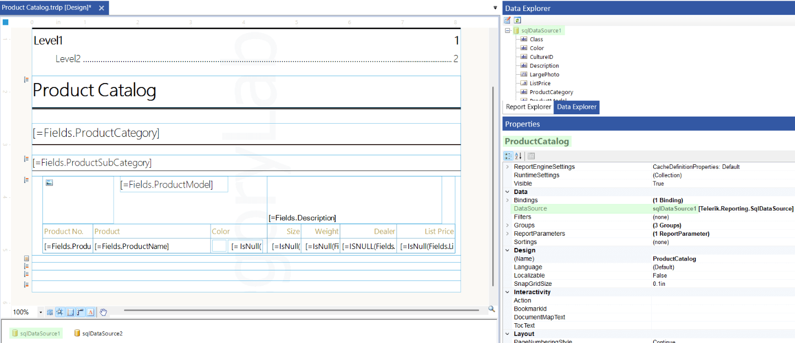
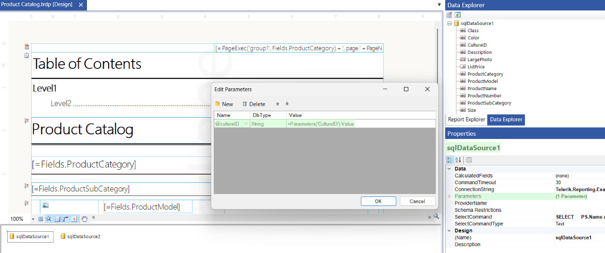
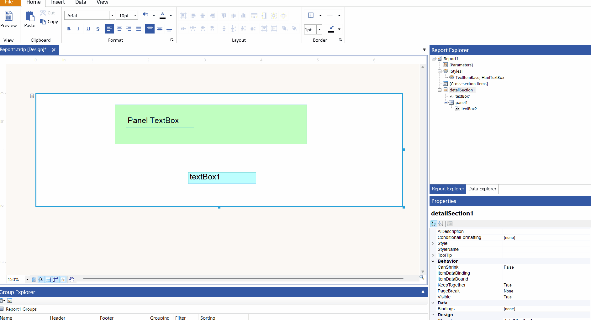

# Tips for Troubleshooting Report Design

## Fixing Report Designer Warnings

Ensure there are no yellow triangle warnings shown in design time when editing your report definitions in the report designers. Hover the corresponding warning triangle to check the exact problem described in the tooltip.

For example, the following image shows the tooltip of the warning stating that "Report is too wide to horizontally fit on a single page.":

To fix the above warning, you may:
* Decrease the Report `Width`
* Increase the Report Page Width in one of the following ways:
	+ Change the Report [`PageSettings`](/api/telerik.reporting.drawing.pagesettings) > `PaperKind` to a bigger one that will accommodate the content;
	+ Inrease the Report [`PageSettings`](/api/telerik.reporting.drawing.pagesettings) > `PaperSize` > `Width` for `Custom` paper kind;
	+ Decrease the Report [`PageSettings`](/api/telerik.reporting.drawing.pagesettings) > `Margins` > `Left` and/or `Right`.

Check for [Bindings]() and [Conditional Formatting]() that may be altering the report layout only at runtime.

## Troubleshooting Report Layout

Use different __Styles__, for example, `Background Color` and `Borders`, to easily distinguish between report sections and items and identify which one is responsible for the observed inconsistency in the report layout. For complex reports, with many nested items, start by coloring the top-level containers first, and then dig deeper by coloring that container's nested items as well, until you find the item responsible for the issues.

Here is an example with the detail section and the Panel inside it easily distinguishable due to the background colors:

### Data is Missing at Runtime

Ensure you have assigned the `DataSource` property of your Report or other [data item](), for example, [Table]() or [Graph]():

Alternatively, you may use [Binding]() for the `DataSource` property to display the data only at runtime. With this approach, the Binding will override the `DataSource` property Value at runtime.

When displaying data in a TextBox or other report item, ensure it is in the correct [data scope](). This means that its parent data item should have as DataSource the corresponding source of data, for example, [DataSource component]().

### Data is Multiplying at Runtime

The problem may occur if you have set the `DataSource` property of the [Report item]() an inner data item (e.g., Table) in its detail section to the same value, for example, to the same DataSource component.

The reason for the issue is that the detail section of the data items (e.g., the Report) is rendered as many times as there are records in its data source. Therefore, when you place a Table in the Report detail section, it gets rendered as many times as the Report DataSource records. When the Table and the Report have the same DataSource, the Table will be rendered multiple times.

For fixing the problem, remove/reset the DataSource property value of the Report (parent data item).

In scenarios, where you need the same DataSource to be used in the Report and an inner data item (e.g., Table), consider the following approaches to avoid data multiplication:

* Place the inner data item (Table) in a [Report Header/Footer]() section. These sections are generated once per report.
* [Introduce a Report Group]() and place the inner data item (Table) in the [Group Header or Footer section]((#group-header). These sections are generated once per group. Therefore, the Table will be displayed once per group.
* Limit inner data item (Table) data:
	+ Use [Filtering]() to ensure the Table displays relevant data for the group or parent detail section.
	+ Use [Binding to the parent data item](#binding-to-data-from-the-parent-data-item) in the Table's DataSource. In a Report Group this will ensure the data in the Table is relevant to the group. In Report detail section, the Binding will let the Table display only the current detail data record.

### DataSource (SQL) Parameter Values are not Applied

The DataSource components expose [DataSource parameters]() that may be used to [filter the data server-side](#server-side-filtering). The values of DataSource parameters must be set to a valid [Expression](), including the available [Global Objects]().

For example, the [SqlDataSource paramters]() can be used as SQL query parameters in _Select commands_ and _Stored Procedures_. In the most common scenario, the SqlDataSource parameters are linked with [Report Parameters]():

If the SQL query parameters are not passed correctly to the database, ensure the above link with a Report Parameter/Expression is correct.

### Expression Values

Use a temporary `TextBox` in the same [data item]() or [report section](#report-sections), ensuring the same [scope]() to display the actually evaluated content in the [Binding](), [Conditional Formatting]() or other [Expressions]().

### Unexpected Page Breaks

* Page Break Properties:
	Inspect the [Report Sections](#report-sections) for the `PageBreak` property and [Report Groups]() and the [Table Groups]() for the `GroupPageBreak` property settings.

* Keep Together Settings:
	Most of the Report Items and Sections expose the property `KeepTogether`. The Groups expose `GroupKeepTogether`.
	When the property value is `True`, the Reporting Engine tries to render the entire item/section/group content on the same page. If it doesn't fit, it attempts to move the whole content to a new page. When the content fits on the new page, the previous page may remain partly blank. If this is not the desired outcome, ensure the corresponding report items/sections/groups have their keep together values set to false.

* Horizontal Pagination:
	Generally, the [Report items]() grow only vertically to accommodate larger content. Only [Crosstabs and Tables/Lists with column grouping](), _rotated Tables_ and [SubReports]() may grow horizontally. In case of unexpected horizontal page breaks, inspect the items' runtime content.

### Report Items Order in Accessibility

When enabling the [Accessibility feature]() of your reports, the items will be read according to their logical item order. This order may be seen and changed in the [Report Explorer]()] in the [report designers]().

By default, the [Report Items]() appear in the Report Explorer in the order they have been added to the report definition. Therefore, if you place an item added later at the top of the report, it may be shown in the Report Explorer before items appearing lower in the report section, despite being added before. 

Consider reordering the items the way they must appear when using Accessibility by dragging the items in the Report Explorer:

## Type Reports in Visual Studio Report Designer

The [Visual Studio Report Designer for .NET Framework]() automatically generates the code for the CS/VB reports and stores it in the `InitializeComponent` method of the file `ReportName.designer.cs`/`ReportName.Designer.vb`. Check the file for errors if the report cannot be opened in the report designer.

## See Also

* [Understanding Pagination]()
* [Interactive and Print Layouts]()
* [Basic Design Considerations for Report Items]()
* [Properties and Settings of the Report Definition]()
