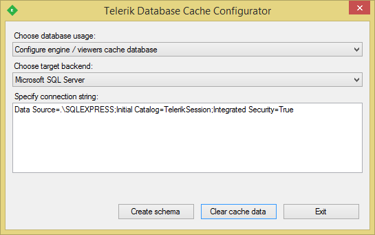

# Configuring the Database Cache Provider

> The cache settings mentioned in this article are not obligatory, and they do not apply to the **HTML5 Report Viewer** or its Angular, WebForms, MVC and other wrappers. Details about the Cache Storage of the Reporting REST Service that works with the HTML5 Report Viewer are available in [Report Viewer and Reporting REST services]() and [REST Service Storage Settings]().

The database cache provider stores the rendered pages and resources in database. This is useful in web farm applications where different computers can serve different requests to the same report, so a common storage is necessary to hold the shared resources.

Before using the database cache provider it is necessary to install the shared database. Start the **Database Cache Configuration Tool** that can be found in the following location `-InstallDir-\Tools\DatabaseCacheConfigurator.exe`, where **InstallDir** is the installation directory of **Telerik Reporting**.



Choose the desired target backend from the drop-down list and specify the connection string to the database being created in the text block below. It is recommended that the database specified in the connection string is different from your production database. Click the "Create schema" button to configure the database. The **Database Cache Configuration Tool** can be used to create a new database or reconfigure an existing one, if the database schema has changed from the previous release of **Telerik Reporting**.

Two cache providers are available:

- **ADO.NET** cache provider. The following XML snippet demonstrates how to configure this provider:

  ```XML
  <Telerik.Reporting>
  	<Cache provider="ADO.NET">
  		<Providers>
  			<Provider name="ADO.NET">
  				<Parameters>
  					<Parameter name="ProviderName" value="System.Data.SqlClient" />
  					<Parameter name="ConnectionString" value="MyConnectionString" />
  				</Parameters>
  			</Provider>
  		</Providers>
  	</Cache>
  </Telerik.Reporting>
  ```

  Here the "ProviderName" parameter specifies the **ADO.NET** provider, and the "ConnectionString" specifies the connection string to the database.

- **Telerik Data Access** cache provider. Add the requires reference to _Telerik.OpenAccess.dll_, _Telerik.OpenAccess.35.Extensions.dll_ and _Telerik.OpenAccess.Runtime.dll_. It is necessary to configure the [Telerik Reporting Configuration Section]() first and then use the following XML snippet to configure this provider in application’s configuration file:

  ```XML
  <Telerik.Reporting>
  	<Cache provider="Database">
  		<Providers>
  			<Provider name="Database">
  				<Parameters>
  					<Parameter name="BackendName" value="mssql" />
  					<Parameter name="ConnectionString" value="MyConnectionString" />
  				</Parameters>
  			</Provider>
  		</Providers>
  	</Cache>
  </Telerik.Reporting>
  ```

  Here the "BackendName" parameter specifies the name of the chosen backend. Complete list of the backends is available in the [Backend Strings and Provider Names List](https://docs.telerik.com/data-access/developers-guide/database-specifics/database-specifics-backend-strings-provider-names-list) article. The "ConnectionString" specifies the connection string to the database. The connection string can be specified either as a named connection, configured in the "connectionStrings" section of the configuration file, or directly as an inline connection string. **Binding Redirects** In case you use **Telerik Data Access** version greater than 2015.1.225.1, you have to redirect all assemblies required by the Database Cache Provider to their latest versions. To do this, add the following bindingRedirects to your configuration file and replace the x.x.x.x with the exact version of **Telerik Data Access** assemblies:

  ```XML
  <?xml version="1.0" encoding="utf-8" ?>
  <configuration>
  	<runtime>
  		<assemblyBinding xmlns="urn:schemas-microsoft-com:asm.v1">
  			<dependentAssembly>
  				<assemblyIdentity name="Telerik.OpenAccess" culture="neutral" publicKeyToken="7ce17eeaf1d59342"/>
  				<bindingRedirect oldVersion="0.0.0.0-65535.65535.65535.65535" newVersion="x.x.x.x"/>
  			</dependentAssembly>
  			<dependentAssembly>
  				<assemblyIdentity name="Telerik.OpenAccess.35.Extensions" culture="neutral" publicKeyToken="7ce17eeaf1d59342"/>
  				<bindingRedirect oldVersion="0.0.0.0-65535.65535.65535.65535" newVersion="x.x.x.x"/>
  			</dependentAssembly>
  			<dependentAssembly>
  				<assemblyIdentity name="Telerik.OpenAccess.Runtime" culture="neutral" publicKeyToken="7ce17eeaf1d59342"/>
  				<bindingRedirect oldVersion="0.0.0.0-65535.65535.65535.65535" newVersion="x.x.x.x"/>
  			</dependentAssembly>
  		</assemblyBinding>
  	</runtime>
  </configuration>
  ```

## See Also

- [Configuring Cache]()
- [Configuring the File Cache Provider]()
- [Telerik Reporting Configuration Section]()
